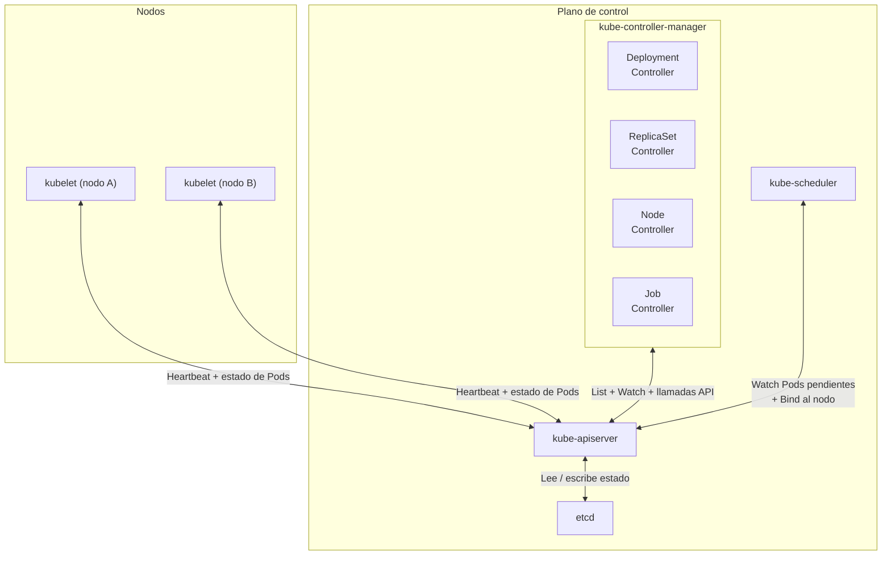
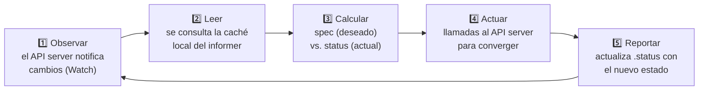
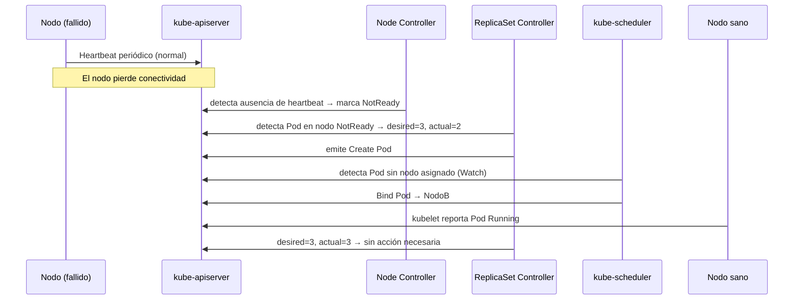

# La reconciliación en Kubernetes: fundamentos

> **Prerequisitos:** Saber qué es un contenedor y tener nociones básicas de Kubernetes.

¿Por qué Kubernetes puede "curarse solo" cuando un `Pod` falla?
¿Qué mecanismo interno garantiza que el clúster siempre intente converger
al estado que tú declaraste?
Esta explicación responde esas preguntas describiendo el _bucle de control_
y el patrón de **reconciliación**,
que es el corazón arquitectónico de Kubernetes.

## El problema que resuelve

Los sistemas distribuidos fallan constantemente.
Un nodo puede perder conectividad,
un contenedor puede salir de forma inesperada,
o un operador puede aplicar una configuración errónea.

Sin un mecanismo de corrección continua,
cada fallo requeriría intervención manual.
Kubernetes lo resuelve con una premisa simple:
**el clúster siempre debe intentar alcanzar el estado deseado,**
sin importar cuántas veces falle en el intento.

## Estado deseado y estado actual

Todo recurso de Kubernetes tiene dos perspectivas que coexisten en la API:

| Perspectiva        | Campo en la API | Descripción                                    |
| ------------------ | --------------- | ---------------------------------------------- |
| **Estado deseado** | `.spec`         | Lo que tú declaras que quieres                 |
| **Estado actual**  | `.status`       | Lo que el clúster reporta que existe en verdad |

Cuando describes un `Deployment` con `replicas: 3`,
estás declarando el estado deseado.
Si uno de esos tres `Pod` cae,
el estado actual refleja `replicas: 2`.
Esa diferencia es la que dispara la reconciliación.

> **Nota:** El campo `.spec` es tuyo — tú lo escribes.
> El campo `.status` es del sistema — los controladores lo actualizan.

## El bucle de control

En automatización y robótica,
un _bucle de control_ (_control loop_) es un ciclo sin fin
que observa el estado de un sistema
y toma acciones para corregir las desviaciones que detecta.

El ejemplo clásico es el termostato:

- Tú defines la temperatura deseada (por ejemplo, 22 °C).
- El termostato mide la temperatura actual.
- Si la actual es menor, enciende la calefacción.
- Cuando se alcanza la temperatura deseada, la apaga.
- El ciclo se repite indefinidamente.

Kubernetes aplica exactamente este principio a escala de clúster.

## Los controladores

Un _controlador_ (_controller_) es un bucle de control especializado
que vigila uno o más tipos de recursos de Kubernetes
y toma acciones para acercar el estado actual al estado deseado.

Kubernetes incluye decenas de controladores integrados
que se ejecutan dentro del componente `kube-controller-manager`.
Cada controlador es responsable de un aspecto específico del clúster:

| Controlador   | Recurso que observa        | Acción típica                         |
| ------------- | -------------------------- | ------------------------------------- |
| `Deployment`  | `Deployment`, `ReplicaSet` | Crea o elimina `ReplicaSet`           |
| `ReplicaSet`  | `ReplicaSet`, `Pod`        | Crea o elimina `Pod`                  |
| `Job`         | `Job`, `Pod`               | Crea `Pod` hasta completar el trabajo |
| `DaemonSet`   | `DaemonSet`, `Pod`         | Garantiza un `Pod` por nodo           |
| `StatefulSet` | `StatefulSet`, `Pod`       | Gestiona `Pod` con identidad estable  |

Un controlador **no** ejecuta contenedores directamente.
Su responsabilidad es hablar con el `kube-apiserver`:
observar cambios, calcular la diferencia con el estado deseado,
y emitir llamadas a la API para crear, actualizar o eliminar recursos.
Este diseño desacoplado permite que los controladores fallen y se reinicien
sin perder consistencia.

### El ciclo de reconciliación

El núcleo de cada controlador es su función de reconciliación.
Sigue siempre la misma secuencia:

### Informers: observación eficiente

Los controladores no consultan el API server en cada iteración.
En su lugar usan _informers_,
que son componentes que:

- **Sincronizan** una caché local con el estado del API server al arrancar.
- **Observan** cambios mediante una conexión de larga duración (_watch_).
- **Notifican** al controlador solo cuando hay cambios en los recursos relevantes.

Este mecanismo evita sobrecargar el API server
y hace que la reconciliación sea eficiente
incluso con miles de recursos en el clúster.

## Convergencia eventual

La reconciliación es **eventual**:
el clúster no garantiza que el estado deseado se alcance de forma inmediata,
sino que los controladores **siguen intentándolo** hasta lograrlo.

En cualquier momento dado,
el clúster puede estar en un estado de transición.
Lo que Kubernetes garantiza es que,
siempre que los controladores estén activos y puedan hacer cambios útiles,
el sistema converge hacia el estado deseado.

Esta propiedad tiene consecuencias importantes:

- Los controladores se diseñan con **idempotencia** —
  reconciliar el mismo estado dos veces no produce efectos distintos.
- Si un controlador falla y se reinicia,
  simplemente lee el estado actual y reconcilia desde ahí.
- Múltiples controladores pueden coexistir sin interferirse,
  porque cada uno solo atiende los recursos vinculados a su tipo.

## Un ejemplo concreto: fallo de nodo

Considera este escenario con un `Deployment` de tres réplicas:

**Paso 1 — Estado estable.**
El controlador de `Deployment` ha creado un `ReplicaSet`,
que a su vez tiene tres `Pod` corriendo en tres nodos distintos.

**Paso 2 — Fallo de nodo.**
Uno de los nodos pierde conectividad.
Su `kubelet` deja de enviar _heartbeats_.
Tras el tiempo de gracia,
el controlador de nodos marca ese nodo como `NotReady`.

**Paso 3 — Detección de la diferencia.**
El controlador del `ReplicaSet` detecta que uno de sus `Pod`
está en un nodo `NotReady`.
Encola una reconciliación.

**Paso 4 — Acción correctiva.**
Al reconciliar: `deseado = 3`, `actual = 2`.
Emite una llamada al API server para crear un nuevo `Pod`.

**Paso 5 — Convergencia.**
El `kube-scheduler` asigna el nuevo `Pod` a un nodo sano.
El `kubelet` de ese nodo lo inicia.
El controlador reconcilia de nuevo: `deseado = 3`, `actual = 3`.
No hay acción necesaria.

Todo este proceso ocurre automáticamente,
sin intervención humana,
en cuestión de segundos.

## Controladores personalizados y el patrón Operator

El mismo patrón es extensible más allá de los recursos nativos.
Kubernetes permite definir nuevos tipos de recursos
mediante `CustomResourceDefinition` (`CRD`)
y asociarles un controlador personalizado (_custom controller_).

Un _Operator_ es la combinación de un `CRD`
con un controlador que codifica el conocimiento operacional de una aplicación.
Por ejemplo,
un Operator de base de datos puede gestionar copias de seguridad,
actualizaciones de versión y recuperación ante fallos
con la misma filosofía de reconciliación que usa `Deployment`.

## Por qué este diseño es robusto

El patrón de reconciliación tiene propiedades arquitectónicas destacadas:

| Propiedad           | Descripción                                                                |
| ------------------- | -------------------------------------------------------------------------- |
| **Idempotencia**    | Reconciliar el mismo estado dos veces no produce efectos distintos.        |
| **Recuperabilidad** | Si un controlador cae y se reinicia, continúa desde el estado actual.      |
| **Desacoplamiento** | Cada controlador es independiente; un fallo en uno no afecta a los demás.  |
| **Observabilidad**  | El estado siempre es legible en `.status`, lo que facilita el diagnóstico. |
| **Extensibilidad**  | El mismo patrón se aplica a recursos nativos y a recursos personalizados.  |

## Glosario

| Término                   | Definición breve                                                                                       |
| ------------------------- | ------------------------------------------------------------------------------------------------------ |
| `bucle de control`        | Ciclo continuo que compara estado deseado y actual, y toma acciones correctivas.                       |
| `controlador`             | Componente que implementa un bucle de control para un tipo de recurso específico.                      |
| `estado deseado`          | Configuración declarada por el usuario en el campo `.spec` de un recurso.                              |
| `estado actual`           | Estado reportado por el sistema en el campo `.status` de un recurso.                                   |
| `reconciliación`          | Proceso de calcular y eliminar la diferencia entre estado deseado y estado actual.                     |
| `informer`                | Componente que sincroniza una caché local con el API server y notifica cambios vía _watch_.            |
| `kube-controller-manager` | Proceso del plano de control que ejecuta todos los controladores integrados de Kubernetes.             |
| `CRD`                     | `CustomResourceDefinition` — mecanismo para definir nuevos tipos de recursos en Kubernetes.            |
| `Operator`                | Patrón de extensión que combina un `CRD` con un controlador personalizado para gestionar aplicaciones. |
| `convergencia eventual`   | Garantía de que el sistema alcanzará el estado deseado si los controladores permanecen activos.        |

## Referencias

- [Documentación oficial: Controladores](https://kubernetes.io/docs/concepts/architecture/controller/) —
  kubernetes.io
- [Código fuente: `pkg/controller`](https://github.com/kubernetes/kubernetes/tree/master/pkg/controller) —
  github.com/kubernetes/kubernetes
- [Repositorio de ejemplo: `sample-controller`](https://github.com/kubernetes/sample-controller) —
  github.com/kubernetes/sample-controller
- [Documentación oficial: Gestión de cargas de trabajo](https://kubernetes.io/docs/concepts/workloads/controllers/) —
  kubernetes.io

[Inicio](../README.md) | [Siguiente →](02-informers-listers.md)
