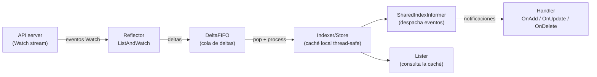

# Informers, cachés y listers en Kubernetes

> **Prerequisitos:** [week01/01-reconciliation-theory.md](01-reconciliation-theory.md) — bucle de control y reconciliación.

¿Cómo sabe un controlador que algo cambió en el clúster
sin consultar el API server en cada iteración?
¿Por qué los controladores pueden procesar decenas de miles de recursos
sin colapsar la API?
Esta explicación responde esas preguntas describiendo el subsistema de
observación del lado del cliente:
_informers_, `Reflector`, `Store`, `Indexer` y _listers_.

## El problema de escalar la observación

Un controlador necesita reaccionar a cambios en recursos de Kubernetes.
La opción más ingenua sería hacer una llamada `List` periódica al API server,
pero eso no escala:
con miles de controladores y miles de objetos,
el API server quedaría saturado de peticiones redundantes.

Kubernetes resuelve esto con un modelo **observar-y-cachear**:
los controladores no consultan directamente al API server;
en cambio, mantienen una copia local sincronizada,
y el API server solo les envía deltas de cambio.

## Arquitectura del subsistema de caché

El subsistema se construye como una cadena de componentes,
cada uno con una responsabilidad clara:



### Reflector

El `Reflector` es el componente que habla con el API server.
Su trabajo es:

1. Hacer una llamada `List` inicial para obtener todos los objetos
   y su `ResourceVersion`.
2. Abrir una conexión `Watch` a partir de esa `ResourceVersion`.
3. Por cada evento recibido (`Added`, `Modified`, `Deleted`),
   insertar un delta en el `DeltaFIFO`.
4. Si la conexión se cae, reconectarse y reanudar desde el último
   `ResourceVersion` conocido.

El `Reflector` garantiza que ningún cambio se pierda:
si la conexión se interrumpe demasiado tiempo para reconectar sin perder eventos,
hace un nuevo `List` completo (_relist_).

El timeout del `Watch` se elige aleatoriamente entre 5 y 10 minutos,
lo que distribuye la carga de reconexión entre múltiples controladores.
Si el `ListAndWatch` falla, el `Reflector` usa **backoff exponencial**:
comienza en 800 ms, se duplica con cada fallo,
llega a un máximo de 30 s,
y se reinicia a cero si el API server estuvo saludable durante 2 minutos seguidos.

### DeltaFIFO

El `DeltaFIFO` es una cola que acumula los cambios por objeto.
A diferencia de una cola simple,
agrupa todos los cambios pendientes para la misma clave bajo una entrada única,
llamada `Deltas`.

Cada `Delta` tiene un tipo:

| Tipo       | Cuándo ocurre                                                                                            |
| ---------- | -------------------------------------------------------------------------------------------------------- |
| `Added`    | El objeto apareció por primera vez.                                                                      |
| `Updated`  | El objeto fue modificado.                                                                                |
| `Deleted`  | El objeto fue eliminado (puede llevar un `DeletedFinalStateUnknown`).                                    |
| `Replaced` | Tras un relist, el objeto fue reemplazado. Solo si `EmitDeltaTypeReplaced=true`; si no, se emite `Sync`. |
| `Sync`     | Resincronización periódica (sin cambio real en el API server).                                           |
| `Bookmark` | Evento de marcador para propagar el `ResourceVersion` sin datos de objeto.                               |

El `DeltaFIFO` resuelve un problema importante:
si el mismo objeto se modifica varias veces mientras espera en la cola,
todos esos cambios se preservan en orden,
y el consumidor los ve todos de una vez al procesar la entrada.

> **Nota sobre `Replaced` vs `Sync`:** Versiones antiguas de `DeltaFIFO` usaban `Sync`
> para ambos tipos de evento.
> La distinción se introdujo para que el controlador pueda diferenciar
> entre un objeto que _realmente_ cambió (relist) y uno que simplemente se reenvía periódicamente.

### ThreadSafeStore e Indexer

El `Store` es la caché local donde el `Reflector` almacena el estado actual
de cada objeto.
Es una estructura _thread-safe_ (segura para acceso concurrente).

El `Indexer` extiende el `Store` con la capacidad de indexar objetos
por campos arbitrarios,
lo que permite hacer consultas eficientes del tipo
"dame todos los `Pod` en el `namespace` X".

El índice más común es `NamespaceIndex`,
que indexa los objetos por su campo `metadata.namespace`.

```go
// Ejemplo de uso del Indexer — consulta por namespace
pods, err := indexer.ByIndex(cache.NamespaceIndex, "production")
```

Internamente, el `Indexer` mantiene dos estructuras:

- `Indexers`: un mapa de nombre de índice → función de indexación.
- `Indices`: un mapa de nombre de índice → mapa de valor indexado → conjunto de claves.

### SharedIndexInformer

El `SharedIndexInformer` es la pieza que une todo.
Combina un `Reflector`, un `DeltaFIFO` y un `Indexer` en un único objeto
que puede ser compartido por **múltiples controladores al mismo tiempo**.

"Compartido" es la clave:
en lugar de que cada controlador tenga su propio `Reflector` y su propia conexión
`Watch` al API server,
todos los controladores interesados en el mismo tipo de recurso comparten
una sola instancia del `SharedIndexInformer`.
Esto reduce drásticamente la carga sobre el API server.

El `SharedIndexInformer` permite registrar múltiples `ResourceEventHandler`,
uno por cada controlador:

```go
// Los manejadores de eventos se registran con AddEventHandler
informer.AddEventHandler(cache.ResourceEventHandlerFuncs{
    AddFunc: func(obj interface{}) {
        // obj es el objeto nuevo; se encola su clave en el workqueue
    },
    UpdateFunc: func(oldObj, newObj interface{}) {
        // oldObj es el estado anterior; newObj es el nuevo
    },
    DeleteFunc: func(obj interface{}) {
        // obj puede ser DeletedFinalStateUnknown si se perdió el evento
    },
})
```

> **Nota:** Los manejadores reciben los objetos **por referencia**.
> **No se deben modificar**.
> Si necesitas modificar el objeto, crea primero una copia profunda.

`AddEventHandler` retorna un `ResourceEventHandlerRegistration`,
que permite dos operaciones importantes:

```go
registration, err := informer.AddEventHandler(cache.ResourceEventHandlerFuncs{
    // ...
})

// HasSynced del registration es más preciso que el del informer:
// retorna true cuando el handler específico ha recibido todos los
// objetos del List inicial, no solo cuando el informer los procesó.
if !registration.HasSynced() {
    // este handler aún no vio todos los objetos del List inicial
}

// Los handlers se pueden eliminar dinámicamente
informer.RemoveEventHandler(registration)
```

> **Importante:** `informer.HasSynced()` indica que el informer completó el `List` inicial.
> `registration.HasSynced()` indica que _este handler en particular_
> recibió todos esos eventos.
> Prefiere `registration.HasSynced()` para garantías más fuertes.

### Sincronización inicial: HasSynced

Cuando arranca un controlador,
el `SharedIndexInformer` necesita completar su `List` inicial
antes de que el controlador empiece a reconciliar.
De lo contrario, el controlador podría actuar sobre un estado incompleto.

La función `cache.WaitForNamedCacheSync` bloquea hasta que la caché esté lista:

```go
// El controlador espera a que la caché esté sincronizada antes de procesar
if !cache.WaitForNamedCacheSync("mi-controlador", stopCh, informer.HasSynced) {
    return // la caché no se sincronizó; no continúes
}
```

### Resincronización periódica (resync)

Además del `Watch` continuo,
el `SharedIndexInformer` puede reenviar periódicamente _todos los objetos en caché_
a los handlers,
generando eventos `Sync` sin que haya cambios reales en el API server.

Esto sirve para que los controladores detecten y reparen derivas
que podrían haberse perdido por errores de procesamiento previos.
Cada handler puede tener su propio período de resync:

```go
// Este handler se resincroniza cada 30 segundos
informer.AddEventHandlerWithResyncPeriod(handler, 30*time.Second)

// Este otro no solicita resync (cero = no quiero resync)
informer.AddEventHandlerWithResyncPeriod(otroHandler, 0)
```

> **Nota:** El resync no genera tráfico al API server.
> Solo reenvía objetos de la caché local a los handlers.
> Es trabajo puramente en memoria.

### TransformFunc: reducir consumo de memoria

El `SharedIndexInformer` acepta una `TransformFunc` opcional
que se invoca sobre cada objeto _antes_ de almacenarlo en la caché.
Su uso principal es eliminar campos que el controlador no necesita,
reduciendo el consumo de RAM:

```go
informer.SetTransform(func(obj interface{}) (interface{}, error) {
    // Eliminar el campo ManagedFields que raramente necesitan los controladores
    if accessor, err := meta.Accessor(obj); err == nil {
        accessor.SetManagedFields(nil)
    }
    return obj, nil
})
```

> **Advertencia:** La `TransformFunc` debe ser idempotente.
> Se ejecuta en el camino crítico de cada evento entrante;
> no realices operaciones lentas dentro de ella.

## Listers: consultas a la caché local

Un _lister_ es un objeto generado automáticamente (con `code-generator`)
que proporciona una interfaz tipada y segura para consultar el `Indexer`.

En lugar de llamar directamente a `indexer.ByIndex(...)` con cadenas de texto,
un lister expone métodos del tipo:

```go
// Lister generado para Pods
podLister PodLister  // interfaz generada por code-generator

// Listar todos los pods en un namespace
pods, err := podLister.Pods("production").List(labels.Everything())

// Obtener un pod por nombre
pod, err := podLister.Pods("production").Get("mi-pod")
```

Los listers nunca hacen llamadas al API server.
**Siempre leen de la caché local**.
Esto es una decisión de diseño fundamental:
los controladores deben preferir los listers a los clientes directos
para las operaciones de lectura.

## SharedInformerFactory: gestión centralizada

En un programa real con múltiples controladores,
cada tipo de recurso debería compartir un único `SharedIndexInformer`.
La `SharedInformerFactory` es el mecanismo que garantiza esto:

```go
// Una sola factory por proceso, con un intervalo de resincronización
factory := informers.NewSharedInformerFactory(clientset, 30*time.Second)

// Múltiples controladores obtienen el mismo informer para Pods
podInformer := factory.Core().V1().Pods()
deploymentInformer := factory.Apps().V1().Deployments()

// Todos los informers arrancan a la vez
factory.Start(stopCh)
factory.WaitForCacheSync(stopCh) // espera a que todos estén sincronizados
```

> **Advertencia:** No crees un `SharedIndexInformer` directamente para un tipo
> si ya existe una `SharedInformerFactory` para ese proceso.
> Usar dos informers separados para el mismo recurso duplica la carga
> sobre el API server.

## Flujo completo de un evento

Veamos qué ocurre cuando alguien ejecuta `kubectl delete pod mi-pod`:

**Paso 1 — El API server emite el evento.**
La conexión `Watch` del `Reflector` recibe un evento `Deleted` para `mi-pod`.

**Paso 2 — El Reflector inserta el delta.**
El `Reflector` llama a `DeltaFIFO.Delete(pod)`.
El `DeltaFIFO` crea una entrada `{Deleted, pod}` para la clave `default/mi-pod`.

> **Caso especial — `DeletedFinalStateUnknown`:**
> Si la conexión `Watch` se cayó antes de recibir el evento `Deleted`,
> el `Reflector` hará un relist.
> Si el objeto ya no está en la lista pero sí estaba en la caché,
> el `Reflector` genera un delta `Deleted` con un objeto de tipo
> `DeletedFinalStateUnknown{Key: "default/mi-pod", Obj: <último estado conocido>}`.
> Los handlers deben detectar este tipo en `DeleteFunc`:
>
> ```go
> DeleteFunc: func(obj interface{}) {
>     // Detectar si fue un borrado "tombstone" por pérdida de eventos Watch
>     if d, ok := obj.(cache.DeletedFinalStateUnknown); ok {
>         obj = d.Obj // usar el último estado conocido
>     }
>     key, _ := cache.MetaNamespaceKeyFunc(obj)
>     queue.Add(key)
> },
> ```

**Paso 3 — El procesador consume el delta.**
El `SharedIndexInformer` tiene un hilo interno que hace `DeltaFIFO.Pop()`.
Para cada delta:

- Actualiza el `Indexer` (elimina el objeto de la caché local).
- Llama a `OnDelete(pod)` en todos los `ResourceEventHandler` registrados.

**Paso 4 — El controlador encola la clave.**
El manejador `OnDelete` típicamente solo encola la clave del objeto
en un `workqueue` para procesarla después de forma asíncrona.

**Paso 5 — El controlador reconcilia.**
Más adelante, el hilo del controlador saca la clave del `workqueue`
y ejecuta la función de reconciliación,
que lee el estado actual usando el lister
(confirmando que el pod ya no existe).

## Resumen: qué hace cada componente

| Componente              | Paquete                        | Responsabilidad                                                  |
| ----------------------- | ------------------------------ | ---------------------------------------------------------------- |
| `Reflector`             | `k8s.io/client-go/tools/cache` | Sincroniza la caché con el API server vía List+Watch.            |
| `DeltaFIFO`             | `k8s.io/client-go/tools/cache` | Cola que acumula deltas de cambio por objeto.                    |
| `Indexer`               | `k8s.io/client-go/tools/cache` | Almacén thread-safe con índices para consultas eficientes.       |
| `SharedIndexInformer`   | `k8s.io/client-go/tools/cache` | Combina los anteriores y los comparte entre controladores.       |
| `SharedInformerFactory` | `k8s.io/client-go/informers`   | Garantiza una sola instancia de informer por tipo.               |
| _Lister_                | Código generado                | Interfaz tipada para consultar la caché sin tocar el API server. |

## Por qué este diseño es correcto

El subsistema de informers tiene propiedades arquitectónicas muy importantes:

| Propiedad                 | Descripción                                                                                     |
| ------------------------- | ----------------------------------------------------------------------------------------------- |
| **Reducción de carga**    | Un `Watch` por tipo de recurso en lugar de N `List` periódicos.                                 |
| **Consistencia eventual** | La caché converge al estado del API server; los controladores actúan sobre una vista coherente. |
| **Desacoplamiento**       | Los controladores no necesitan saber cómo se obtiene el estado; solo leen la caché.             |
| **Seguridad ante fallos** | Si la conexión Watch cae, el Reflector reconecta y hace relist automáticamente.                 |
| **Compartición**          | Múltiples controladores reutilizan el mismo informer, eliminando trabajo duplicado.             |

## Glosario

| Término                            | Definición breve                                                                                                  |
| ---------------------------------- | ----------------------------------------------------------------------------------------------------------------- |
| `Reflector`                        | Componente que ejecuta `ListAndWatch` contra el API server y escribe deltas en el `DeltaFIFO`.                    |
| `DeltaFIFO`                        | Cola que agrupa cambios sucesivos del mismo objeto en una lista de `Delta` ordenada.                              |
| `Store`                            | Almacén thread-safe de objetos de Kubernetes, accesible por clave `namespace/name`.                               |
| `Indexer`                          | Extensión del `Store` que permite consultas por campos indexados (p. ej., namespace).                             |
| `SharedIndexInformer`              | Informer compartible que combina `Reflector`, `DeltaFIFO` e `Indexer`.                                            |
| `SharedInformerFactory`            | Fábrica que garantiza una sola instancia de `SharedIndexInformer` por tipo de recurso.                            |
| `Lister`                           | Interfaz generada automáticamente para consultar la caché local de forma tipada.                                  |
| `ResourceEventHandler`             | Interfaz con los métodos `OnAdd`, `OnUpdate` y `OnDelete` que notifican cambios a los controladores.              |
| `HasSynced`                        | Función que retorna `true` cuando el informer ha completado su primer `List` y procesado todos sus items.         |
| `ResourceEventHandlerRegistration` | Handle retornado por `AddEventHandler`; tiene su propio `HasSynced` por handler y permite `RemoveEventHandler`.   |
| `DeletedFinalStateUnknown`         | Envoltorio que el `Reflector` usa cuando detecta un borrado por relist pero no tuvo el evento `Deleted` original. |
| `TransformFunc`                    | Función opcional que transforma objetos antes de almacenarlos en caché; usada para reducir RAM.                   |
| `ResourceVersion`                  | Valor opaco que el API server asigna a cada versión de un objeto; usado para reanudar un `Watch`.                 |
| `relist`                           | Nuevo `List` completo que hace el `Reflector` cuando no puede reanudar el `Watch` sin perder eventos.             |
| resync                             | Reenvío periódico de todos los objetos en caché a los handlers, sin consultar el API server.                      |
| backoff exponencial                | Estrategia del `Reflector` para reconectarse: 800 ms inicial, máximo 30 s, reset tras 2 min de éxito.             |

## Referencias

- [Código fuente: `k8s.io/client-go/tools/cache`](https://github.com/kubernetes/client-go/tree/master/tools/cache) —
  github.com/kubernetes/client-go
- [Documentación del paquete `cache`](https://pkg.go.dev/k8s.io/client-go/tools/cache) —
  pkg.go.dev
- [Código fuente: `k8s.io/client-go/informers`](https://github.com/kubernetes/client-go/tree/master/informers) —
  github.com/kubernetes/client-go
- [sample-controller: ejemplo canónico de informer + workqueue](https://github.com/kubernetes/sample-controller) —
  github.com/kubernetes/sample-controller

[← Atrás](01-reconciliation-theory.md) | [Inicio](../README.md) | [Siguiente →](03-workqueues.md)
