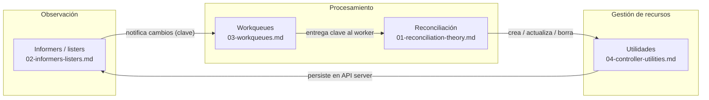

# Semana 1 — Fundamentos del patrón de reconciliación

> **Tipo de contenido:** Explicación / Navegación
> **Prerequisitos:** Saber qué es un contenedor y tener nociones básicas de Kubernetes (Pods, Deployments).
> **Relacionado:** [Currícula de la sesión 1](../README.md) · [Minuta de la sesión inaugural](../2026-05-22-arranque-grupo-estudio-kubernetes.md)
> **Siguiente paso:** Semana 2 — Controladores básicos (Namespace, TokenCleaner)

Esta semana cubre los fundamentos que todo controlador de Kubernetes comparte,
sin importar su complejidad.
Antes de analizar el código de `ReplicaSet`, `Deployment` o `Job`,
necesitas entender qué problema resuelve la reconciliación,
cómo los controladores observan el clúster de forma eficiente,
cómo desacoplan la observación del procesamiento,
y qué utilidades usan para gestionar el ciclo de vida de los recursos.

## Objetivos de aprendizaje

Al terminar esta semana serás capaz de:

- Explicar el bucle de control y la diferencia entre estado deseado (`.spec`) y estado actual (`.status`).
- Describir la cadena `Reflector` → `DeltaFIFO` → `Indexer` → `SharedIndexInformer` y el papel de cada pieza.
- Justificar por qué los controladores usan un `workqueue` en lugar de procesar eventos directamente.
- Elegir el tipo de cola correcto (`TypedInterface`, `TypedDelayingInterface`, `TypedRateLimitingInterface`) para cada situación.
- Usar `SetControllerReference`, finalizers y `CreateOrUpdate` en un controlador propio.

## Cómo encajan los cuatro documentos

Los cuatro temas de esta semana no son independientes:
forman la arquitectura interna de cualquier controlador de Kubernetes.



El ciclo completo es:
el **informer** detecta un cambio y encola la clave del objeto en el **workqueue**;
el worker saca la clave, ejecuta la **función de reconciliación**,
que utiliza las **utilidades** para crear o actualizar recursos secundarios;
esos cambios llegan al API server y el informer los detecta en la siguiente vuelta.

## Documentos de la semana

### 1 · La reconciliación en Kubernetes: fundamentos

**Archivo:** [01-reconciliation-theory.md](01-reconciliation-theory.md)

Responde la pregunta de fondo: ¿por qué Kubernetes puede "curarse solo"?
Introduce el _bucle de control_, la distinción `.spec` / `.status`,
el ciclo de reconciliación (Observar → Leer → Calcular → Actuar → Reportar),
la convergencia eventual y el patrón `Operator`.

Conceptos clave: `bucle de control`, `estado deseado`, `estado actual`,
`convergencia eventual`, `idempotencia`, `kube-controller-manager`, `CRD`, `Operator`.

---

### 2 · Informers, cachés y listers en Kubernetes

**Archivo:** [02-informers-listers.md](02-informers-listers.md)

Explica cómo los controladores observan el clúster sin saturar el API server.
Describe cada pieza de la cadena de caché y su responsabilidad,
el mecanismo de `ListAndWatch`,
la resincronización periódica y la `TransformFunc` para reducir memoria.

Conceptos clave: `Reflector`, `DeltaFIFO`, `Indexer`, `SharedIndexInformer`,
`SharedInformerFactory`, `Lister`, `HasSynced`, `DeletedFinalStateUnknown`, `ResourceVersion`.

---

### 3 · Workqueues en Kubernetes

**Archivo:** [03-workqueues.md](03-workqueues.md)

Explica por qué los controladores no procesan eventos del informer directamente
y qué garantías aporta el workqueue: deduplicación, procesamiento único,
reencolado seguro y reintentos con backoff.
Describe la jerarquía de colas y el papel crítico de `Forget`.

Conceptos clave: `TypedInterface`, `TypedDelayingInterface`,
`TypedRateLimitingInterface`, `TypedItemExponentialFailureRateLimiter`,
`TypedBucketRateLimiter`, `DefaultTypedControllerRateLimiter`, `Forget`.

---

### 4 · Utilidades de controladores en Kubernetes

**Archivo:** [04-controller-utilities.md](04-controller-utilities.md)

Describe las herramientas del paquete `controller-runtime/controllerutil`
que un controlador usa para gestionar el ciclo de vida de los recursos:
establecer _owner references_, bloquear el borrado con finalizers
y crear o actualizar recursos de forma idempotente.

Conceptos clave: `SetControllerReference`, `SetOwnerReference`,
`finalizer`, `deletionTimestamp`, `AddFinalizer`, `RemoveFinalizer`,
`CreateOrUpdate`, `CreateOrPatch`, `OperationResult`.

## Orden de lectura recomendado

Lee los documentos en el orden numerado.
Cada uno asume que leíste el anterior.

```
01-reconciliation-theory.md   →   02-informers-listers.md
                                          ↓
                              03-workqueues.md
                                          ↓
                              04-controller-utilities.md
```

Si ya tienes experiencia con informers, puedes saltar al documento 3 directamente;
pero si la noción de caché local no te es familiar, empieza por el 1.

## Referencia rápida de componentes

| Componente                      | Paquete                                        | Qué hace                                             |
| ------------------------------- | ---------------------------------------------- | ---------------------------------------------------- |
| `Reflector`                     | `k8s.io/client-go/tools/cache`                 | Ejecuta `ListAndWatch` y escribe deltas en la cola.  |
| `DeltaFIFO`                     | `k8s.io/client-go/tools/cache`                 | Cola de cambios ordenados por objeto.                |
| `Indexer`                       | `k8s.io/client-go/tools/cache`                 | Caché local con índices para consultas eficientes.   |
| `SharedIndexInformer`           | `k8s.io/client-go/tools/cache`                 | Une Reflector + DeltaFIFO + Indexer, compartible.    |
| `SharedInformerFactory`         | `k8s.io/client-go/informers`                   | Garantiza una sola instancia de informer por tipo.   |
| _Lister_                        | Código generado (`code-generator`)             | Consulta tipada a la caché sin tocar el API server.  |
| `TypedRateLimitingInterface`    | `k8s.io/client-go/util/workqueue`              | Cola con deduplicación y backoff automático.         |
| `DefaultTypedControllerRateLimiter` | `k8s.io/client-go/util/workqueue`          | Rate limiter estándar: exponential + token bucket.   |
| `SetControllerReference`        | `sigs.k8s.io/controller-runtime/controllerutil` | Owner reference con `controller: true`.             |
| `CreateOrUpdate`                | `sigs.k8s.io/controller-runtime/controllerutil` | Upsert idempotente vía `PUT`.                       |
| `CreateOrPatch`                 | `sigs.k8s.io/controller-runtime/controllerutil` | Upsert idempotente vía `PATCH`.                     |
