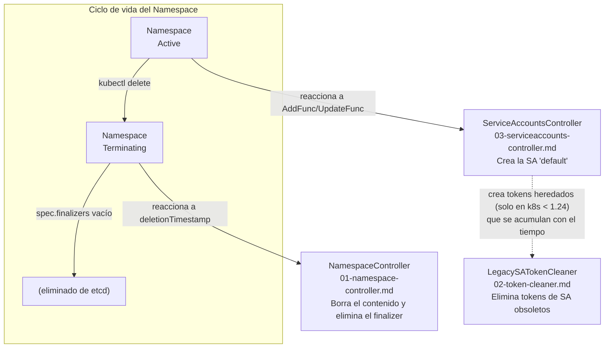

# Controladores básicos

Esta semana aplica los fundamentos de la semana 1 a tres controladores
integrados de Kubernetes.
Los tres son _controladores básicos_:
implementan patrones de reconciliación claros,
tienen una sola responsabilidad y son lo suficientemente pequeños para
estudiarlos de principio a fin en pocas horas.

La selección no es casual.
Los tres forman una triada sobre el ciclo de vida del `Namespace`:
uno lo termina cuando se borra,
otro garantiza que siempre tenga la identidad mínima necesaria,
y el tercero limpia las credenciales obsoletas que ese sistema de identidad
dejó acumuladas en el tiempo.

## Objetivos

Al terminar esta semana serás capaz de:

- Describir las dos fases de un `Namespace` (`Active` / `Terminating`)
  y el papel del finalizer `kubernetes` en su ciclo de borrado.
- Explicar por qué el `NamespaceController` añade un retraso de 5 segundos
  antes de procesar un `Namespace` en `Terminating`.
- Distinguir el patrón de workqueue reactivo del patrón de bucle periódico,
  y justificar cuándo usar cada uno.
- Reconocer las condiciones exactas bajo las que el `LegacySATokenCleaner`
  invalida y borra un `Secret` de token heredado.
- Implementar la lógica de "garantizar existencia" de un recurso (`get-or-create`)
  de forma idempotente y con manejo de tombstones.

## Mapa conceptual

Los tres controladores comparten un contexto: el `Namespace`.

## Patrones de reconciliación en esta semana

Cada controlador ilustra un patrón diferente:

| Controlador                    | Patrón principal              | Novedad respecto a semana 1               |
| ------------------------------ | ----------------------------- | ----------------------------------------- |
| `NamespaceController`          | Delegación + estimado de espera | `ResourcesRemainingError`, grace period  |
| `LegacySATokenCleaner`         | Bucle periódico sin workqueue | `wait.UntilWithContext`, lógica de tiempo |
| `ServiceAccountsController`    | Get-or-create idempotente     | Tombstone handling, fase del `Namespace`  |

## Contenido

### 1 · [El controlador de Namespace en Kubernetes](01-namespace-controller.md)

Explica el ciclo de borrado de un `Namespace`:
cómo el controlador detecta el `deletionTimestamp`,
por qué añade un retraso antes de procesar,
cómo funciona el `NamespacedResourcesDeleter` en sus cinco pasos,
y qué ocurre cuando un recurso tiene un finalizer bloqueante.

Conceptos clave: `Terminating`, `deletionTimestamp`, `spec.finalizers`,
`finalizeNamespace`, `ResourcesRemainingError`,
`deleteCollection` vs. `deleteEachItem`,
`namespaceDeletionGracePeriod`.

### 2 · [El limpiador de tokens heredados de ServiceAccount](02-token-cleaner.md)

Explica por qué existen los tokens heredados,
las cinco condiciones que deben cumplirse para borrar un token,
la lógica de dos etapas (invalidar → borrar),
el rol del `ConfigMap` de rastreo como punto de partida seguro,
y por qué este controlador no necesita workqueue.

Conceptos clave: `LegacySATokenCleaner`, `legacy-token-last-used`,
`legacy-token-invalid-since`, `evaluateSATokens`,
`wait.UntilWithContext`, `Preconditions.ResourceVersion`.

### 3 · [El controlador de ServiceAccounts en Kubernetes](03-serviceaccounts-controller.md)

Describe el controlador más pequeño de la semana:
garantiza la presencia de la `ServiceAccount` `default` en todos los
`Namespaces` activos.
Sirve como ejemplo de la anatomía mínima de un controlador de Kubernetes
e ilustra el manejo de tombstones en borrados y la idempotencia defensiva.

Conceptos clave: `ServiceAccountsController`, `serviceAccountDeleted`,
`DeletedFinalStateUnknown`, `syncNamespace`,
`NamespaceTerminatingCause`, `get-or-create`.

