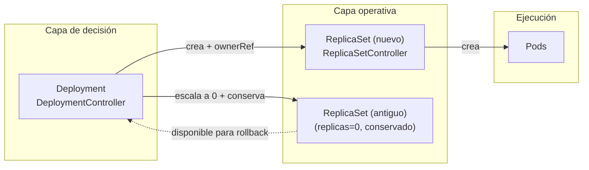

# Deployment a profundidad

Esta semana analiza el `Deployment`,
el controlador más usado en Kubernetes y el ejemplo canónico de reconciliación compuesta.
Un `Deployment` no opera directamente sobre `Pods`:
delega en `ReplicaSets` y gestiona la transición entre ellos.
Entender esa jerarquía —y cómo el `DeploymentController` la coordina—
es clave para cualquier ingeniero que trabaje con Kubernetes en producción.

## Objetivos

Al terminar esta semana serás capaz de:

- Explicar por qué un `Deployment` crea un nuevo `ReplicaSet` en cada rollout
  en lugar de modificar el existente.
- Distinguir los campos `updatedReplicas`, `readyReplicas` y `availableReplicas`
  y saber cuándo su valor difiere.
- Configurar `maxUnavailable` y `maxSurge` según las restricciones de disponibilidad y capacidad.
- Identificar cuándo un rollout está atascado usando las condiciones de `.status`.
- Ejecutar un rollback a una revisión específica y explicar qué cambia y qué no.

## Mapa conceptual

Los cuatro artículos de esta semana siguen el ciclo de vida de un rollout:

El flujo es:

1. Cambio en `.spec.template` → `DeploymentController` crea nuevo `ReplicaSet`.
2. `ReplicaSetController` crea `Pods` para el nuevo `RS`.
3. `DeploymentController` escala hacia abajo el `RS` antiguo.
4. El `.status` refleja cada paso; `rollout status` lo expone al operador.
5. Si algo falla, `rollout undo` restaura el `RS` histórico.

## Patrones de reconciliación en esta semana

| Artículo                 | Patrón principal                     | Novedad respecto a semana 1                  |
| ------------------------ | ------------------------------------ | -------------------------------------------- |
| Relación Deployment ↔ RS | Jerarquía de controladores           | `pod-template-hash`, adopción de Pods        |
| Rollout strategies       | Transición controlada entre estados  | `maxUnavailable`, `maxSurge`, rollover       |
| Deployment status        | Condiciones como señal de estado     | `Progressing`, `Available`, `ReplicaFailure` |
| Rollback y revisiones    | Historia como mecanismo de seguridad | `revisionHistoryLimit`, `rollout undo`       |

## Contenido

### 1 · [La relación Deployment ↔ ReplicaSet](01-deployment-replicaset.md)

Explica por qué el `Deployment` crea `ReplicaSets` en lugar de gestionar `Pods` directamente,
cómo se vinculan con `ownerReferences`,
y cuándo se crea un nuevo `ReplicaSet`.

Conceptos clave: `ownerReference`, `pod-template-hash`, adopción de `Pods`,
`DeploymentController`, `ReplicaSetController`.

### 2 · [Rollouts y estrategias de actualización](02-rollout-strategies.md)

Explica las estrategias `Recreate` y `RollingUpdate`,
los parámetros `maxUnavailable` y `maxSurge`,
el comportamiento de rollover cuando se envían actualizaciones encadenadas,
y cómo pausar y reanudar un rollout.

Conceptos clave: `Recreate`, `RollingUpdate`, `maxUnavailable`, `maxSurge`,
rollover, pausa, `minReadySeconds`.

### 3 · [Gestión del campo status en un Deployment](03-deployment-status.md)

Describe los campos `replicas`, `updatedReplicas`, `readyReplicas`, `availableReplicas`
y las tres condiciones (`Progressing`, `Available`, `ReplicaFailure`).
Explica `progressDeadlineSeconds` y cómo usarlo en pipelines de CI/CD.

Conceptos clave: condiciones de `.status`, `progressDeadlineSeconds`,
`terminatingReplicas` (v1.35+), `minReadySeconds`.

### 4 · [Rollback y revisiones de un Deployment](04-rollback-revisions.md)

Explica el historial de revisiones basado en `ReplicaSets`,
cómo documentar cambios con `kubernetes.io/change-cause`,
cómo ejecutar un rollback a la revisión anterior o a una específica,
y los límites del rollback (no restaura réplicas ni estado externo).

Conceptos clave: `revisionHistoryLimit`, `rollout undo`, `--to-revision`,
`kubernetes.io/change-cause`.
