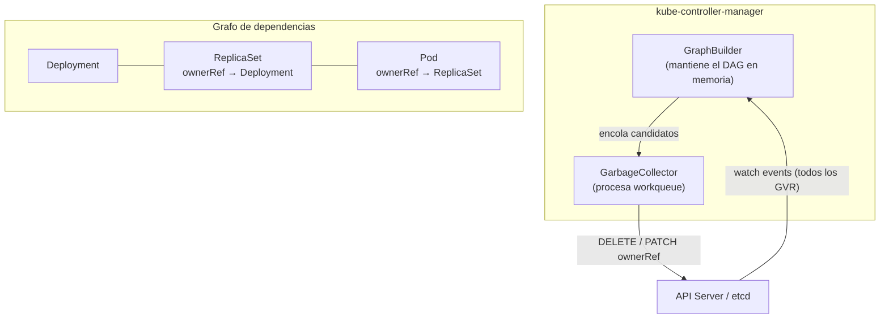

# Reconciliación basada en grafo: Garbage Collector

Esta semana estudia el `GarbageCollector` de Kubernetes,
el controlador responsable de limpiar los objetos que pierden a su propietario.
A diferencia de los controladores de las semanas anteriores —que reconcilian el estado
de un tipo concreto de recurso—,
el `GarbageCollector` opera sobre el grafo de dependencias de **todos** los recursos del clúster.
Entender cómo funciona es fundamental para construir controladores que gestionen correctamente
el ciclo de vida de los objetos secundarios que crean.

## Objetivos

Al terminar esta semana serás capaz de:

- Describir la arquitectura del `GarbageCollector` y la función del `GraphBuilder`.
- Explicar para qué sirve el `uid` en las `ownerReferences`
  y por qué es más fiable que el nombre.
- Distinguir los campos `controller` y `blockOwnerDeletion` en una `ownerReference`.
- Comparar las políticas `Background`, `Foreground` y `Orphan`
  y justificar cuándo usar cada una.
- Describir el flujo interno de borrado foreground paso a paso.

## Mapa conceptual

El flujo es:

1. `GraphBuilder` recibe eventos de todos los recursos y actualiza el grafo.
2. Cuando un propietario desaparece, `GraphBuilder` encola los dependientes.
3. `GarbageCollector` evalúa cada dependiente y aplica la política de propagación.
4. Para borrado en background, borra el dependiente directamente.
5. Para borrado en foreground, espera a que todos los dependientes con
   `blockOwnerDeletion=true` desaparezcan antes de liberar el propietario.
6. Para orphan, elimina la `ownerReference` del dependiente (no lo borra).

## Patrones de reconciliación en esta semana

| Artículo                       | Concepto clave                                                        |
| ------------------------------ | --------------------------------------------------------------------- |
| Grafo de propietarios          | `GraphBuilder`, DAG, tombstones                                       |
| ownerReferences en profundidad | `uid`, `controller`, `blockOwnerDeletion`, restricciones de namespace |
| Políticas de cascada           | `Background`, `Foreground`, `Orphan`, finalizers de sistema           |
| Internos del GarbageCollector  | Workqueue del GC, flujo paso a paso, diferencia con finalizers        |

## Contenido

### 1 · [El grafo de propietarios y el GarbageCollector](01-graph-builder.md)

Introduce el problema de los objetos huérfanos,
explica la arquitectura del `GarbageCollector` (dos componentes: `GraphBuilder` y procesador de workqueue),
y describe cómo el grafo se construye a partir de las `ownerReferences`.

Conceptos clave: `GraphBuilder`, grafo de propietarios (DAG), `DeletedFinalStateUnknown`,
`ownerReference`, huérfano potencial.

### 2 · [ownerReferences y ciclos de dependencia](02-owner-references.md)

Explica los cinco campos de una `ownerReference` (`apiVersion`, `kind`, `name`, `uid`, `controller`,
`blockOwnerDeletion`),
por qué se usa `uid` en lugar de nombre,
las restricciones de namespace,
y la interacción con finalizers.

Conceptos clave: `uid`, `controller: true`, `blockOwnerDeletion`,
restricciones de namespace en ownerReferences,
`SetControllerReference`.

### 3 · [Borrado en cascada: foreground, background y orphan](03-cascade-orphan.md)

Compara las tres políticas de propagación,
explica el comportamiento observable de cada una,
y proporciona guía de cuándo usar cada política.

Conceptos clave: `propagationPolicy`, `Background`, `Foreground`,
`Orphan`, finalizer `foregroundDeletion`, finalizer `orphan`.

### 4 · [Internos del GarbageCollector: foreground vs. background](04-foreground-background-internals.md)

Detalla el flujo interno de procesamiento del `GarbageCollector`,
el algoritmo de evaluación de la workqueue,
el flujo paso a paso del foreground deletion,
y la diferencia entre el `GarbageCollector` y otros mecanismos de limpieza
(finalizers, TTLAfterFinished, kubelet).

Conceptos clave: workqueue del GC, evaluación de ownerReferences,
DAG, `OwnerRefInvalidNamespace`, ciclos de dependencia.
