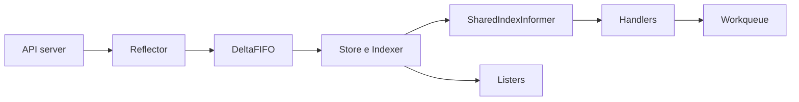

# Informers, cachés y listers en Kubernetes

## Prerequisitos

- [La reconciliación en Kubernetes: fundamentos](01-reconciliation-theory.md)

## El problema de la observación

Un controlador necesita detectar cambios sin ejecutar una consulta periódica
por cada objeto.
La cadena `List` + `Watch` + caché reduce el tráfico al API server y ofrece una
vista local para la reconciliación.

## Flujo completo

El `Reflector` obtiene y observa recursos.
`DeltaFIFO` agrupa cambios, `Store` e `Indexer` mantienen la caché,
`SharedIndexInformer` notifica a los handlers y los listers permiten leer sin
red.
Los eventos solo disparan la reconciliación; el estado actual de la caché guía
la decisión.

## Ruta de profundización

1. [Reflector y ListAndWatch](02a-reflector-list-watch.md)
2. [DeltaFIFO y acumulación de cambios](02b-deltafifo.md)
3. [Store e Indexer](02c-store-indexer.md)
4. [SharedIndexInformer y handlers](02d-shared-index-informer.md)
5. [Listers y consultas locales](02e-listers.md)
6. [SharedInformerFactory y sincronización](02f-informer-factory.md)

## Resumen

La caché local tiene consistencia eventual.
Espera a que el informer se sincronice antes de procesar y tolera objetos que
desaparecen entre una lectura y la siguiente.
Usa listers para leer y clientes del API server para escribir.

## Contenido relacionado

- [Workqueues en Kubernetes](03-workqueues.md)
- [Utilidades de controladores en Kubernetes](04-controller-utilities.md)

## Referencias

- [Paquete `cache` de client-go](https://pkg.go.dev/k8s.io/client-go/tools/cache)
- [Paquete `informers` de client-go](https://pkg.go.dev/k8s.io/client-go/informers)

[← Atrás](01-reconciliation-theory.md) | [Inicio](../README.md) |
[Siguiente →](03-workqueues.md)
