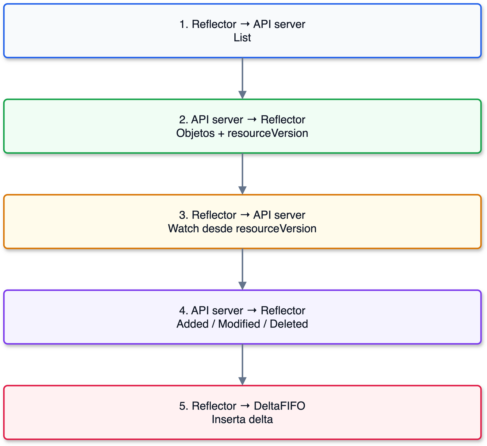

# Reflector y ListAndWatch en Kubernetes

## Prerequisitos

- [Informers, cachés y listers en Kubernetes](02-informers-listers.md)

## Responsabilidad

El `Reflector` es el componente que comunica la caché local con el API server.
Ejecuta `ListAndWatch` para obtener el estado inicial y observar cambios posteriores.

> **Analogía — el guardia de una bodega:**
> El guardia cuenta todo lo que hay al comenzar su turno.
> Después registra cada entrada, modificación o salida en su bitácora.
> Si pierde demasiado tiempo de vigilancia, vuelve a contar la bodega completa.

## Flujo de `ListAndWatch`

1. `List` obtiene los objetos y el `resourceVersion` observado.
2. `Watch` solicita los cambios posteriores a esa versión.
3. Cada evento se convierte en un delta para `DeltaFIFO`.
4. Si el historial ya no está disponible, el `Reflector` ejecuta otro `List`.



## `ResourceVersion`

`resourceVersion` es una cadena que representa la versión observada por el API
server en su almacenamiento interno.
El cliente debe tratarla como un valor opaco y devolverla sin modificar cuando
la use en otra solicitud.

### Para qué lo usa el `Reflector`

El `Reflector` necesita unir dos operaciones que ocurren en momentos distintos:

1. `List` obtiene una fotografía inicial de la colección y guarda el
   `resourceVersion` de esa respuesta.
2. Entre `List` y `Watch` pueden crearse, modificarse o eliminarse objetos.
3. `Watch` recibe ese valor y solicita los eventos posteriores a la fotografía.
4. El `Reflector` entrega esos eventos a `DeltaFIFO`, que actualiza la caché
   hasta que converge con el estado del API server.

Sin ese punto de continuación, el cliente tendría que repetir `List` después
de cada cambio o podría dejar un hueco entre la fotografía inicial y el inicio
de la observación.
Los eventos son disparadores para actualizar la caché;
la fuente de verdad sigue siendo el estado almacenado en el API server.

Por ejemplo, si `List` devuelve `resourceVersion: "10245"`, el `Reflector`
puede iniciar el `Watch` desde `10245`.
Los eventos posteriores pueden llevar los valores `10596`, `11020` y otros,
que el `Reflector` conserva como su nueva posición de observación.

> **Nota:** No compares un `resourceVersion` de un `Pod` con el de un
> `Deployment`.
> Solo puedes razonar sobre el orden de estos valores cuando pertenecen al
> mismo tipo de recurso y al mismo grupo de API.

```bash
kubectl get pod mi-pod -o jsonpath='{.metadata.resourceVersion}'
```

## Límites y recuperación

El `Reflector` no es la fuente de verdad.
La fuente de verdad sigue siendo el API server, mientras que la caché converge
de forma eventual mediante eventos, reconexiones y relist.
El historial de cambios se conserva durante un tiempo limitado.
Si el `Reflector` solicita una versión que el servidor ya no conserva, el API
server responde con `410 Gone`.
En ese caso, el `Reflector` no puede continuar ese `Watch` y debe ejecutar otro
`List` para reconstruir la fotografía de la colección antes de abrir un nuevo
`Watch`.
El `Watch` también puede terminar por un tiempo de espera normal, por lo que
las reconexiones forman parte del funcionamiento esperado.

## Contenido relacionado

- [DeltaFIFO y acumulación de cambios](02b-deltafifo.md)
- [Store e Indexer](02c-store-indexer.md)

## Referencias

- [Paquete `cache` de client-go](https://pkg.go.dev/k8s.io/client-go/tools/cache)
- [Documentación de Kubernetes sobre resource versions](https://kubernetes.io/docs/reference/using-api/api-concepts/#resource-versions)
