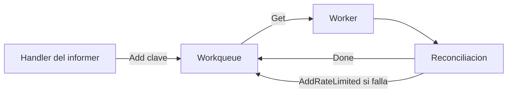

# Workqueues en Kubernetes

## Prerequisitos

- [Informers, cachés y listers en Kubernetes](02-informers-listers.md)
- [La reconciliación en Kubernetes: fundamentos](01-reconciliation-theory.md)

## El problema del procesamiento directo

Un handler de informer no debe ejecutar toda la reconciliación.
En su lugar, encola una clave como `produccion/web` y un worker la procesa de
forma asíncrona.
Así se desacoplan la observación, la deduplicación y el procesamiento.

> **Analogía — una bandeja de pedidos en una taquería:**
> La persona que toma los pedidos anota cada orden y la deja en una bandeja.
> Quien prepara la comida procesa las órdenes a su ritmo y evita preparar varias
> veces la misma actualización pendiente.
> Si una orden falla, vuelve a la bandeja con una espera controlada.

## Ciclo general

La cola no contiene el objeto completo.
Contiene una clave que permite al worker leer el estado más reciente desde un
lister y reconciliar de forma basada en niveles.

## Ruta de profundización

1. [TypedInterface y estado interno](03a-typed-interface.md)
2. [Workers, `Get` y `Done`](03b-workers-get-done.md)
3. [Colas con retraso](03c-delaying-queues.md)
4. [Rate limiters](03d-rate-limiters.md)
5. [Reintentos y `Forget`](03e-retries-forget.md)

## Garantías principales

| Garantía            | Propósito                                                    |
| ------------------- | ------------------------------------------------------------ |
| Deduplicación       | Evita varias entradas pendientes para la misma clave.        |
| Procesamiento único | No entrega una clave a dos workers simultáneamente.          |
| Reencolado seguro   | Conserva un cambio que llega durante el procesamiento.       |
| Backoff             | Reduce la presión sobre el API server ante fallos repetidos. |

## Resumen

El handler observa y encola.
El worker obtiene una clave, consulta la caché, reconcilia, llama a `Done` y
limpia el historial con `Forget` cuando el procesamiento termina correctamente.
La cola coordina el trabajo, pero no reemplaza la lógica de reconciliación.

## Contenido relacionado

- [Informers, cachés y listers en Kubernetes](02-informers-listers.md)
- [Utilidades de controladores en Kubernetes](04-controller-utilities.md)

## Referencias

- [Paquete `workqueue` de client-go](https://pkg.go.dev/k8s.io/client-go/util/workqueue)
- [sample-controller](https://github.com/kubernetes/sample-controller)

[← Atrás](02-informers-listers.md) | [Inicio](../README.md) |
[Siguiente →](04-controller-utilities.md)
