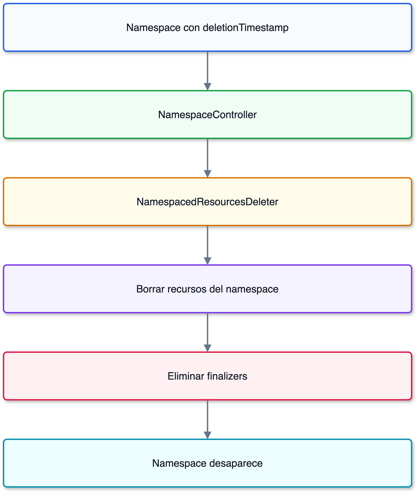

# El controlador de Namespace en Kubernetes

## Prerequisitos

- [La reconciliación en Kubernetes: fundamentos](../module01/01-reconciliation-theory.md)
- [Informers, cachés y listers](../module01/02-informers-listers.md)
- [Workqueues](../module01/03-workqueues.md)

## Qué problema resuelve

El controlador de `Namespace` coordina el borrado de los recursos que viven
dentro de un namespace.
El objeto permanece en `Terminating` hasta que Kubernetes confirma que su
contenido y sus finalizers ya no bloquean el borrado.

> **Analogía — cerrar un negocio:**
> Primero se liquidan sus cuentas, contratos y permisos.
> Solo después se elimina su registro oficial.
> El controlador coordina ese cierre sin depender de una intervención manual.

## Flujo general

## Ruta de profundización

1. [Ciclo de vida y reconciliación](01a-namespace-lifecycle.md)
2. [NamespacedResourcesDeleter](01b-namespaced-resources-deleter.md)
3. [Diagnóstico de namespaces atascados](01c-namespace-diagnosis.md)

## Contenido relacionado

- [Finalizers y ciclo de borrado](../module01/04-controller-utilities.md)
- [Borrado en cascada](../module04/03-cascade-orphan.md)

## Referencias

- [Namespaces en Kubernetes](https://kubernetes.io/docs/concepts/overview/working-with-objects/namespaces/)
- [Código del controlador de Namespace](https://github.com/kubernetes/kubernetes/tree/master/pkg/controller/namespace)

[← Atrás](../module01/04-controller-utilities.md) | [Inicio](../README.md) |
[Siguiente →](02-token-cleaner.md)
