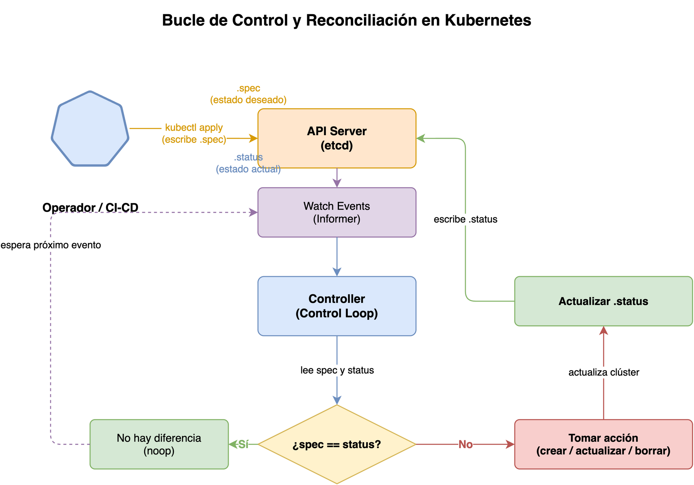
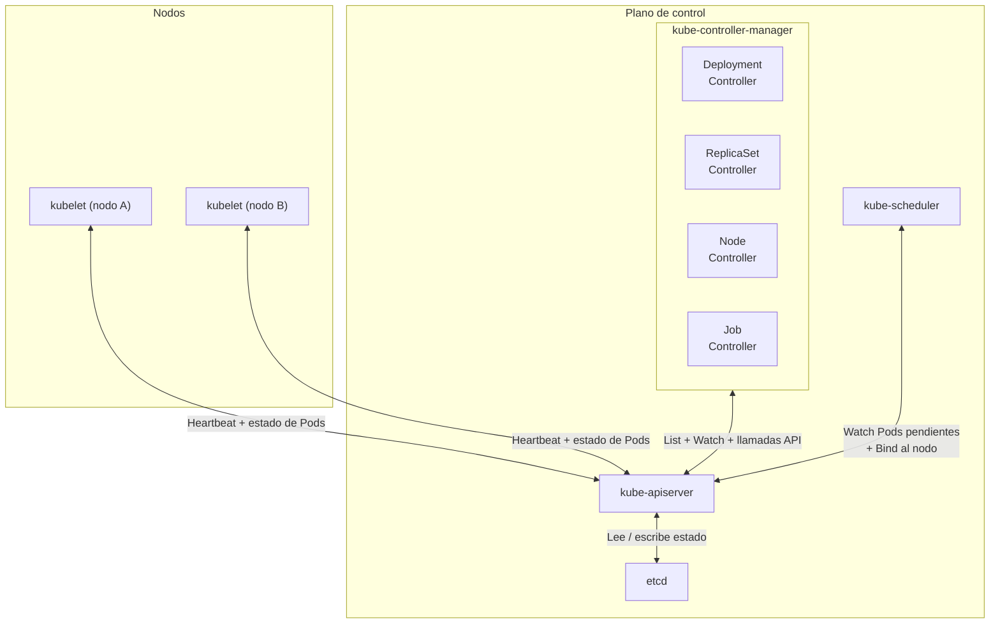
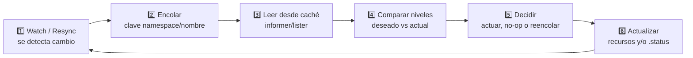
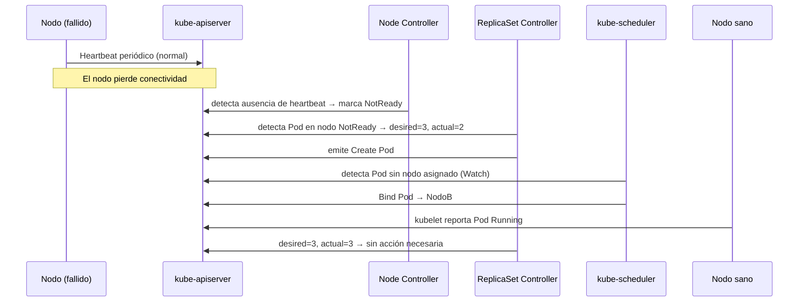

## Prerequisitos

- Saber qué es un contenedor.
- Tener nociones básicas de Kubernetes (qué es un `Pod`, un `Deployment`).

¿Por qué Kubernetes puede "curarse solo" cuando un `Pod` falla?
¿Qué mecanismo interno garantiza que el clúster siempre intente converger
al estado que tú declaraste?
Esta explicación responde esas preguntas describiendo el _bucle de control_
y el patrón de **reconciliación**,
que es el corazón arquitectónico de Kubernetes.

## El problema que resuelve

Los sistemas distribuidos fallan constantemente.
Un nodo puede perder conectividad,
un contenedor puede salir de forma inesperada,
o un operador puede aplicar una configuración errónea.

> **Analogía — el jardinero y el huerto:**
> Imagina un jardinero que quiere mantener exactamente 10 plantas de tomate.
> Si una se seca, no escribe un informe ni espera instrucciones:
> simplemente planta una nueva.
> Si por accidente se añaden 12, arranca las dos sobrantes.
> Nunca hay que pedirle que "corrija" la situación;
> solo sabe el objetivo y actúa para lograrlo continuamente.
> Los controladores de Kubernetes son ese jardinero.

Sin un mecanismo de corrección continua,
cada fallo requeriría intervención manual.
Kubernetes lo resuelve con una premisa simple:
**el clúster siempre debe intentar alcanzar el estado deseado,**
sin importar cuántas veces falle en el intento.

## Estado deseado y estado actual

Todo recurso de Kubernetes tiene dos perspectivas que coexisten en la API:

| Perspectiva        | Campo en la API | Quién lo escribe          | Descripción                                    |
| ------------------ | --------------- | ------------------------- | ---------------------------------------------- |
| **Estado deseado** | `.spec`         | Tú (o tu herramienta CI)  | Lo que declaras que quieres                    |
| **Estado actual**  | `.status`       | Los controladores/kubelet | Lo que el clúster reporta que existe en verdad |

Cuando describes un `Deployment` con `replicas: 3`,
estás declarando el estado deseado.
Si uno de esos tres `Pod` cae,
el estado actual refleja `replicas: 2`.
Esa diferencia es la que dispara la reconciliación.

> **Nota:** El campo `.spec` es tuyo — tú lo escribes.
> El campo `.status` es del sistema — los controladores lo actualizan.

Puedes inspeccionar ambos campos en cualquier momento:

```bash
# Ver el estado deseado (spec) y el actual (status) de un Deployment
kubectl get deployment mi-app -o jsonpath='{"deseado: "}{.spec.replicas}{"\nactual: "}{.status.availableReplicas}{"\n"}'
```

## El bucle de control



En automatización y robótica,
un _bucle de control_ (_control loop_) es un ciclo sin fin
que observa el estado de un sistema
y toma acciones para corregir las desviaciones que detecta.

El ejemplo clásico es el termostato:

- Tú defines la temperatura deseada (por ejemplo, 22 °C).
- El termostato mide la temperatura actual.
- Si la actual es menor, enciende la calefacción.
- Cuando se alcanza la temperatura deseada, la apaga.
- El ciclo se repite indefinidamente.

Kubernetes aplica exactamente este principio a escala de clúster.

> **Analogía — el termostato de un datacenter:**
> Imagina ahora ese mismo termostato controlando no una habitación,
> sino miles de servidores a la vez.
> Cada rack tiene su temperatura deseada en la configuración;
> el sistema central mide constantemente cada uno
> y activa o desactiva la refrigeración donde sea necesario.
> Eso es Kubernetes: miles de "termostatos" independientes
> (los controladores), cada uno responsable de su dominio,
> ajustando el clúster hacia el estado declarado.

**El bucle no es un proceso secuencial único.**
En Kubernetes, muchos bucles de control corren en paralelo al mismo tiempo,
cada uno para un tipo de recurso distinto.

## Los controladores

Un _controlador_ (_controller_) es un bucle de control especializado
que vigila uno o más tipos de recursos de Kubernetes
y toma acciones para acercar el estado actual al estado deseado.

No existe un único bucle de reconciliación global para todo el clúster.
Existen múltiples controladores independientes,
cada uno con su propia lógica,
su propia cola de trabajo
y sus propios trabajadores procesando elementos en paralelo.
Por eso puedes tener al mismo tiempo al controlador de `Deployment`,
al de `ReplicaSet`
y al de `Node`
reconciliando recursos distintos de forma concurrente.

Kubernetes incluye decenas de controladores integrados
que se ejecutan dentro del componente `kube-controller-manager`.
Cada controlador es responsable de un aspecto específico del clúster:



| Controlador     | Recursos que observa (informers) | Recursos que gestiona | Función principal                                                         |
| --------------- | -------------------------------- | --------------------- | ------------------------------------------------------------------------- |
| **Deployment**  | Deployment, ReplicaSet, Pod      | ReplicaSet            | Mantener el estado deseado de la aplicación (rollouts, updates, rollback) |
| **ReplicaSet**  | ReplicaSet, Pod                  | Pod                   | Mantener un número deseado de Pods con base en label selectors            |
| **Job**         | Job, Pod                         | Pod                   | Ejecutar tareas batch hasta completarse                                   |
| **DaemonSet**   | DaemonSet, Pod, Node             | Pod                   | Asegurar que haya un Pod por nodo elegible                                |
| **StatefulSet** | StatefulSet, Pod, PVC            | Pod, PVC              | Mantener identidad estable y almacenamiento persistente por réplica       |

Un controlador **no** ejecuta contenedores directamente.
Su responsabilidad es hablar con el `kube-apiserver`:
observar cambios, calcular la diferencia con el estado deseado,
y emitir llamadas a la API para crear, actualizar o eliminar recursos.
Este diseño desacoplado permite que los controladores fallen y se reinicien
sin perder consistencia.

### El ciclo de reconciliación

El núcleo de cada controlador es su función de reconciliación.
La reconciliación en Kubernetes es principalmente **level-based**:
el controlador decide qué hacer comparando el estado observado ahora
contra el estado deseado,
no por el tipo exacto de evento que llegó primero.

> **Analogía — level-based vs edge-based:**
> En electrónica, un circuito _edge-based_ reacciona al momento exacto
> en que una señal cambia de 0 a 1 (el "flanco").
> Si te pierdes ese flanco, no sabes qué ocurrió.
> Un circuito _level-based_ mide el nivel actual de la señal en cada instante
> y actúa según lo que ve ahora, no según cuándo cambió.
> Kubernetes usa el segundo enfoque:
> aunque pierdas un evento, la reconciliación posterior
> mide el estado real y toma la decisión correcta de todos modos.

Los eventos (_add/update/delete_) se usan como **disparadores**
para encolar claves de recursos,
pero la decisión final se toma leyendo el estado actual desde caché.
Por eso,
aunque se pierda un evento puntual,
el siguiente evento o una resincronización periódica
puede volver a encolar el recurso y corregir la desviación.

Cada iteración suele verse así:



### Modelo de `watch`, `informer` y `workqueue` en el plano de control

Los controladores no consultan el API server en cada iteración.
En su lugar usan tres piezas que trabajan juntas:

- **`watcher`** sobre el API server: recibe eventos de cambio en tiempo real.
- **`informer`/`lister`**: mantiene una caché local indexada para lecturas rápidas.
- **`workqueue`**: desacopla recepción de eventos y ejecución de reconciliación.

El flujo operativo típico es este:

1. El informer hace un `List` inicial para poblar caché.
2. El watcher mantiene un `Watch` continuo y actualiza esa caché.
3. Cada cambio relevante encola una clave lógica del recurso.
4. Un trabajador toma la clave,
   lee el estado actual desde caché,
   y ejecuta reconciliación.
5. Si hay error transitorio,
   la clave se reencola con _backoff_.

Este diseño permite alta concurrencia,
reduce carga sobre `kube-apiserver`
y evita que ráfagas de eventos saturen la lógica del controlador.

Los informers son componentes que:

- **Sincronizan** una caché local con el estado del API server al arrancar.
- **Observan** cambios mediante una conexión de larga duración (_watch_).
- **Notifican** al controlador solo cuando hay cambios en los recursos relevantes.

Este mecanismo evita sobrecargar el API server
y hace que la reconciliación sea eficiente
incluso con miles de recursos en el clúster.

## Convergencia eventual

La reconciliación es **eventual**:
el clúster no garantiza que el estado deseado se alcance de forma inmediata,
sino que los controladores **siguen intentándolo** hasta lograrlo.

> **Analogía — el GPS recalculando la ruta:**
> Cuando sigues el GPS y te equivocas de salida,
> el sistema no se rinde ni protesta.
> Recalcula la ruta desde donde estás ahora
> y te sigue guiando hacia el destino.
> No importa cuántas veces te equivoques:
> cada vez que recalcula, parte del estado actual.
> Kubernetes hace lo mismo: si un Pod falla, se reinicia el cálculo
> de "¿cómo llego al estado deseado?"
> sin importar cuántos fallos ocurrieron antes.

En cualquier momento dado,
el clúster puede estar en un estado de transición.
Lo que Kubernetes garantiza es que,
siempre que los controladores estén activos y puedan hacer cambios útiles,
el sistema converge hacia el estado deseado.

Esta propiedad tiene consecuencias importantes:

- Los controladores se diseñan con **idempotencia** —
  reconciliar el mismo estado dos veces no produce efectos distintos.
- Si un controlador falla y se reinicia,
  simplemente lee el estado actual y reconcilia desde ahí.
- Múltiples controladores pueden coexistir sin interferirse,
  porque cada uno solo atiende los recursos vinculados a su tipo.

También implica matices prácticos:

- Un controlador puede decidir **no actuar inmediatamente**
  si detecta que aún falta información,
  que una dependencia no está lista,
  o que conviene esperar un reintento con _backoff_.
- El resultado de reconciliar puede ser **no-op**
  (sin cambios)
  cuando el estado actual ya cumple lo deseado.
- El orden temporal de eventos no siempre coincide con el orden de observación
  por parte de cada controlador;
  por eso el modelo level-based es clave para mantener consistencia lógica.

> **Nota:** En producción,
> "eventual" significa "converge cuando las condiciones lo permiten",
> no "converge instantáneamente".

## Ejemplo práctico: escalado de Deployment

Este ejemplo muestra dos controladores independientes actuando en cadena.

**Paso 1 — Cambias el objetivo.**
Aplicas un `Deployment` de `replicas: 3` a `replicas: 5`.
Aquí solo cambias `.spec` del `Deployment`.

**Paso 2 — Reconciliación del Deployment Controller.**
El controlador de `Deployment` observa la diferencia,
reconcilia,
y actualiza el `ReplicaSet` objetivo para reflejar el nuevo tamaño.

**Paso 3 — Reconciliación del ReplicaSet Controller.**
En paralelo,
el controlador de `ReplicaSet` compara su deseado (`5`)
con su actual (`3`)
y crea dos `Pod` adicionales.

**Paso 4 — Programación y ejecución.**
El `kube-scheduler` asigna los nuevos `Pod` a nodos,
y los `kubelet` de esos nodos arrancan los contenedores.

**Paso 5 — Estado estable.**
Cuando `.status.availableReplicas` llega a `5`,
los controladores mantienen vigilancia,
pero no realizan más acciones.

## Un ejemplo concreto: fallo de nodo

Considera este escenario con un `Deployment` de tres réplicas:

**Paso 1 — Estado estable.**
El controlador de `Deployment` ha creado un `ReplicaSet`,
que a su vez tiene tres `Pod` corriendo en tres nodos distintos.

**Paso 2 — Fallo de nodo.**
Uno de los nodos pierde conectividad.
Su `kubelet` deja de enviar _heartbeats_.
Tras el tiempo de gracia,
el controlador de nodos marca ese nodo como `NotReady`.

**Paso 3 — Detección de la diferencia.**
El controlador del `ReplicaSet` detecta que uno de sus `Pod`
está en un nodo `NotReady`.
Encola una reconciliación.

**Paso 4 — Acción correctiva.**
Al reconciliar: `deseado = 3`, `actual = 2`.
Emite una llamada al API server para crear un nuevo `Pod`.

**Paso 5 — Convergencia.**
El `kube-scheduler` asigna el nuevo `Pod` a un nodo sano.
El `kubelet` de ese nodo lo inicia.
El controlador reconcilia de nuevo: `deseado = 3`, `actual = 3`.
No hay acción necesaria.

Todo este proceso ocurre automáticamente,
sin intervención humana,
en cuestión de segundos.



## Controladores personalizados y el patrón Operator

El mismo patrón es extensible más allá de los recursos nativos.
Kubernetes permite definir nuevos tipos de recursos
mediante `CustomResourceDefinition` (`CRD`)
y asociarles un controlador personalizado (_custom controller_).

Un _Operator_ es la combinación de un `CRD`
con un controlador que codifica el conocimiento operacional de una aplicación.
Por ejemplo,
un Operator de base de datos puede gestionar copias de seguridad,
actualizaciones de versión y recuperación ante fallos
con la misma filosofía de reconciliación que usa `Deployment`.

## Por qué este diseño es robusto

El patrón de reconciliación tiene propiedades arquitectónicas destacadas:

| Propiedad           | Descripción                                                                |
| ------------------- | -------------------------------------------------------------------------- |
| **Idempotencia**    | Reconciliar el mismo estado dos veces no produce efectos distintos.        |
| **Recuperabilidad** | Si un controlador cae y se reinicia, continúa desde el estado actual.      |
| **Desacoplamiento** | Cada controlador es independiente; un fallo en uno no afecta a los demás.  |
| **Observabilidad**  | El estado siempre es legible en `.status`, lo que facilita el diagnóstico. |
| **Extensibilidad**  | El mismo patrón se aplica a recursos nativos y a recursos personalizados.  |

## Preguntas de repaso

Antes de continuar con la siguiente sesión,
intenta responder las siguientes preguntas:

1. ¿Qué diferencia hay entre el estado deseado en `.spec` y el estado actual en `.status`?
2. ¿Por qué Kubernetes necesita varios controladores y no un único bucle global?
3. ¿Qué ocurre cuando el estado actual se aleja del estado deseado?
4. ¿Cómo ayuda el bucle de control a que Kubernetes se recupere de fallos?

Si no puedes responder alguna pregunta con confianza,
revisa nuevamente el contenido de la sesión antes de avanzar.

## Lo que aprendí hoy

Hoy entendí que Kubernetes funciona como alguien que revisa una lista de pendientes
una y otra vez: compara lo que pedí en `.spec` con lo que realmente está pasando
en `.status` y corrige la diferencia.
No necesita recordar cada paso anterior,
porque puede mirar el estado actual y volver a acercarlo al objetivo.
Eso explica por qué el sistema puede recuperarse de un fallo y por qué la
reconciliación debe ser idempotente: repetir la misma revisión no debe causar
un cambio inesperado.

Este patrón es el punto de partida para entender cómo Kubernetes observa
el estado y decide cuándo reconciliarlo.

## Glosario

| Término                      | Definición breve                                                                                         |
| ---------------------------- | -------------------------------------------------------------------------------------------------------- |
| `bucle de control`           | Ciclo continuo que compara estado deseado y actual, y toma acciones correctivas.                         |
| `controlador`                | Componente que implementa un bucle de control para un tipo de recurso específico.                        |
| `estado deseado`             | Configuración declarada por el usuario en el campo `.spec` de un recurso.                                |
| `estado actual`              | Estado reportado por el sistema en el campo `.status` de un recurso.                                     |
| `reconciliación`             | Proceso de calcular y eliminar la diferencia entre estado deseado y estado actual.                       |
| `informer`                   | Componente que sincroniza una caché local con el API server y notifica cambios vía _watch_.              |
| `workqueue`                  | Cola de trabajo del controlador donde se encolan claves de recursos para reconciliar con reintentos.     |
| `level-based reconciliation` | Enfoque donde el controlador decide por comparación de estado actual vs deseado, no por el evento bruto. |
| `kube-controller-manager`    | Proceso del plano de control que ejecuta todos los controladores integrados de Kubernetes.               |
| `CRD`                        | `CustomResourceDefinition` — mecanismo para definir nuevos tipos de recursos en Kubernetes.              |
| `Operator`                   | Patrón de extensión que combina un `CRD` con un controlador personalizado para gestionar aplicaciones.   |
| `convergencia eventual`      | Garantía de que el sistema alcanzará el estado deseado si los controladores permanecen activos.          |

## Referencias

- [Documentación oficial: Controladores](https://kubernetes.io/docs/concepts/architecture/controller/) —
  kubernetes.io
- [Código fuente: `pkg/controller`](https://github.com/kubernetes/kubernetes/tree/master/pkg/controller) —
  github.com/kubernetes/kubernetes
- [Repositorio de ejemplo: `sample-controller`](https://github.com/kubernetes/sample-controller) —
  github.com/kubernetes/sample-controller
- [Documentación oficial: Gestión de cargas de trabajo](https://kubernetes.io/docs/concepts/workloads/controllers/) —
  kubernetes.io

## Siguiente paso

[Informers, cachés y listers en Kubernetes](02-informers-listers.md) →
explica cómo los controladores observan el clúster de forma eficiente
sin saturar el API server, y describe cada pieza de la cadena `Reflector` → `DeltaFIFO` → `Indexer` → `SharedIndexInformer`.

[Inicio](../README.md) | [Siguiente →](02-informers-listers.md)
