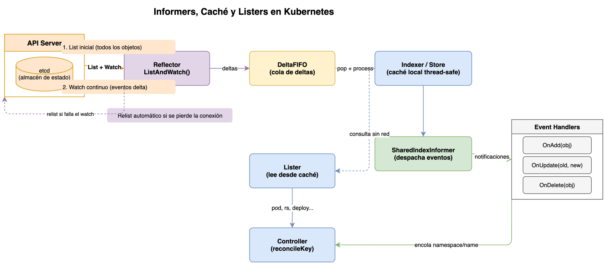
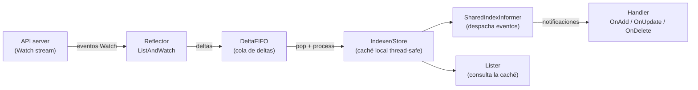

¿Cómo sabe un controlador que algo cambió en el clúster
sin consultar el API server en cada iteración?
¿Por qué los controladores pueden procesar decenas de miles de recursos
sin colapsar la API?
¿Por qué el código de un controlador nunca llama a `GET /api/v1/pods`
para leer el estado de un Pod?
Esta explicación responde esas preguntas describiendo el subsistema de
observación del lado del cliente:
_informers_, `Reflector`, `Store`, `Indexer` y _listers_.

## Prerequisitos

- [La reconciliación en Kubernetes: fundamentos](01-reconciliation-theory.md)

## El problema de escalar la observación

Un controlador necesita reaccionar a cambios en recursos de Kubernetes.
La opción más ingenua sería hacer una llamada `List` periódica al API server,
pero eso no escala:
con miles de controladores y miles de objetos,
el API server quedaría saturado de peticiones redundantes.

> **Analogía — el banco y las alertas de movimiento:**
> Imagina que tienes una cuenta bancaria y cada minuto llamas al banco
> para preguntar si hubo algún movimiento.
> Ahora multiplica eso por mil clientes llamando cada segundo.
> El banco colapsaría.
> La solución inteligente es que el banco te envíe una notificación
> solo cuando ocurre un cargo o un abono.
> Eso es exactamente `List`+`Watch`:
> obtienes el estado inicial (_List_) una sola vez,
> y después el API server te avisa de cada cambio (_Watch_).

Kubernetes resuelve esto con un modelo **observar-y-cachear**:
los controladores no consultan directamente al API server;
en cambio, mantienen una copia local sincronizada,
y el API server solo les envía deltas de cambio.

La tabla siguiente compara las estrategias posibles:

| Estrategia                          | Carga sobre el API server | Latencia de reacción | Resiliente ante desconexión |
| ----------------------------------- | ------------------------- | -------------------- | --------------------------- |
| `List` periódico (_polling_)        | Alta y constante          | Alta (≥ intervalo)   | No pierde cambios           |
| `Watch` puro (sin caché)            | Baja en estado estable    | Baja (< 1 s)         | Pierde cambios si se cae    |
| `List` + `Watch` + caché (Informer) | Mínima                    | Muy baja (< 1 s)     | Sí: relist automático       |

## Arquitectura del subsistema de caché



El subsistema se construye como una cadena de componentes,
cada uno con una responsabilidad clara:



### Trazando un ejemplo: un Pod nuevo del Deployment `web`

Para que la cadena anterior no quede abstracta,
sigue el mismo `Pod` a través de cada componente.
Un `Deployment` llamado `web` en el `namespace` `produccion` escala de 3 a 4 réplicas,
y el `ReplicaSetController` crea el `Pod` `web-7d8f9-x4k2p`:

1. **Reflector** — recibe el evento `Added` desde el `Watch` del API server
   y calcula que la clave del `Pod` es `produccion/web-7d8f9-x4k2p`.
2. **DeltaFIFO** — inserta un `Delta{Type: Added, Object: <Pod>}`
   bajo esa clave.
   Si el `Pod` cambia de fase (`Pending` → `Running`) antes de procesarse,
   se agrega un segundo `Delta{Type: Updated}` a la misma entrada.
3. **Indexer/Store** — al procesar la entrada,
   guarda el objeto en la caché local
   y lo registra en el índice `NamespaceIndex` bajo la clave `produccion`.
4. **SharedIndexInformer** — despacha el evento a todos los handlers registrados:
   el controlador de `ReplicaSet` (que ya sabe que creó este `Pod`)
   y cualquier otro controlador que observe `Pod` en ese `namespace`.
5. **Handler** — el `AddFunc` del `ReplicaSetController` encola la clave
   del `ReplicaSet` propietario (no la del `Pod`) en su workqueue,
   para recalcular cuántas réplicas están `Ready`.
6. **Lister** — minutos después, cuando el controlador de `Deployment` reconcilia,
   consulta `podLister.Pods("produccion").List(selector)`
   y encuentra el `Pod` `web-7d8f9-x4k2p` sin hacer ninguna llamada de red.

Este recorrido explica por qué el `Reflector` es el único punto de tráfico real
hacia el API server:
todo lo que ocurre después —`DeltaFIFO`, `Indexer`, `Lister`— es trabajo en memoria.

### Reflector

El `Reflector` es el único componente del subsistema que genera tráfico de red real.
Se conecta al API server y traduce los eventos de la red en deltas internos.

> **Analogía — el vigilante de almacén:**
> El `Reflector` funciona como un vigilante que empieza su turno
> recorriendo el almacén y anotando en un cuaderno cada artículo existente
> (llamada `List`).
> Después se sienta en la entrada y registra cada objeto que entra o sale
> (conexión `Watch`).
> Si se queda dormido y pierde varios eventos,
> no intenta adivinar qué cambió:
> vuelve a recorrer el almacén completo desde cero
> para garantizar que su cuaderno está actualizado (_relist_).

Su trabajo es:

1. Hacer una llamada `List` inicial para obtener todos los objetos
   y su `ResourceVersion`.
2. Abrir una conexión `Watch` a partir de esa `ResourceVersion`.
3. Por cada evento recibido (`Added`, `Modified`, `Deleted`),
   insertar un delta en el `DeltaFIFO`.
4. Si la conexión se cae, reconectarse y reanudar desde el último
   `ResourceVersion` conocido.

El `Reflector` garantiza que ningún cambio se pierda:
si la conexión se interrumpe demasiado tiempo para reconectar sin perder eventos,
hace un nuevo `List` completo (_relist_).

El timeout del `Watch` se elige aleatoriamente entre 5 y 10 minutos,
lo que distribuye la carga de reconexión entre múltiples controladores.
Si el `ListAndWatch` falla, el `Reflector` usa **backoff exponencial**:
comienza en 800 ms, se duplica con cada fallo,
llega a un máximo de 30 s,
y se reinicia a cero si el API server estuvo saludable durante 2 minutos seguidos.

**¿Qué es la ResourceVersion?**

El `ResourceVersion` es un valor opaco asignado por el API server
que identifica un instante concreto en el historial del `etcd`.
Cada objeto tiene su propia `ResourceVersion`, que cambia con cada modificación.
Al abrir un `Watch` con esa `ResourceVersion`,
el API server solo envía los eventos _a partir de ese punto_,
evitando reenviar cambios que el `Reflector` ya conoce.

> **Nota:** No compares `ResourceVersion` entre objetos distintos
> ni las interpretes como números de versión absolutos.
> Son marcadores opacos del `etcd`,
> válidos solo dentro del mismo tipo de recurso y clúster.

Puedes inspeccionar el valor de cualquier objeto con:

```bash
kubectl get pod mi-pod -o jsonpath='{.metadata.resourceVersion}'
```

### DeltaFIFO

El `DeltaFIFO` es una cola que acumula los cambios por objeto.
A diferencia de una cola simple,
agrupa todos los cambios pendientes para la misma clave bajo una entrada única,
llamada `Deltas`.

> **Analogía — el extracto bancario:**
> Una cola normal es como ver solo el saldo actual de tu cuenta:
> sabes dónde estás, pero no cómo llegaste ahí.
> El `DeltaFIFO` es el extracto bancario:
> registra cada movimiento en orden cronológico.
> Si en 5 minutos hubo un depósito, un retiro y otro depósito,
> el controlador ve los tres en secuencia, no solo el saldo final.
> La secuencia importa porque puede cambiar la lógica
> de lo que el controlador debe hacer.

Cada `Delta` tiene un tipo:

| Tipo       | Cuándo ocurre                                                                                            |
| ---------- | -------------------------------------------------------------------------------------------------------- |
| `Added`    | El objeto apareció por primera vez.                                                                      |
| `Updated`  | El objeto fue modificado.                                                                                |
| `Deleted`  | El objeto fue eliminado (puede llevar un `DeletedFinalStateUnknown`).                                    |
| `Replaced` | Tras un relist, el objeto fue reemplazado. Solo si `EmitDeltaTypeReplaced=true`; si no, se emite `Sync`. |
| `Sync`     | Resincronización periódica (sin cambio real en el API server).                                           |
| `Bookmark` | Evento de marcador para propagar el `ResourceVersion` sin datos de objeto.                               |

El `DeltaFIFO` resuelve un problema importante:
si el mismo objeto se modifica varias veces mientras espera en la cola,
todos esos cambios se preservan en orden,
y el consumidor los ve todos de una vez al procesar la entrada.

#### Ejemplo: múltiples cambios en la misma clave

Supón que el usuario modifica un `ConfigMap` dos veces seguidas
antes de que el controlador las procese.
En una cola FIFO normal, la segunda modificación sobreescribiría a la primera.
En el `DeltaFIFO`, ambas quedan registradas bajo la misma clave:

```text
Deltas["default/mi-configmap"] = [
  {Type: Updated, Object: <versión 2>},
  {Type: Updated, Object: <versión 3>},
]
```

El controlador las procesa en orden y puede comparar `oldObj` con `newObj`
en cada paso para entender exactamente qué campo cambió.

> **Nota sobre `Replaced` vs `Sync`:** Versiones antiguas de `DeltaFIFO` usaban `Sync`
> para ambos tipos de evento.
> La distinción se introdujo para que el controlador pueda diferenciar
> entre un objeto que _realmente_ cambió (relist) y uno que simplemente se reenvía periódicamente.

### ThreadSafeStore e Indexer

El `Store` es la caché local donde el `Reflector` almacena el estado actual
de cada objeto.
Es una estructura _thread-safe_ (segura para acceso concurrente),
lo que permite leer desde múltiples goroutines sin bloqueos explícitos.

> **Analogía — la biblioteca con catálogo de fichas:**
> El `Store` es el fondo bibliográfico completo:
> cada libro tiene un número de catalogación único (`namespace/name`)
> que permite acceder directamente a él.
> El `Indexer` añade los ficheros de catálogo temáticos:
> puedes encontrar todos los libros de ciencias (_namespace_ "production")
> sin hojear uno por uno todos los libros del fondo.

El `Indexer` extiende el `Store` con la capacidad de indexar objetos
por campos arbitrarios,
lo que permite hacer consultas eficientes del tipo
"dame todos los `Pod` en el `namespace` X".

El índice más común es `NamespaceIndex`,
que indexa los objetos por su campo `metadata.namespace`.

```go
// Ejemplo de uso del Indexer — consulta por namespace
pods, err := indexer.ByIndex(cache.NamespaceIndex, "production")
```

También puedes definir índices personalizados.
Por ejemplo, indexar `Pod` por el nodo en que están programados:

```go
// Función de indexación: clave = nombre del nodo
func indexByNode(obj interface{}) ([]string, error) {
    pod, ok := obj.(*corev1.Pod)
    if !ok {
        return nil, fmt.Errorf("tipo inesperado: %T", obj)
    }
    if pod.Spec.NodeName == "" {
        return nil, nil // Pod sin nodo asignado aún
    }
    return []string{pod.Spec.NodeName}, nil
}

// Registro del índice personalizado en el informer
indexer.AddIndexers(cache.Indexers{
    "byNode": indexByNode,
})

// Consulta: todos los Pods programados en "worker-01"
pods, err := indexer.ByIndex("byNode", "worker-01")
```

Internamente, el `Indexer` mantiene dos estructuras:

- `Indexers`: un mapa de nombre de índice → función de indexación.
- `Indices`: un mapa de nombre de índice → mapa de valor indexado → conjunto de claves.

La complejidad de una consulta por índice es O(1) para encontrar el índice
y O(n) para recuperar los n objetos resultantes,
lo que es mucho más eficiente que iterar sobre todos los objetos del `Store`.

### SharedIndexInformer

El `SharedIndexInformer` es la pieza que une todo.
Combina un `Reflector`, un `DeltaFIFO` y un `Indexer` en un único objeto
que puede ser compartido por **múltiples controladores al mismo tiempo**.

> **Analogía — la suscripción compartida al periódico:**
> Imagina que en una oficina de 10 personas cada una compra su propio periódico.
> El contenido es idéntico para todas,
> pero el gasto se multiplica por 10.
> El `SharedIndexInformer` es el ejemplar compartido:
> una sola conexión `Watch` al API server,
> y cada controlador recibe su propio "apartado de noticias" (handler)
> del mismo flujo de eventos.

"Compartido" es la clave:
en lugar de que cada controlador tenga su propio `Reflector` y su propia conexión
`Watch` al API server,
todos los controladores interesados en el mismo tipo de recurso comparten
una sola instancia del `SharedIndexInformer`.
Esto reduce drásticamente la carga sobre el API server.

El `SharedIndexInformer` permite registrar múltiples `ResourceEventHandler`,
uno por cada controlador:

```go
// Los manejadores de eventos se registran con AddEventHandler
informer.AddEventHandler(cache.ResourceEventHandlerFuncs{
    AddFunc: func(obj interface{}) {
        // obj es el objeto nuevo; se encola su clave en el workqueue
    },
    UpdateFunc: func(oldObj, newObj interface{}) {
        // oldObj es el estado anterior; newObj es el nuevo
    },
    DeleteFunc: func(obj interface{}) {
        // obj puede ser DeletedFinalStateUnknown si se perdió el evento
    },
})
```

> **Nota:** Los manejadores reciben los objetos **por referencia**.
> **No se deben modificar**.
> Si necesitas modificar el objeto, crea primero una copia profunda.

`AddEventHandler` retorna un `ResourceEventHandlerRegistration`,
que permite dos operaciones importantes:

```go
registration, err := informer.AddEventHandler(cache.ResourceEventHandlerFuncs{
    // ...
})

// HasSynced del registration es más preciso que el del informer:
// retorna true cuando el handler específico ha recibido todos los
// objetos del List inicial, no solo cuando el informer los procesó.
if !registration.HasSynced() {
    // este handler aún no vio todos los objetos del List inicial
}

// Los handlers se pueden eliminar dinámicamente
informer.RemoveEventHandler(registration)
```

> **Importante:** `informer.HasSynced()` indica que el informer completó el `List` inicial.
> `registration.HasSynced()` indica que _este handler en particular_
> recibió todos esos eventos.
> Prefiere `registration.HasSynced()` para garantías más fuertes.

### Sincronización inicial: HasSynced

Cuando arranca un controlador,
el `SharedIndexInformer` necesita completar su `List` inicial
antes de que el controlador empiece a reconciliar.
De lo contrario, el controlador podría actuar sobre un estado incompleto.

La función `cache.WaitForNamedCacheSync` bloquea hasta que la caché esté lista:

```go
// El controlador espera a que la caché esté sincronizada antes de procesar
if !cache.WaitForNamedCacheSync("mi-controlador", stopCh, informer.HasSynced) {
    return // la caché no se sincronizó; no continúes
}
```

### Resincronización periódica (resync)

Además del `Watch` continuo,
el `SharedIndexInformer` puede reenviar periódicamente _todos los objetos en caché_
a los handlers,
generando eventos `Sync` sin que haya cambios reales en el API server.

Esto sirve para que los controladores detecten y reparen derivas
que podrían haberse perdido por errores de procesamiento previos.
Cada handler puede tener su propio período de resync:

```go
// Este handler se resincroniza cada 30 segundos
informer.AddEventHandlerWithResyncPeriod(handler, 30*time.Second)

// Este otro no solicita resync (cero = no quiero resync)
informer.AddEventHandlerWithResyncPeriod(otroHandler, 0)
```

> **Nota:** El resync no genera tráfico al API server.
> Solo reenvía objetos de la caché local a los handlers.
> Es trabajo puramente en memoria.

### TransformFunc: reducir consumo de memoria

El `SharedIndexInformer` acepta una `TransformFunc` opcional
que se invoca sobre cada objeto _antes_ de almacenarlo en la caché.
Su uso principal es eliminar campos que el controlador no necesita,
reduciendo el consumo de RAM:

```go
informer.SetTransform(func(obj interface{}) (interface{}, error) {
    // Eliminar el campo ManagedFields que raramente necesitan los controladores
    if accessor, err := meta.Accessor(obj); err == nil {
        accessor.SetManagedFields(nil)
    }
    return obj, nil
})
```

> **Advertencia:** La `TransformFunc` debe ser idempotente.
> Se ejecuta en el camino crítico de cada evento entrante;
> no realices operaciones lentas dentro de ella.

## Listers: consultas a la caché local

Un _lister_ es un objeto generado automáticamente (con `code-generator`)
que proporciona una interfaz tipada y segura para consultar el `Indexer`.

> **Analogía — el catálogo en línea de la biblioteca:**
> Buscar un libro recorriendo físicamente todos los estantes es lento.
> El catálogo en línea (el _lister_) ofrece una interfaz estructurada
> para encontrar el libro por título, autor o tema,
> sin necesidad de saber cómo está organizado el fondo bibliográfico.
> Además, consulta su base de datos local
> sin contactar al proveedor cada vez que alguien busca un libro.

En lugar de llamar directamente a `indexer.ByIndex(...)` con cadenas de texto,
un lister expone métodos del tipo:

```go
// Lister generado para Pods
podLister PodLister  // interfaz generada por code-generator

// Listar todos los Pods en un namespace
pods, err := podLister.Pods("production").List(labels.Everything())

// Obtener un Pod por nombre
pod, err := podLister.Pods("production").Get("mi-pod")

// Filtrar por etiquetas con un selector
selector := labels.SelectorFromSet(labels.Set{"app": "frontend"})
frontendPods, err := podLister.Pods("production").List(selector)
```

Los listers nunca hacen llamadas al API server.
**Siempre leen de la caché local**.
Esto es una decisión de diseño fundamental:
los controladores deben preferir los listers a los clientes directos
para las operaciones de lectura.

### Lister vs. cliente directo: cuándo usar cada uno

| Situación                                         | Usa                   | Motivo                                         |
| ------------------------------------------------- | --------------------- | ---------------------------------------------- |
| Leer el estado de un recurso en el loop           | Lister                | Sin latencia de red; no carga el API server    |
| Verificar si un recurso existe antes de crearlo   | Lister                | Mismo motivo                                   |
| Crear, actualizar o eliminar un recurso           | Cliente (`clientset`) | Las escrituras siempre van al API server       |
| Necesitar el estado _garantizadamente_ más fresco | Cliente con `Get`     | La caché puede tardar segundos en actualizarse |

> **Advertencia:** Usar el cliente para _leer_ dentro del loop de reconciliación
> introduce latencia de red innecesaria y aumenta la carga sobre el API server.
> Reserva el cliente para escrituras y para casos donde la consistencia
> fuerte sea imprescindible.

## SharedInformerFactory: gestión centralizada

En un programa real con múltiples controladores,
cada tipo de recurso debería compartir un único `SharedIndexInformer`.
La `SharedInformerFactory` es el mecanismo que garantiza esto.

> **Analogía — el departamento de IT centralizado:**
> En lugar de que cada equipo de la empresa contrate su propio acceso a internet,
> el departamento de IT gestiona una sola conexión y la distribuye a todos.
> La `SharedInformerFactory` hace lo mismo:
> administra todas las conexiones `Watch` del proceso
> y garantiza que no haya instancias duplicadas para el mismo tipo de recurso.

```go
// Una sola factory por proceso, con un intervalo de resincronización
factory := informers.NewSharedInformerFactory(clientset, 30*time.Second)

// Múltiples controladores obtienen el mismo informer para cada tipo
podInformer := factory.Core().V1().Pods()
deploymentInformer := factory.Apps().V1().Deployments()

// Todos los informers arrancan a la vez
factory.Start(stopCh)
factory.WaitForCacheSync(stopCh) // espera a que todos estén sincronizados
```

También puedes limitar el ámbito a un solo `namespace`
cuando el controlador no necesita observar el clúster completo:

```go
// Factory con ámbito de namespace — reduce objetos en caché
namespacedFactory := informers.NewSharedInformerFactoryWithOptions(
    clientset,
    30*time.Second,
    informers.WithNamespace("production"),
)
```

O aplicar filtros de etiquetas para reducir aún más el volumen:

```go
// Factory que solo observa Pods con la etiqueta app=frontend
filteredFactory := informers.NewSharedInformerFactoryWithOptions(
    clientset,
    30*time.Second,
    informers.WithTweakListOptions(func(opts *metav1.ListOptions) {
        opts.LabelSelector = "app=frontend"
    }),
)
```

> **Advertencia:** No crees un `SharedIndexInformer` directamente para un tipo
> si ya existe una `SharedInformerFactory` para ese proceso.
> Usar dos informers separados para el mismo recurso duplica la carga
> sobre el API server.

## Flujo completo de un evento

Veamos qué ocurre cuando alguien ejecuta `kubectl delete pod mi-pod`:

**Paso 1 — El API server emite el evento.**
La conexión `Watch` del `Reflector` recibe un evento `Deleted` para `mi-pod`.

**Paso 2 — El Reflector inserta el delta.**
El `Reflector` llama a `DeltaFIFO.Delete(pod)`.
El `DeltaFIFO` crea una entrada `{Deleted, pod}` para la clave `default/mi-pod`.

> **Caso especial — `DeletedFinalStateUnknown`:**
> Si la conexión `Watch` se cayó antes de recibir el evento `Deleted`,
> el `Reflector` hará un relist.
> Si el objeto ya no está en la lista pero sí estaba en la caché,
> el `Reflector` genera un delta `Deleted` con un objeto de tipo
> `DeletedFinalStateUnknown{Key: "default/mi-pod", Obj: <último estado conocido>}`.
> Los handlers deben detectar este tipo en `DeleteFunc`:
>
> ```go
> DeleteFunc: func(obj interface{}) {
>     // Detectar si fue un borrado "tombstone" por pérdida de eventos Watch
>     if d, ok := obj.(cache.DeletedFinalStateUnknown); ok {
>         obj = d.Obj // usar el último estado conocido
>     }
>     key, _ := cache.MetaNamespaceKeyFunc(obj)
>     queue.Add(key)
> },
> ```

**Paso 3 — El procesador consume el delta.**
El `SharedIndexInformer` tiene un hilo interno que hace `DeltaFIFO.Pop()`.
Para cada delta:

- Actualiza el `Indexer` (elimina el objeto de la caché local).
- Llama a `OnDelete(pod)` en todos los `ResourceEventHandler` registrados.

**Paso 4 — El controlador encola la clave.**
El manejador `OnDelete` típicamente solo encola la clave del objeto
en un `workqueue` para procesarla después de forma asíncrona.

**Paso 5 — El controlador reconcilia.**
Más adelante, el hilo del controlador saca la clave del `workqueue`
y ejecuta la función de reconciliación,
que lee el estado actual usando el lister
(confirmando que el pod ya no existe).

## Resumen: qué hace cada componente

| Componente              | Paquete                        | Responsabilidad                                                  |
| ----------------------- | ------------------------------ | ---------------------------------------------------------------- |
| `Reflector`             | `k8s.io/client-go/tools/cache` | Sincroniza la caché con el API server vía List+Watch.            |
| `DeltaFIFO`             | `k8s.io/client-go/tools/cache` | Cola que acumula deltas de cambio por objeto.                    |
| `Indexer`               | `k8s.io/client-go/tools/cache` | Almacén thread-safe con índices para consultas eficientes.       |
| `SharedIndexInformer`   | `k8s.io/client-go/tools/cache` | Combina los anteriores y los comparte entre controladores.       |
| `SharedInformerFactory` | `k8s.io/client-go/informers`   | Garantiza una sola instancia de informer por tipo.               |
| _Lister_                | Código generado                | Interfaz tipada para consultar la caché sin tocar el API server. |

## Por qué este diseño es correcto

El subsistema de informers tiene propiedades arquitectónicas muy importantes:

| Propiedad                 | Descripción                                                                                     |
| ------------------------- | ----------------------------------------------------------------------------------------------- |
| **Reducción de carga**    | Un `Watch` por tipo de recurso en lugar de N `List` periódicos.                                 |
| **Consistencia eventual** | La caché converge al estado del API server; los controladores actúan sobre una vista coherente. |
| **Desacoplamiento**       | Los controladores no necesitan saber cómo se obtiene el estado; solo leen la caché.             |
| **Seguridad ante fallos** | Si la conexión Watch cae, el Reflector reconecta y hace relist automáticamente.                 |
| **Compartición**          | Múltiples controladores reutilizan el mismo informer, eliminando trabajo duplicado.             |

## Preguntas de repaso

Antes de continuar con la siguiente sesión,
intenta responder las siguientes preguntas:

1. ¿Qué papel cumple cada pieza de la cadena `Reflector` → `DeltaFIFO` → `Indexer` → `Lister`?
2. ¿Por qué un `SharedIndexInformer` reduce la carga sobre el API server?
3. ¿Qué riesgo tiene leer datos desde la caché si todavía no se ha sincronizado?
4. ¿Cómo ayuda `WaitForCacheSync` a evitar errores de reconciliación?

Si no puedes responder alguna pregunta con confianza,
revisa nuevamente el contenido de la sesión antes de avanzar.

## Glosario

| Término                            | Definición breve                                                                                                  |
| ---------------------------------- | ----------------------------------------------------------------------------------------------------------------- |
| `Reflector`                        | Componente que ejecuta `ListAndWatch` contra el API server y escribe deltas en el `DeltaFIFO`.                    |
| `DeltaFIFO`                        | Cola que agrupa cambios sucesivos del mismo objeto en una lista de `Delta` ordenada.                              |
| `Store`                            | Almacén thread-safe de objetos de Kubernetes, accesible por clave `namespace/name`.                               |
| `Indexer`                          | Extensión del `Store` que permite consultas por campos indexados (p. ej., namespace).                             |
| `SharedIndexInformer`              | Informer compartible que combina `Reflector`, `DeltaFIFO` e `Indexer`.                                            |
| `SharedInformerFactory`            | Fábrica que garantiza una sola instancia de `SharedIndexInformer` por tipo de recurso.                            |
| `Lister`                           | Interfaz generada automáticamente para consultar la caché local de forma tipada.                                  |
| `ResourceEventHandler`             | Interfaz con los métodos `OnAdd`, `OnUpdate` y `OnDelete` que notifican cambios a los controladores.              |
| `HasSynced`                        | Función que retorna `true` cuando el informer ha completado su primer `List` y procesado todos sus items.         |
| `ResourceEventHandlerRegistration` | Handle retornado por `AddEventHandler`; tiene su propio `HasSynced` por handler y permite `RemoveEventHandler`.   |
| `DeletedFinalStateUnknown`         | Envoltorio que el `Reflector` usa cuando detecta un borrado por relist pero no tuvo el evento `Deleted` original. |
| `TransformFunc`                    | Función opcional que transforma objetos antes de almacenarlos en caché; usada para reducir RAM.                   |
| `ResourceVersion`                  | Valor opaco que el API server asigna a cada versión de un objeto; usado para reanudar un `Watch`.                 |
| `relist`                           | Nuevo `List` completo que hace el `Reflector` cuando no puede reanudar el `Watch` sin perder eventos.             |
| resync                             | Reenvío periódico de todos los objetos en caché a los handlers, sin consultar el API server.                      |
| backoff exponencial                | Estrategia del `Reflector` para reconectarse: 800 ms inicial, máximo 30 s, reset tras 2 min de éxito.             |

## Referencias

- [Código fuente: `k8s.io/client-go/tools/cache`](https://github.com/kubernetes/client-go/tree/master/tools/cache) —
  github.com/kubernetes/client-go
- [Documentación del paquete `cache`](https://pkg.go.dev/k8s.io/client-go/tools/cache) —
  pkg.go.dev
- [Código fuente: `k8s.io/client-go/informers`](https://github.com/kubernetes/client-go/tree/master/informers) —
  github.com/kubernetes/client-go
- [sample-controller: ejemplo canónico de informer + workqueue](https://github.com/kubernetes/sample-controller) —
  github.com/kubernetes/sample-controller

## Siguiente paso

[Workqueues en Kubernetes](03-workqueues.md) →
explica por qué los controladores no procesan eventos del informer directamente
y qué garantías aporta la cola de trabajo: deduplicación, procesamiento único y reintentos con backoff.

[← Atrás](01-reconciliation-theory.md) | [Inicio](../README.md) | [Siguiente →](03-workqueues.md)
