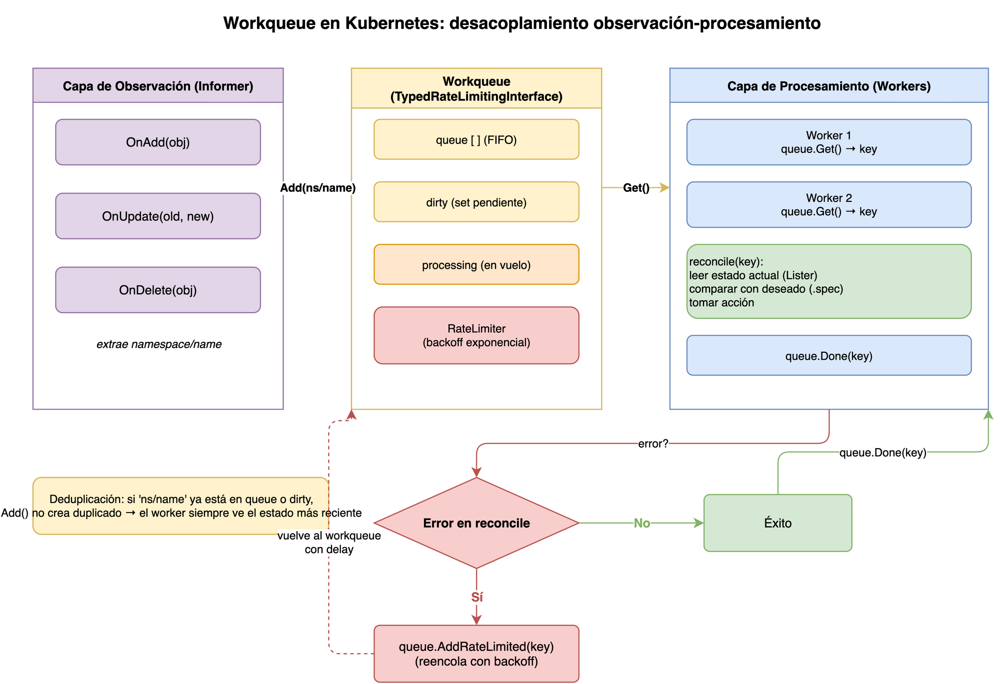
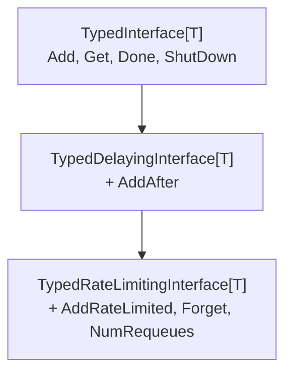

## Prerequisitos

- [Informers, cachés y listers en Kubernetes](02-informers-listers.md)

¿Por qué los controladores no procesan los eventos del informer directamente?
¿Qué pasa si el mismo recurso cambia diez veces antes de que el controlador
termine de procesarlo?
¿Cómo evitar saturar el API server cuando hay muchos errores consecutivos?
Esta explicación describe el workqueue,
la pieza que desacopla la observación del procesamiento.

## El problema del procesamiento directo

Cuando un informer llama a `OnAdd` o `OnUpdate`,
ese llamado ocurre en el hilo del informer.
Si el controlador hiciera todo su trabajo ahí —
consultar el API server, comparar estados, aplicar cambios —
habría varios problemas:

- **Acumulación:** si el procesamiento es lento,
  los nuevos eventos se bloquean esperando que termine el anterior.
- **Duplicados innecesarios:** si el mismo objeto cambia varias veces seguidas,
  el controlador haría trabajo redundante para versiones intermedias del objeto.
- **Reintentos naïve:** ante un error, el controlador tendría que reintentar
  inmediatamente, generando bucles rápidos que saturan el API server.

> **Analogía — el restaurante y la bandeja de pedidos:**
> Imagina un cocinero que sale a la sala en cuanto llega cada pedido,
> atiende al cliente en el acto y vuelve.
> Si llegan 30 pedidos a la vez, colapsa.
> La solución real es la **bandeja de comandas**:
> el camarero anota el pedido (encola la clave),
> y el cocinero trabaja a su ritmo con la siguiente comanda cuando
> termina la anterior.
> Si el mismo cliente pide varias veces lo mismo,
> la comanda se actualiza sin duplicarse.
> Eso es el workqueue.

La solución es un **workqueue**:
el manejador de eventos solo encola una clave (`namespace/name`),
y uno o más hilos trabajadores la procesan de forma asíncrona.

## Ejemplo guía: escalar un Deployment

Para no perderte entre interfaces y estructuras abstractas,
usaremos el mismo escenario concreto en toda esta explicación:
un `Deployment` llamado `web` en el namespace `produccion`.

1. Un usuario ejecuta `kubectl scale deployment/web -n produccion --replicas=5`.
2. El informer del `Deployment` recibe el evento `OnUpdate`
   y llama al manejador del controlador.
3. El manejador **no** procesa el escalado ahí mismo;
   solo encola la clave `produccion/web` en el workqueue.
4. Antes de que un worker recoja la clave,
   otro usuario corrige el comando a `--replicas=3`.
   El informer dispara un segundo `OnUpdate` para el mismo objeto.
5. Un worker libre llama a `queue.Get()`,
   obtiene la clave `produccion/web` **una sola vez**,
   y reconcilia el estado deseado (3 réplicas) contra el `ReplicaSet` real.

Este flujo —una clave, varios cambios, un solo procesamiento— es exactamente
lo que las siguientes secciones explican con las estructuras internas del workqueue.

## TypedInterface: la cola básica



La interfaz fundamental del workqueue es `TypedInterface[T]`.
Para los controladores, `T` suele ser `string` (la clave del objeto).

```go
type TypedInterface[T comparable] interface {
    Add(item T)           // encola el item; si ya está pendiente, no lo duplica
    Len() int             // número de items pendientes
    Get() (T, bool)       // bloquea hasta obtener un item; bool=true si shutdown
    Done(item T)          // marca el item como procesado
    ShutDown()            // señala el cierre; los workers terminarán al vaciar la cola
    ShutDownWithDrain()   // igual que ShutDown pero espera que todos estén Done
    ShuttingDown() bool   // retorna true si se llamó a ShutDown
}
```

Las propiedades clave de esta cola son:

| Propiedad               | Descripción                                                                                                  |
| ----------------------- | ------------------------------------------------------------------------------------------------------------ |
| **FIFO justo**          | Los items se procesan en el orden en que fueron encolados.                                                   |
| **Deduplicación**       | Si un item se encola dos veces antes de ser obtenido con `Get`, solo se procesa una vez.                     |
| **Procesamiento único** | Un item que ya fue obtenido con `Get` no puede procesarse en paralelo otra vez hasta que se llame a `Done`.  |
| **Reencolado seguro**   | Si el item se vuelve a encolar mientras está siendo procesado, se reprocesará una vez que se llame a `Done`. |

> **Analogía — la casilla de entrada de correo:**
> Si recibes el mismo email tres veces antes de leerlo,
> el buzón inteligente no te muestra tres copias: te muestra una.
> Cuando la abres (Get), el mensaje deja de estar "sin leer"
> y no puede abrirse en otra ventana simultánea.
> Cuando la cierras (Done), si llegó una nueva versión del mismo hilo
> mientras la leías, aparece como no leida de nuevo.
> Eso es exactamente `dirty` + `processing` + `queue`.

Internamente la cola mantiene tres estructuras:

- **`queue`** (`[]T`): orden FIFO de los items listos para procesar.
- **`dirty`** (`set[T]`): items encolados pero aún no procesados.
  Un item que llega mientras está en `processing` se agrega a `dirty` pero no a `queue` todavía.
- **`processing`** (`set[T]`): items actualmente en manos de un worker (entre `Get` y `Done`).

Cuando se llama a `Done(item)`,
si `item` está en `dirty` (llegó un nuevo cambio mientras se procesaba),
se mueve automáticamente a `queue` para su reprocesamiento.
Así se garantiza que ningún cambio se pierda aunque el controlador esté ocupado.

### Trazando el ejemplo del Deployment `web`

Retomando el escenario anterior, así se mueve la clave `produccion/web`
entre las tres estructuras internas:

| Paso                                    | `queue`           | `dirty`           | `processing`      |
| --------------------------------------- | ----------------- | ----------------- | ------------------ |
| 1. Llega el evento de `--replicas=5`   | `[produccion/web]` | `{produccion/web}` | `{}`                |
| 2. Llega el evento de `--replicas=3`   | `[produccion/web]` | `{produccion/web}` | `{}` (no se duplica) |
| 3. Un worker llama a `Get()`           | `[]`               | `{}`               | `{produccion/web}`  |
| 4. El worker aún reconcilia y llega un tercer cambio (`--replicas=4`) | `[]` | `{produccion/web}` | `{produccion/web}` |
| 5. El worker llama a `Done()`          | `[produccion/web]` | `{}`               | `{}` (se reencola por el cambio del paso 4) |

Así, aunque el `Deployment` cambió tres veces,
el controlador solo reconcilia dos veces:
una con el estado que encontró al llamar a `Get`,
y otra con el estado final tras el reencolado automático del paso 5.

### El ciclo del trabajador

El patrón estándar de un hilo trabajador (_worker_) es:

```go
func (c *Controlador) runWorker(ctx context.Context) {
    for c.processNextItem(ctx) { // procesa en bucle hasta que la cola se cierre
    }
}

func (c *Controlador) processNextItem(ctx context.Context) bool {
    // Bloquea hasta obtener un item o hasta que se cierre la cola
    key, shutdown := c.queue.Get()
    if shutdown {
        return false // señal de parada
    }
    defer c.queue.Done(key) // siempre marca como Done al salir

    err := c.reconcile(ctx, key)
    if err != nil {
        c.queue.AddRateLimited(key) // reintenta respetando el rate limiter
        return true
    }

    c.queue.Forget(key) // elimina el historial de fallos del rate limiter
    return true
}
```

Para nuestro ejemplo, `key` llega como `"produccion/web"`.
El método `reconcile` haría algo como:

```go
func (c *Controlador) reconcile(ctx context.Context, key string) error {
    namespace, name, _ := cache.SplitMetaNamespaceKey(key) // "produccion", "web"

    deployment, err := c.deploymentLister.Deployments(namespace).Get(name)
    if apierrors.IsNotFound(err) {
        return nil // el Deployment fue eliminado; nada que hacer
    }

    // Compara réplicas deseadas (deployment.Spec.Replicas) contra el ReplicaSet real
    // y aplica los cambios necesarios (crear, escalar o eliminar Pods).
    return c.syncReplicaSet(ctx, deployment)
}
```

El `defer c.queue.Done(key)` es crítico.
Si se omite, el workqueue creería que el item sigue siendo procesado,
y nunca lo volvería a encolar aunque llegaran nuevos cambios.
El `defer` garantiza que `Done` se llame incluso si `reconcile` entra en pánico (`panic`).

## TypedDelayingInterface: reintentos con retraso

La `TypedDelayingInterface[T]` extiende la cola básica con un método adicional:

```go
type TypedDelayingInterface[T comparable] interface {
    TypedInterface[T]
    AddAfter(item T, duration time.Duration) // encola el item después de la duración indicada
}
```

Esto permite implementar reintentos con retraso fijo
sin recurrir a `time.Sleep` en el hilo trabajador:

```go
// Reintentar en 5 segundos sin bloquear el worker
c.queue.AddAfter(key, 5*time.Second)
```

Sin embargo, en la práctica se prefiere el rate limiter,
que ajusta el retraso automáticamente según el historial de fallos.

## TypedRateLimitingInterface: reintentos inteligentes

La `TypedRateLimitingInterface[T]` es la variante más usada en controladores reales.
Combina la `TypedDelayingInterface[T]` con un `TypedRateLimiter[T]`:

```go
type TypedRateLimitingInterface[T comparable] interface {
    TypedDelayingInterface[T]
    AddRateLimited(item T)      // encola respetando el tiempo que dice el rate limiter
    Forget(item T)              // borra el historial de fallos del item en el rate limiter
    NumRequeues(item T) int     // número de veces que el item ha sido reencolado por fallos
}
```

El `TypedRateLimiter[T]` decide cuánto tiempo esperar antes de volver a encolar
un item que falló:

```go
type TypedRateLimiter[T comparable] interface {
    When(item T) time.Duration  // ¿cuánto tiempo debe esperar este item?
    Forget(item T)              // borra el historial de este item
    NumRequeues(item T) int     // ¿cuántas veces ha fallado?
}
```

## Los rate limiters disponibles

Kubernetes incluye cuatro implementaciones de `TypedRateLimiter[T]`:

### TypedItemExponentialFailureRateLimiter

Implementa backoff exponencial por item:
$\text{espera} = \text{baseDelay} \times 2^{\text{numFallos}}$

- El primer fallo espera `baseDelay` (normalmente 5ms).
- El décimo fallo espera hasta `maxDelay` (normalmente 1000s).

Es el componente de backoff que evita que un error persistente
genere un bucle rápido contra el API server.

En nuestro ejemplo, imagina que reconciliar `produccion/web` falla
porque el `ServiceAccount` que usan sus Pods todavía no existe
(quizás lo está creando otro controlador en paralelo).
El primer reintento espera 5 ms, el segundo 10 ms, el tercero 20 ms,
y así sucesivamente, hasta que el `ServiceAccount` aparezca
y la reconciliación tenga éxito.

> **Analogía — el reinicio tras un apagón:**
> Imagina que todos los dispositivos de un edificio intentan conectarse
> a internet en cuanto se restituye la luz.
> Si todos reintentaran cada segundo, el router colapsaría.
> La solución es que cada dispositivo espere un tiempo aleatorio
> que crece con cada fallo:
> 1 s, luego 2 s, luego 4 s, etc.
> El `TypedItemExponentialFailureRateLimiter` aplica exactamente eso
> por cada item individual.

### TypedBucketRateLimiter

Implementa el algoritmo de _token bucket_ (cubo de fichas).
Controla el ritmo **global** de encolado,
independientemente de si el item falló antes o no.

> **Analogía — el cubo de fichas:**
> Imagina una máquina expendedora de fichas.
> El cubo empieza lleno (10 fichas = burst).
> Cada reconciliación consume una ficha.
> El cubo se recarga a un ritmo de 10 fichas por segundo.
> Si el cubo se vacía, debes esperar a que se recargue.
> Esto permite ráfagas cortas a máxima velocidad
> pero impone un límite sostenido.

El `DefaultTypedControllerRateLimiter` usa un cubo configurado con
10 fichas y una tasa de recarga de 10 fichas por segundo.
Esto significa que el controlador puede procesar un máximo de 10 items
de golpe,
pero a largo plazo no puede exceder 10 reconciliaciones por segundo
en total.

Si además de `produccion/web` se despliegan otros 20 Deployments a la vez
(por ejemplo, durante un `kubectl apply -f` masivo),
el cubo de fichas limita cuántos de esos 20 se reconcilian de inmediato
y cuántos deben esperar su turno,
sin importar si cada uno individualmente tuvo éxito o fallo previo.

### TypedItemFastSlowRateLimiter

Hace reintentos rápidos para los primeros N fallos,
y luego cambia a reintentos lentos.
Es útil cuando se espera que la mayoría de los errores sean transitorios
y se resuelvan en los primeros intentos.

### TypedMaxOfRateLimiter

Combina múltiples rate limiters y aplica el más restrictivo.
Es la implementación usada por `DefaultTypedControllerRateLimiter`:
aplica tanto el backoff exponencial por item
como el cubo de fichas global.

## DefaultTypedControllerRateLimiter: el estándar

La función de conveniencia `DefaultTypedControllerRateLimiter[T]()` retorna
un `TypedMaxOfRateLimiter` que combina:

- `TypedItemExponentialFailureRateLimiter` con `baseDelay=5ms` y `maxDelay=1000s`.
- `TypedBucketRateLimiter` con **10 fichas** (_burst_) y tasa de recarga de **10 items/s**.

Esto significa que el controlador puede disparar hasta 10 reconciliaciones rápidas de golpe,
pero a largo plazo no puede superar 10 reconciliaciones totales por segundo.
Un item que falla por primera vez esperará 5 ms;
si falla 10 veces, esperará más de 5 segundos.

```go
// Crear una cola con el rate limiter estándar para controladores
queue := workqueue.NewTypedRateLimitingQueueWithConfig(
    workqueue.DefaultTypedControllerRateLimiter[string](),
    workqueue.TypedRateLimitingQueueConfig[string]{
        Name: "mi-controlador", // nombre para métricas Prometheus
    },
)
```

## El papel de Forget

`Forget` es un detalle que los desarrolladores nuevos a menudo olvidan,
pero que tiene un impacto importante en el comportamiento del controlador.

Cuando la reconciliación **tiene éxito**,
se debe llamar a `queue.Forget(key)`.
Esto le indica al rate limiter que borre el historial de fallos de ese item.
Si no se llama,
el rate limiter seguirá recordando los fallos anteriores,
y los siguientes reintentos —aunque sean exitosos a la primera—
esperarán un tiempo cada vez mayor.

```go
// Patrón correcto de manejo de errores con rate limiter
if err := c.reconcile(ctx, key); err != nil {
    c.queue.AddRateLimited(key) // reintenta con backoff
    return true
}
// Éxito: limpia el historial de fallos
c.queue.Forget(key)
c.queue.Done(key)
```

> **Advertencia:** `Forget` solo borra el historial del rate limiter.
> No retira el item de la cola si ya fue encolado con `AddRateLimited`.
> `Done` sigue siendo necesario para completar el ciclo de procesamiento.

## Resumen: jerarquía de colas



| Tipo de cola                    | Cuándo usarla                                                           |
| ------------------------------- | ----------------------------------------------------------------------- |
| `TypedInterface[T]`             | Procesamiento simple sin reintentos controlados.                        |
| `TypedDelayingInterface[T]`     | Reintentos con retraso fijo conocido de antemano.                       |
| `TypedRateLimitingInterface[T]` | **Caso habitual** — reintentos con backoff automático y control global. |

## Preguntas de repaso

Antes de continuar con la siguiente sesión,
intenta responder las siguientes preguntas:

1. ¿Por qué una workqueue usa la clave del objeto y no el objeto completo?
2. ¿Qué problema resuelven la deduplicación y el ordenamiento implícito de la cola?
3. ¿Qué hace un rate limiter cuando una reconciliación falla varias veces?
4. ¿Cuándo conviene llamar a `Forget` y por qué?

Si no puedes responder alguna pregunta con confianza,
revisa nuevamente el contenido de la sesión antes de avanzar.

## Glosario

| Término                                  | Definición breve                                                                                        |
| ---------------------------------------- | ------------------------------------------------------------------------------------------------------- |
| `TypedInterface[T]`                      | Interfaz base del workqueue: FIFO justo, deduplicado y con protección contra procesamiento simultáneo.  |
| `TypedDelayingInterface[T]`              | Extiende `TypedInterface` con `AddAfter` para encolar con retraso fijo.                                 |
| `TypedRateLimitingInterface[T]`          | Extiende `TypedDelayingInterface` con `AddRateLimited` y `Forget` para reintentos con backoff.          |
| `TypedRateLimiter[T]`                    | Interfaz que decide cuánto tiempo debe esperar un item antes de ser reencolado.                         |
| `TypedItemExponentialFailureRateLimiter` | Rate limiter que aplica backoff exponencial por item: `baseDelay × 2^numFallos`.                        |
| `TypedBucketRateLimiter`                 | Rate limiter global basado en token bucket; limita el ritmo total de encolado.                          |
| `TypedMaxOfRateLimiter`                  | Combina varios rate limiters y aplica el más restrictivo en cada caso.                                  |
| `DefaultTypedControllerRateLimiter`      | Combinación estándar de exponential + bucket, recomendada para la mayoría de los controladores.         |
| `Forget`                                 | Método del rate limiter que borra el historial de fallos de un item tras una reconciliación exitosa.    |
| backoff exponencial                      | Estrategia de reintento que aumenta exponencialmente el tiempo de espera tras cada fallo.               |
| token bucket                             | Algoritmo de control de tasa que permite ráfagas cortas pero limita el ritmo sostenido.                 |
| deduplicación                            | Garantía del workqueue de que un mismo item no se procesa dos veces en paralelo ni se encola duplicado. |

## Referencias

- [Documentación del paquete `workqueue`](https://pkg.go.dev/k8s.io/client-go/util/workqueue) —
  pkg.go.dev
- [Código fuente: `k8s.io/client-go/util/workqueue`](https://github.com/kubernetes/client-go/tree/master/util/workqueue) —
  github.com/kubernetes/client-go
- [sample-controller: uso de workqueue en práctica](https://github.com/kubernetes/sample-controller) —
  github.com/kubernetes/sample-controller

## Siguiente paso

[Utilidades de controladores en Kubernetes](04-controller-utilities.md) →
describe las funciones del paquete `controllerutil` para gestionar `ownerReferences`,
finalizers y operaciones idémpotentes de creación (`CreateOrUpdate`, `CreateOrPatch`).

[← Atrás](02-informers-listers.md) | [Inicio](../README.md) | [Siguiente →](04-controller-utilities.md)
