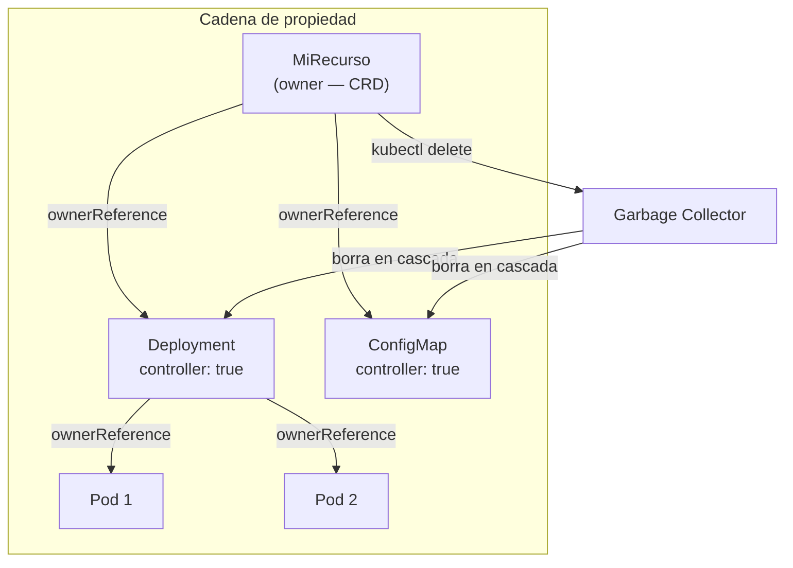
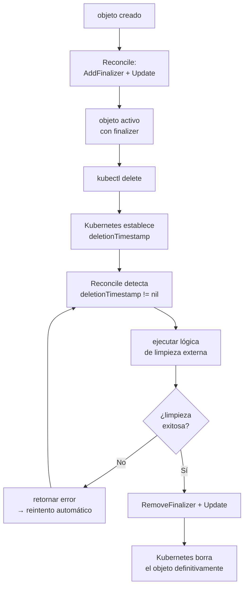
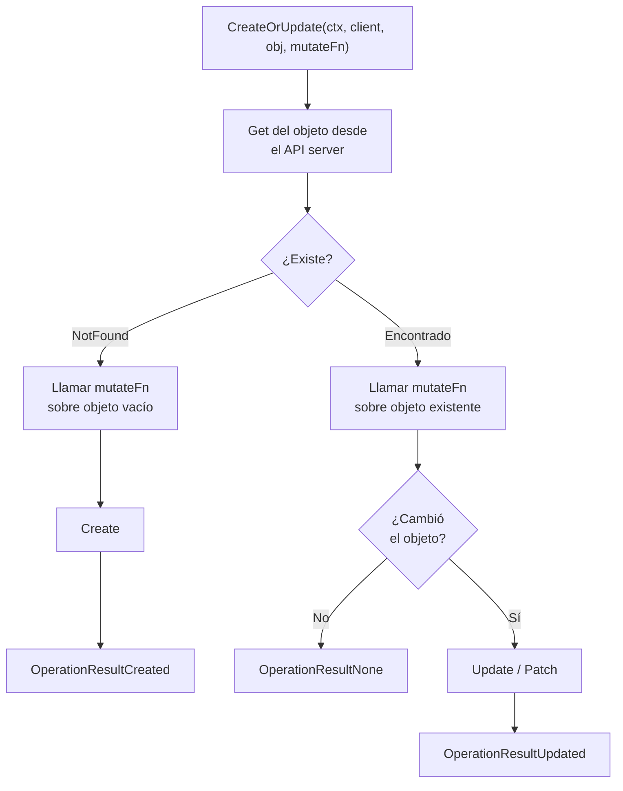

## Prerequisitos

- [Informers, cachés y listers en Kubernetes](02-informers-listers.md)
- [Workqueues en Kubernetes](03-workqueues.md)

¿Cómo le indica un controlador al recolector de basura de Kubernetes
que debe eliminar un recurso secundario cuando el primario desaparece?
¿Cómo garantiza un controlador que cierta lógica de limpieza se ejecuta
antes de borrar un recurso?
¿Cómo crea o actualiza un recurso de forma idempotente sin condiciones de carrera?
Esta explicación describe las utilidades del paquete `controller-runtime/controllerutil`
que responden esas preguntas.

## OwnerReferences y recolección de basura

> El diagrama detallado del grafo de propietarios y el GarbageCollector se explica en
> [El grafo de propietarios y el GarbageCollector](../week04/01-graph-builder.md).

Kubernetes tiene un recolector de basura incorporado.
Cuando un objeto tiene una _owner reference_ que apunta a otro objeto
que ya no existe,
Kubernetes elimina el objeto hijo automáticamente.

> **Analogía — los documentos y la carpeta que los contiene:**
> Imagina que tienes una carpeta en tu escritorio con varios documentos dentro.
> Cuando arrastra la carpeta a la papelera,
> todos sus documentos también desaparecen:
> la papelera sabe que esos documentos "pertenecen" a esa carpeta.
> Las `ownerReferences` son exactamente eso:
> una declaración de "éste objeto le pertenece a éste otro".
> Cuando el propietario desaparece, el recolector de basura
> de Kubernetes elimina automáticamente todos sus dependientes.
> Este mecanismo es fundamental para los operadores:
> un controlador que crea recursos secundarios
> (por ejemplo, un `Deployment` y su `ConfigMap`)
> debe establecer una _owner reference_ del secundario hacia el primario.
> De lo contrario, si el usuario elimina el recurso primario,
> los recursos secundarios quedarían huérfanos.



### SetControllerReference

La función `SetControllerReference` establece una _owner reference_ con
la bandera `controller: true`:

```go
// owner es el recurso principal (el CRD que gestiona el controlador)
// controlled es el recurso secundario que se va a crear o actualizar
// scheme es el registro de tipos GVK del programa
err := controllerutil.SetControllerReference(owner, controlled, scheme)
```

Las consecuencias de llamar a esta función son:

- El campo `metadata.ownerReferences` del objeto `controlled` incluirá
  una referencia a `owner` con `controller: true` y `blockOwnerDeletion: true`.
- Cuando `owner` sea eliminado, Kubernetes iniciará la eliminación de `controlled`
  de forma automática.
- En `controller-runtime`, los `Watch` con `EnqueueRequestForOwner`
  usarán esta referencia para disparar la reconciliación del `owner`
  cuando `controlled` cambie.

> **Nota:** Solo puede existir una _owner reference_ con `controller: true`
> en un objeto.
> Si se llama a `SetControllerReference` con un segundo propietario diferente,
> la función retornará un error `AlreadyOwnedError`.

### SetOwnerReference

`SetOwnerReference` establece una referencia de propiedad sin la bandera
`controller: true`.
Sirve para expresar dependencias de ciclo de vida
sin el comportamiento de disparar reconciliaciones automáticamente:

```go
// El objeto 'object' depende del ciclo de vida de 'owner',
// pero no disparará reconciliaciones automáticas sobre 'owner'
err := controllerutil.SetOwnerReference(owner, object, scheme)
```

| Función                  | `controller: true` | Dispara reconciliación | Bloquea borrado del owner |
| ------------------------ | :----------------: | :--------------------: | :-----------------------: |
| `SetControllerReference` |         Sí         |     Sí (con Watch)     |     Sí (por defecto)      |
| `SetOwnerReference`      |         No         |           No           |       Configurable        |

## Finalizers: control del ciclo de borrado

Un _finalizer_ es un campo en `metadata.finalizers`
que actúa como un bloqueo en el proceso de eliminación.

> **Analogía — la fianza del apartamento:**
> Cuando alquilas un apartamento, el propietario retiene una fianza.
> Puedes entregar las llaves (solicitar el borrado),
> pero no recuperas la fianza hasta que el piso se inspeccionas y está en orden.
> El finalizer funciona igual:
> el usuario pide borrar el recurso,
> pero Kubernetes no lo elimina definitivamente hasta que el controlador
> realice su inspección y retire el finalizer (devuelva la fianza).

Cuando alguien ejecuta `kubectl delete` sobre un objeto que tiene finalizers:

1. Kubernetes **no borra el objeto inmediatamente**.
2. En cambio, establece `metadata.deletionTimestamp` con la hora actual.
3. El objeto permanece visible en el clúster hasta que todos sus finalizers
   sean eliminados.
4. El controlador es responsable de detectar el `deletionTimestamp`,
   ejecutar la lógica de limpieza,
   y entonces eliminar el finalizer.
5. Cuando el último finalizer se elimina,
   Kubernetes procede con el borrado definitivo.

Este mecanismo permite a los controladores ejecutar acciones externas
antes de que un recurso desaparezca:
por ejemplo, liberar un balanceador de carga externo,
eliminar registros DNS,
o realizar copias de seguridad.



### Funciones para gestionar finalizers

```go
// Agregar un finalizer al objeto (retorna true si se modificó la lista)
updated := controllerutil.AddFinalizer(obj, "mi-operador.ejemplo.com/cleanup")

// Comprobar si un finalizer está presente
present := controllerutil.ContainsFinalizer(obj, "mi-operador.ejemplo.com/cleanup")

// Eliminar el finalizer (retorna true si se modificó la lista)
updated := controllerutil.RemoveFinalizer(obj, "mi-operador.ejemplo.com/cleanup")
```

> **Advertencia:** Después de `AddFinalizer` o `RemoveFinalizer`,
> debes actualizar el objeto en el API server con `client.Update(ctx, obj)`.
> Las funciones solo modifican la estructura en memoria;
> no persisten el cambio automáticamente.

### Patrón de uso: lógica de finalizer en el bucle de reconciliación

```go
func (r *Reconciler) Reconcile(ctx context.Context, req ctrl.Request) (ctrl.Result, error) {
    var obj MiRecurso
    if err := r.Get(ctx, req.NamespacedName, &obj); err != nil {
        return ctrl.Result{}, client.IgnoreNotFound(err)
    }

    // ¿Está siendo eliminado?
    if !obj.DeletionTimestamp.IsZero() {
        if controllerutil.ContainsFinalizer(&obj, "mi-operador.ejemplo.com/cleanup") {
            // Ejecutar lógica de limpieza aquí
            if err := r.limpiarRecursosExternos(ctx, &obj); err != nil {
                return ctrl.Result{}, err
            }
            // Limpieza completada: eliminar el finalizer
            controllerutil.RemoveFinalizer(&obj, "mi-operador.ejemplo.com/cleanup")
            return ctrl.Result{}, r.Update(ctx, &obj)
        }
        return ctrl.Result{}, nil // sin finalizer; Kubernetes procederá con el borrado
    }

    // El objeto no está siendo borrado: asegurar que el finalizer existe
    if controllerutil.AddFinalizer(&obj, "mi-operador.ejemplo.com/cleanup") {
        return ctrl.Result{}, r.Update(ctx, &obj)
    }

    // Reconciliación normal...
    return ctrl.Result{}, nil
}
```

> **Nota:** El nombre del finalizer debe ser único y descriptivo.
> La convención es usar el formato `grupo.dominio/nombre-del-finalizer`,
> igual que los nombres de los recursos de Kubernetes.

## CreateOrUpdate y CreateOrPatch: upsert idempotente

En un controlador,
la función de reconciliación se puede ejecutar muchas veces
para el mismo objeto.
Por lo tanto, la lógica que crea recursos secundarios
debe ser idempotente:
si el recurso ya existe, debe actualizarlo;
si no existe, debe crearlo.

> **Analogía — el perfil de usuario en una aplicación:**
> Cuando un usuario inicia sesión en una aplicación por primera vez,
> el sistema crea su perfil.
> La segunda vez que inicia sesión,
> el sistema actualiza sus datos (hora del último acceso, etc.)
> en lugar de intentar crear un perfil duplicado.
> `CreateOrUpdate` hace lo mismo con cualquier recurso de Kubernetes:
> si ya existe, lo actualiza;
> si no, lo crea.

`CreateOrUpdate` y `CreateOrPatch` implementan este patrón de _upsert_:



```go
// Definir el objeto con su clave (Name + Namespace)
svc := &corev1.Service{
    ObjectMeta: metav1.ObjectMeta{
        Name:      "mi-servicio",
        Namespace: "default",
    },
}

// CreateOrUpdate: obtiene el objeto; si no existe, lo crea; si existe, lo actualiza
result, err := controllerutil.CreateOrUpdate(ctx, r.Client, svc, func() error {
    // MutateFn: define el estado deseado del objeto
    // Esta función se llama tanto en Create como en Update
    svc.Spec.Ports = []corev1.ServicePort{
        {Port: 80, Protocol: corev1.ProtocolTCP},
    }
    // Establecer la owner reference dentro de la MutateFn
    return controllerutil.SetControllerReference(owner, svc, r.Scheme)
})
```

La función retorna un `OperationResult` que indica qué ocurrió:

| `OperationResult`              | Significado                                  |
| ------------------------------ | -------------------------------------------- |
| `OperationResultNone`          | El objeto ya existía y no necesitó cambios.  |
| `OperationResultCreated`       | El objeto fue creado.                        |
| `OperationResultUpdated`       | El objeto existía y fue actualizado.         |
| `OperationResultUpdatedStatus` | El objeto y su `status` fueron actualizados. |

### CreateOrUpdate vs CreateOrPatch

Ambas funciones realizan un _upsert_,
pero difieren en el mecanismo de actualización:

| Función          | Mecanismo | Cuándo usarla                                                  |
| ---------------- | --------- | -------------------------------------------------------------- |
| `CreateOrUpdate` | `PUT`     | El controlador gestiona el objeto completo.                    |
| `CreateOrPatch`  | `PATCH`   | Solo algunos campos son gestionados; los demás pueden cambiar. |

`CreateOrPatch` es más seguro en entornos donde otros actores
(usuarios, otros controladores) pueden modificar el mismo objeto:
un `PATCH` solo actualiza los campos que cambiaron,
reduciendo la posibilidad de conflictos.

> **Advertencia:** Si la `MutateFn` establece un campo a `nil`
> que tiene un valor por defecto en el API server,
> `CreateOrUpdate` realizará una actualización en cada reconciliación
> porque el objeto obtenido del API server siempre tendrá ese campo con el valor por defecto.
> Para evitarlo, no restablezcan campos que no gestionan explícitamente.

## Resumen: cuándo usar cada utilidad

| Situación                                                      | Utilidad recomendada                           |
| -------------------------------------------------------------- | ---------------------------------------------- |
| Crear un recurso secundario que debe borrarse con el primario. | `SetControllerReference`                       |
| Expresar dependencia de ciclo de vida sin disparar Watch.      | `SetOwnerReference`                            |
| Ejecutar lógica de limpieza antes del borrado de un recurso.   | Finalizers (`AddFinalizer`, `RemoveFinalizer`) |
| Crear o actualizar un recurso en cada reconciliación.          | `CreateOrUpdate` o `CreateOrPatch`             |
| Verificar si un finalizer está presente antes de actuar.       | `ContainsFinalizer`                            |

## Preguntas de repaso

Antes de continuar con la siguiente sesión,
intenta responder las siguientes preguntas:

1. ¿Cuándo usarías `SetControllerReference` y cuándo `SetOwnerReference`?
2. ¿Qué papel cumplen los finalizers en el ciclo de borrado de un recurso?
3. ¿Por qué `CreateOrUpdate` y `CreateOrPatch` son útiles en un reconciler?
4. ¿Qué debes hacer después de añadir o quitar un finalizer para que el cambio persista?

Si no puedes responder alguna pregunta con confianza,
revisa nuevamente el contenido de la sesión antes de avanzar.

## Glosario

| Término                  | Definición breve                                                                                                         |
| ------------------------ | ------------------------------------------------------------------------------------------------------------------------ |
| `ownerReference`         | Campo en `metadata.ownerReferences` que establece que un objeto depende del ciclo de vida de otro.                       |
| `SetControllerReference` | Función que establece una _owner reference_ con `controller: true`, activando el garbage collector y los Watch de owner. |
| `SetOwnerReference`      | Función que establece una _owner reference_ sin `controller: true`.                                                      |
| `AlreadyOwnedError`      | Error que retorna `SetControllerReference` cuando el objeto ya tiene un propietario con `controller: true`.              |
| `finalizer`              | Cadena en `metadata.finalizers` que bloquea el borrado definitivo de un objeto hasta que sea eliminada.                  |
| `deletionTimestamp`      | Campo que Kubernetes establece cuando se solicita el borrado de un objeto con finalizers.                                |
| `AddFinalizer`           | Función que agrega un finalizer al objeto en memoria (requiere `Update` para persistir).                                 |
| `RemoveFinalizer`        | Función que elimina un finalizer del objeto en memoria (requiere `Update` para persistir).                               |
| `ContainsFinalizer`      | Función que comprueba si un finalizer está presente en el objeto.                                                        |
| `MutateFn`               | Función de callback que `CreateOrUpdate` y `CreateOrPatch` invocan para establecer el estado deseado del objeto.         |
| `OperationResult`        | Tipo retornado por `CreateOrUpdate`/`CreateOrPatch` que indica si el objeto fue creado, actualizado o no cambió.         |
| `CreateOrUpdate`         | Función de upsert que usa `PUT` para crear o actualizar un objeto de forma idempotente.                                  |
| `CreateOrPatch`          | Función de upsert que usa `PATCH` para aplicar solo los cambios necesarios, reduciendo conflictos.                       |
| garbage collector        | Componente de Kubernetes que borra objetos cuyo propietario ya no existe, usando las `ownerReferences`.                  |

## Referencias

- [Documentación del paquete `controllerutil`](https://pkg.go.dev/sigs.k8s.io/controller-runtime/pkg/controller/controllerutil) —
  pkg.go.dev
- [Código fuente: `controller-runtime/controllerutil`](https://github.com/kubernetes-sigs/controller-runtime/blob/main/pkg/controller/controllerutil/controllerutil.go) —
  github.com/kubernetes-sigs/controller-runtime
- [Documentación oficial: Garbage Collection en Kubernetes](https://kubernetes.io/docs/concepts/workloads/controllers/garbage-collection/) —
  kubernetes.io
- [Documentación oficial: Finalizers en Kubernetes](https://kubernetes.io/docs/concepts/workloads/controllers/finalizers/) —
  kubernetes.io

## Siguiente paso

[Semana 2: Controladores básicos](../week02/README.md) →
aplica los fundamentos de esta semana analizando tres controladores integrados:
el `NamespaceController`, el `LegacySATokenCleaner` y el `ServiceAccountsController`.

[← Atrás](03-workqueues.md) | [Inicio](../README.md) | [Siguiente →](../week02/README.md)
