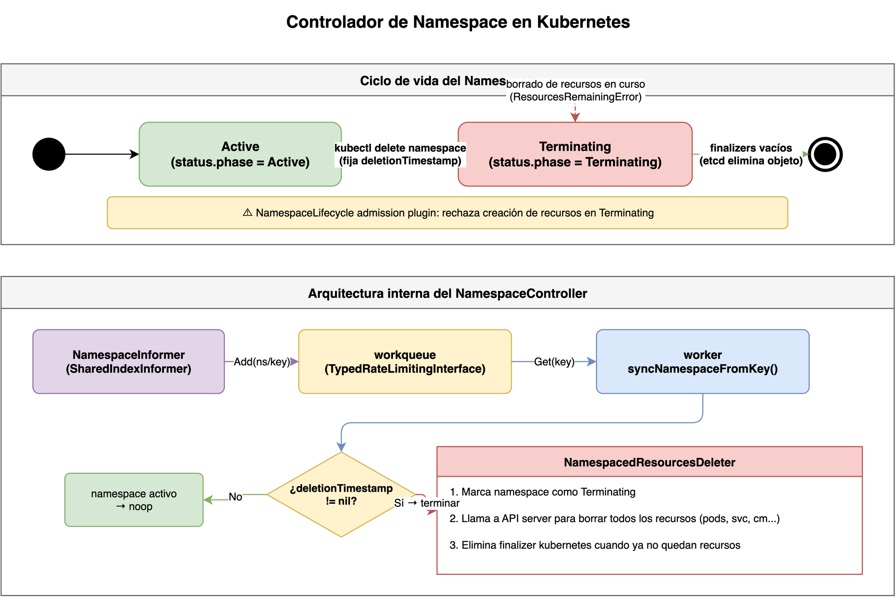
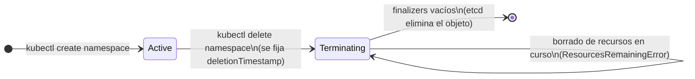
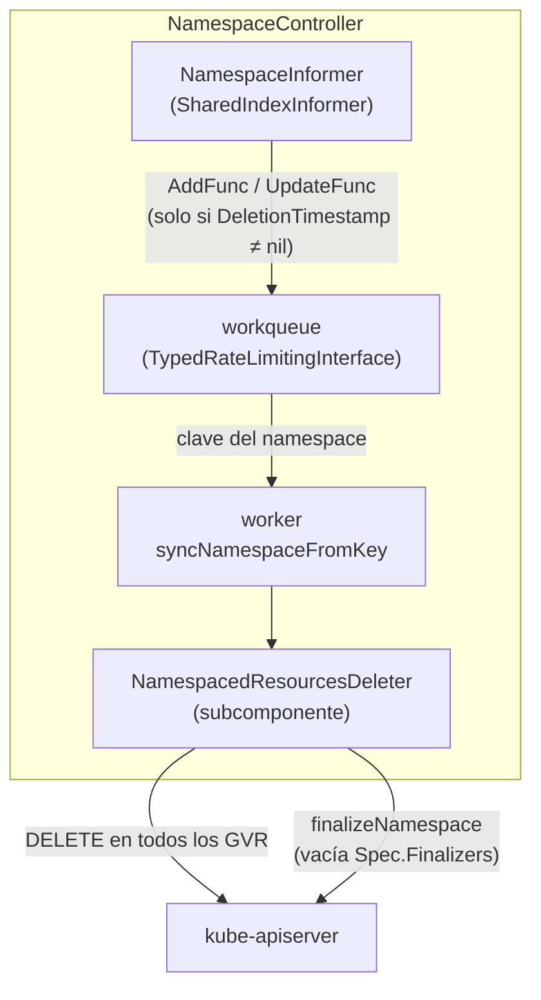
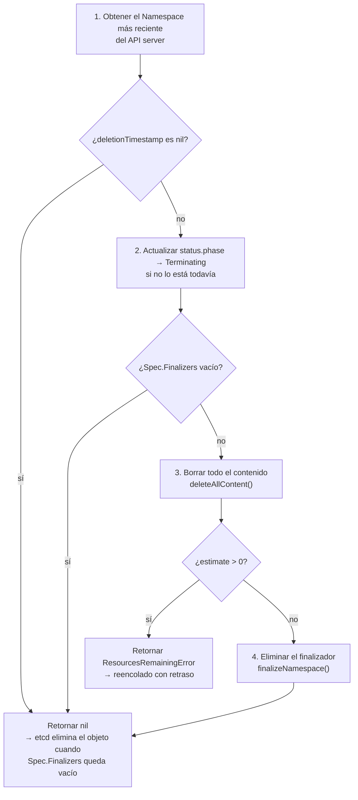

## Prerequisitos

- [La reconciliación en Kubernetes: fundamentos](../week01/01-reconciliation-theory.md)
- [Informers, cachés y listers en Kubernetes](../week01/02-informers-listers.md)
- [Workqueues en Kubernetes](../week01/03-workqueues.md)

¿Qué ocurre exactamente cuando ejecutas `kubectl delete namespace mi-namespace`?
¿Por qué el `namespace` permanece en estado `Terminating` durante varios segundos
o incluso minutos antes de desaparecer?
¿Quién se encarga de borrar todos los recursos que viven dentro de él?
Esta explicación describe el controlador de `Namespace`,
uno de los controladores integrados de Kubernetes más instructivos
por la claridad con que separa la detección de un cambio,
el ciclo de borrado y la finalización del objeto.

## El problema que resuelve

Un `Namespace` no es un contenedor de datos en etcd:
es una _partición lógica_ del clúster.
Cuando se borra, Kubernetes debe garantizar que todos los recursos
que viven dentro de él —`Pod`, `Service`, `ConfigMap`, `Secret`, etc.—
también sean eliminados antes de que el propio `Namespace` desaparezca.

> **Analogía — dar de baja una empresa:**
> Cuando cierras una empresa, no puedes simplemente tachar el nombre
> del registro mercantil.
> Primero debes liquidar deudas, dar de baja a empleados,
> cerrar cuentas bancarias y devolver permisos.
> Solo cuando todo eso está resuelto el registro la elimina definitivamente.
> El `NamespaceController` es el gestor que coordina esa baja:
> no deja que el `Namespace` desaparezca hasta que todas sus
> "obligaciones" (recursos) estén saldadas.

Sin un mecanismo de coordinación esto sería imposible de garantizar,
ya que los recursos podrían seguir siendo accesibles brevemente
en un `Namespace` que ya no existe.

## Ciclo de vida de un Namespace



Un `Namespace` puede estar en dos fases, reflejadas en el campo
`status.phase` del objeto:

| Fase          | Descripción                                                              |
| ------------- | ------------------------------------------------------------------------ |
| `Active`      | El `namespace` está activo y acepta nuevos recursos.                     |
| `Terminating` | Se ha solicitado el borrado; el controlador está limpiando su contenido. |

La transición `Active → Terminating` ocurre en cuanto el API server
registra la petición de borrado en `metadata.deletionTimestamp`.



> **Nota:** Un `Namespace` en fase `Terminating` rechaza la creación
> de nuevos recursos dentro de él.
> El plugin de admisión `NamespaceLifecycle` se encarga de esa restricción.

## Arquitectura del controlador

El `NamespaceController` vive en el paquete
`k8s.io/kubernetes/pkg/controller/namespace`
y se ejecuta dentro del `kube-controller-manager`.
Su estructura es deliberadamente simple:



El controlador tiene dos responsabilidades principales:

1. **Detectar** qué `namespaces` están en proceso de borrado.
2. **Delegar** todo el trabajo de limpieza al subcomponente
   `NamespacedResourcesDeleter`.

### El encolado condicional

A diferencia de la mayoría de controladores,
el `NamespaceController` no encola todos los eventos del informer,
sino únicamente los `namespaces` que ya tienen un `deletionTimestamp`:

> **Por qué encolar solo `Terminating`:**
> Un `Namespace` `Active` no requiere ninguna acción de limpieza.
> Si el controlador encolara todos los eventos, desperdiciaría ciclos de CPU
> procesando miles de `namespaces` sanos sin nada que hacer.
> Solo cuando aparece `deletionTimestamp` hay trabajo real que realizar.

```go
func (nm *NamespaceController) enqueueNamespace(ctx context.Context, obj interface{}) {
    key, err := controller.KeyFunc(obj)
    if err != nil {
        return
    }

    namespace := obj.(*v1.Namespace)
    // no encola si el namespace no está en proceso de borrado
    if namespace.DeletionTimestamp == nil || namespace.DeletionTimestamp.IsZero() {
        return
    }

    // retrasa 5 s para que todos los API servers en modo HA
    // observen el deletionTimestamp antes de que comience la limpieza
    nm.queue.AddAfter(key, namespaceDeletionGracePeriod) // 5 * time.Second
}
```

El retraso de **5 segundos** (`namespaceDeletionGracePeriod`) es una decisión
de ingeniería para dar tiempo a que:

- Los plugins de admisión de otros API servers en clústeres HA
  también vean el `deletionTimestamp` y rechacen nuevas creaciones.
- Los servidores etcd secundarios observen las últimas escrituras
  en el `namespace` antes de que se inicien los borrados.

### El rate limiter personalizado

El `NamespaceController` usa un rate limiter diferente al estándar:

```go
func nsControllerRateLimiter() workqueue.TypedRateLimiter[string] {
    return workqueue.NewTypedMaxOfRateLimiter(
        // reintenta al menos cada 60 s, nunca más
        workqueue.NewTypedItemExponentialFailureRateLimiter[string](
            5*time.Millisecond, // base
            60*time.Second,     // máximo
        ),
        // 10 QPS global, bucket de 100
        &workqueue.TypedBucketRateLimiter[string]{
            Limiter: rate.NewLimiter(rate.Limit(10), 100),
        },
    )
}
```

El techo de **60 segundos** (en lugar de los 1000 segundos del rate limiter
por defecto) garantiza que los `namespaces` en proceso de borrado se reintenten
con frecuencia suficiente,
dado que la cantidad de `namespaces` siendo eliminados simultáneamente
es normalmente pequeña en comparación con otros recursos del clúster.

## El flujo de syncNamespace

Cuando el worker extrae una clave del workqueue, llama a
`syncNamespaceFromKey`, que obtiene el objeto del lister local y delega
inmediatamente en `NamespacedResourcesDeleter.Delete`:

```go
func (nm *NamespaceController) syncNamespaceFromKey(ctx context.Context, key string) error {
    namespace, err := nm.lister.Get(key)
    if errors.IsNotFound(err) {
        // el namespace ya desapareció de etcd, nada que hacer
        return nil
    }
    return nm.namespacedResourcesDeleter.Delete(ctx, namespace.Name)
}
```

El manejo de errores en el worker distingue dos casos:

```go
err := nm.syncNamespaceFromKey(ctx, key)
if estimate, ok := err.(*deletion.ResourcesRemainingError); ok {
    // todavía hay recursos; reencola con un retraso proporcional al estimado
    t := estimate.Estimate/2 + 1
    nm.queue.AddAfter(key, time.Duration(t)*time.Second)
} else {
    // error inesperado; usa el rate limiter estándar
    nm.queue.AddRateLimited(key)
}
```

La distinción entre `ResourcesRemainingError` y cualquier otro error es
clave para la correcta convergencia:
en el primer caso el retraso se calcula en función del tiempo estimado
que tardarán en desaparecer los recursos restantes;
en el segundo se aplica el backoff exponencial del rate limiter.

## NamespacedResourcesDeleter: el motor del borrado

El `NamespacedResourcesDeleter` es el subcomponente que realiza el trabajo
real.
Ejecuta cinco pasos en orden estricto en cada invocación de `Delete`:



### Paso 2: marcar como Terminating

```go
func (d *namespacedResourcesDeleter) updateNamespaceStatusFunc(
    ctx context.Context, namespace *v1.Namespace,
) (*v1.Namespace, error) {
    // si ya está en Terminating, no hace nada
    if namespace.DeletionTimestamp.IsZero() ||
        namespace.Status.Phase == v1.NamespaceTerminating {
        return namespace, nil
    }
    newNamespace := namespace.DeepCopy()
    newNamespace.Status.Phase = v1.NamespaceTerminating
    return d.nsClient.UpdateStatus(ctx, newNamespace, metav1.UpdateOptions{})
}
```

### Paso 3: borrar todo el contenido

`deleteAllContent` descubre todos los `GroupVersionResource` (GVR) disponibles
mediante discovery y los borra en paralelo:

- Primero intenta `DeleteCollection` para eficiencia.
- Si el GVR no lo soporta, cae en borrado ítem a ítem.
- Tras borrar, verifica que no queden ítems remanentes.
- Si quedan ítems con finalizers, devuelve un estimado de espera
  (`finalizerEstimateSeconds = 15` por defecto).

### Paso 4: vaciar los finalizers

Una vez que no quedan recursos, el deleter llama a `Finalize`
(un subrecurso especial del API server para `Namespace`)
para eliminar el token de finalizer del campo `spec.finalizers`:

```go
// Llama al subrecurso /finalize del namespace en lugar de
// una actualización normal, para evitar conflictos con otros
// controladores que también gestionan finalizers
namespace, err := d.nsClient.Finalize(ctx, &namespaceFinalize, metav1.UpdateOptions{})
```

Cuando `spec.finalizers` queda vacío y `deletionTimestamp` está fijado,
el API server elimina definitivamente el objeto de etcd.

> **Advertencia:** Si un recurso dentro del `Namespace` tiene un finalizer
> que nunca se elimina, el `Namespace` nunca terminará de borrarse.
> El síntoma es que el `namespace` se queda permanentemente en `Terminating`.
> La solución es identificar qué recurso tiene el finalizer bloqueante
> y eliminar el finalizer manualmente con `kubectl patch`.

## Diagnóstico del borrado de un Namespace

Puedes observar el estado del proceso con los siguientes comandos:

```bash
# Ver el estado actual del namespace y su deletionTimestamp
kubectl get namespace mi-namespace -o yaml

# Ver los recursos que todavía quedan en el namespace
kubectl api-resources --verbs=list --namespaced -o name \
  | xargs -I{} kubectl get {} --ignore-not-found \
      -n mi-namespace --no-headers

# Ver las condiciones de error que el controlador ha registrado
kubectl get namespace mi-namespace \
  -o jsonpath='{.status.conditions}' | jq .
```

Un `Namespace` atascado en `Terminating` suele mostrar condiciones como:

```yaml
status:
  conditions:
    - type: NamespaceDeletionContentFailure
      status: "True"
      message: "Failed to delete all resource types, ..."
    - type: NamespaceFinalizersRemaining
      status: "True"
      message: "mi-recurso has 1 resource instances, ..."
```

## Relación con otros controladores

El ciclo de borrado de un `Namespace` involucra más de un controlador:

| Controlador                 | Papel en el borrado                                          |
| --------------------------- | ------------------------------------------------------------ |
| `NamespaceController`       | Orquesta el borrado; detecta `Terminating` y delega.         |
| `ServiceAccountsController` | Deja de crear `ServiceAccounts` en el `namespace`.           |
| `GarbageCollector`          | Borra objetos huérfanos cuyo dueño ha sido eliminado.        |
| `EndpointSlice controller`  | Elimina los `EndpointSlice` asociados a `Services` borrados. |

El `NamespaceController` no coordina directamente con estos controladores:
simplemente borra todos los recursos con el cliente dinámico,
y los controladores secundarios reaccionan a esos borrados a través de sus
propios informers.

## Preguntas de repaso

Antes de continuar con la siguiente sesión,
intenta responder las siguientes preguntas:

1. ¿Por qué un `Namespace` puede permanecer en estado `Terminating`?
2. ¿Qué trabajo delega el `NamespaceController` en `NamespacedResourcesDeleter`?
3. ¿Por qué el controlador solo encola `namespaces` con `deletionTimestamp`?
4. ¿Qué garantiza que el `Namespace` no desaparezca antes de limpiar su contenido?

Si no puedes responder alguna pregunta con confianza,
revisa nuevamente el contenido de la sesión antes de avanzar.

## Glosario

| Término                      | Definición breve                                                                              |
| ---------------------------- | --------------------------------------------------------------------------------------------- |
| `deletionTimestamp`          | Campo en `metadata` que indica que el objeto está pendiente de borrado.                       |
| `Terminating`                | Fase de un `Namespace` en proceso de eliminación.                                             |
| `spec.finalizers`            | Lista de tokens que deben eliminarse antes de que etcd borre el objeto.                       |
| `NamespacedResourcesDeleter` | Subcomponente que ejecuta el borrado de todos los GVR dentro del `Namespace`.                 |
| `ResourcesRemainingError`    | Error que indica que quedan recursos y que se debe reintentar más tarde con retraso.          |
| `GVR`                        | `GroupVersionResource`: identificador de un tipo de recurso en la API de Kubernetes.          |
| `finalizerToken`             | Token específico (`kubernetes`) que el `NamespaceController` elimina al finalizar el borrado. |

## Referencias

- [Namespaces](https://kubernetes.io/docs/concepts/overview/working-with-objects/namespaces/) — Documentación oficial
- [Código fuente: namespace_controller.go](https://github.com/kubernetes/kubernetes/blob/master/pkg/controller/namespace/namespace_controller.go) — kubernetes/kubernetes
- [Código fuente: namespaced_resources_deleter.go](https://github.com/kubernetes/kubernetes/blob/master/pkg/controller/namespace/deletion/namespaced_resources_deleter.go) — kubernetes/kubernetes
- [Configure a namespace to delete resources](https://kubernetes.io/docs/tasks/administer-cluster/namespaces/) — Guía de administración

## Siguiente paso

[El limpiador de tokens heredados de ServiceAccount](02-token-cleaner.md) →
describe un controlador que usa el patrón de bucle periódico en lugar de workqueue
para detectar y eliminar credenciales obsoletas acumuladas con el tiempo.

[Inicio](../README.md) | [Siguiente →](02-token-cleaner.md)
