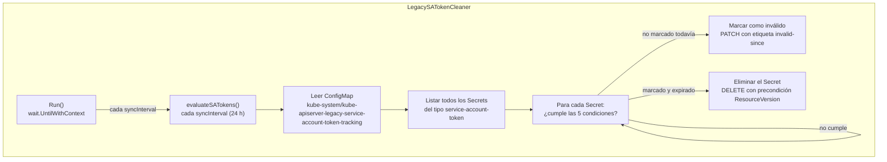

## Prerequisitos

- [La reconciliación en Kubernetes: fundamentos](../week01/01-reconciliation-theory.md)
- [Informers, cachés y listers en Kubernetes](../week01/02-informers-listers.md)

Kubernetes generaba automáticamente tokens de larga duración para
cada `ServiceAccount` antes de la versión 1.24.
Esos tokens —almacenados como `Secrets` de tipo
`kubernetes.io/service-account-token`— nunca expiraban,
lo que suponía un riesgo de seguridad acumulado con el tiempo.
Esta explicación describe el `LegacySATokenCleaner`,
el controlador que detecta esos tokens obsoletos,
los invalida y finalmente los elimina.

## El problema de los tokens heredados

A partir de Kubernetes 1.22,
el mecanismo preferido para inyectar credenciales en los `Pods` es el
**token de volumen proyectado** (_projected volume token_):
tiene tiempo de vida limitado (por defecto 1 hora),
se renueva automáticamente y se invalida cuando el `Pod` es eliminado.

> **Analogía — las llaves maestras del hotel:**
> Las tarjetas magnéticas de los hoteles modernos caducan al hacer el
> _check-out_: aunque alguien conserve la tarjeta, ya no abre la puerta.
> Los tokens de volumen proyectado funcionan igual:
> al terminar el `Pod`, el token queda inutilizable.
> Los tokens heredados, en cambio, son como llaves físicas copiadas
> hace años: siguen abriendo la puerta indefinidamente,
> aunque el huésped original se haya ido hace tiempo.
> El `LegacySATokenCleaner` es el servicio de seguridad
> que revisa el cajero de llaves y destruye las copias antiguas.

Sin embargo,
clústeres que llevan años en funcionamiento acumulan `Secrets` del tipo antiguo,
creados automáticamente por versiones previas de Kubernetes.
Esos tokens:

- Son referenciados bidireccionalmente entre el `ServiceAccount`
  y el `Secret` (el `ServiceAccount.secrets` apunta al `Secret`,
  y el `Secret` tiene la anotación `kubernetes.io/service-account.name`).
- Nunca expiran por sí solos.
- Pueden seguir siendo válidos aunque nadie los use.

## Condiciones para borrar un token heredado

El `LegacySATokenCleaner` (clase `LegacySATokenCleaner`,
paquete `k8s.io/kubernetes/pkg/controller/serviceaccount`)
borra un `Secret` de token heredado únicamente si se cumplen
**todas** las condiciones siguientes:

| Condición              | Descripción                                                                                   |
| ---------------------- | --------------------------------------------------------------------------------------------- |
| Tipo correcto          | `secret.type == kubernetes.io/service-account-token`                                          |
| Token auto-generado    | El `ServiceAccount` referencia el `Secret` en su campo `secrets`                              |
| No montado             | Ningún `Pod` del mismo `namespace` monta el `Secret` actualmente                              |
| No usado recientemente | La etiqueta `kubernetes.io/legacy-token-last-used` es anterior al umbral de limpieza          |
| Marcado como inválido  | Tiene la etiqueta `kubernetes.io/legacy-token-invalid-since` con una fecha anterior al umbral |

El proceso de eliminación es de **dos pasos**:
primero el token se invalida (se le añade la etiqueta `invalid-since`),
y solo se borra en el siguiente ciclo si no ha sido usado desde entonces.

## Arquitectura del controlador

A diferencia de los controladores de la semana 1,
el `LegacySATokenCleaner` **no usa workqueue**.
En su lugar, emplea el patrón más simple de un bucle temporal periódico
gestionado por `wait.UntilWithContext`:



El controlador usa tres informers (caché local):

- `ServiceAccountInformer` — para verificar si el `Secret` es auto-generado.
- `SecretInformer` — para listar los `Secrets` candidatos.
- `PodInformer` — para verificar si el `Secret` está montado en algún `Pod`.

### El ConfigMap de rastreo

Antes de invalidar cualquier token,
el controlador verifica que ha habido suficiente tiempo de observación.
Lee el `ConfigMap` `kube-apiserver-legacy-service-account-token-tracking`
del namespace `kube-system`,
que fue creado por el `LegacyServiceAccountTokenTrackingController`
(estable desde v1.28) con la fecha en que se empezó a rastrear el uso de tokens:

```go
func (tc *LegacySATokenCleaner) latestPossibleTrackedSinceTime(
    ctx context.Context,
) (time.Time, error) {
    configMap, err := tc.client.CoreV1().ConfigMaps(metav1.NamespaceSystem).
        Get(ctx, legacytokentracking.ConfigMapName, metav1.GetOptions{})
    // ...
    trackedSince, _ := configMap.Data[legacytokentracking.ConfigMapDataKey]
    trackedSinceTime, _ := time.Parse(dateFormat, trackedSince)
    // añade un día para trabajar con el inicio del día siguiente
    return trackedSinceTime.AddDate(0, 0, 1), nil
}
```

Si `ahora < trackedSince + minimumSinceLastUsed`, el ciclo termina sin hacer
nada: no se puede saber si un token sin etiqueta `last-used` fue usado antes
de que comenzara el rastreo.

## El bucle de evaluación

El método `evaluateSATokens` recorre todos los `Secrets` en todos los
`namespaces` e implementa la lógica de dos etapas:

```go
func (tc *LegacySATokenCleaner) evaluateSATokens(ctx context.Context) {
    now := tc.clock.Now().UTC()

    // fecha mínima de "último uso" para conservar el token
    preserveUsedOnOrAfter := now.Add(-tc.minimumSinceLastUsed).Format(dateFormat)
    // fecha mínima de creación para considerar el token (recientes se excluyen)
    preserveCreatedOnOrAfter := now.Add(-tc.minimumSinceLastUsed)

    secretList, _ := tc.secretLister.Secrets(metav1.NamespaceAll).List(labels.Everything())

    for _, secret := range secretList {
        // 1. Filtrar solo tokens de ServiceAccount del tipo correcto
        if secret.Type != v1.SecretTypeServiceAccountToken { continue }
        // 2. Excluir tokens recientes (creados dentro del periodo de protección)
        if !secret.CreationTimestamp.Time.Before(preserveCreatedOnOrAfter) { continue }
        // 3. Excluir tokens que se usan actualmente (etiqueta last-used reciente)
        if lastUsed, ok := secret.Labels[serviceaccount.LastUsedLabelKey]; ok {
            if lastUsed >= preserveUsedOnOrAfter { continue }
        }
        // 4. Verificar que es un token auto-generado (referenciado por el SA)
        sa, _ := tc.getServiceAccount(secret)
        if sa == nil || !hasSecretReference(sa, secret.Name) { continue }
        // 5. Verificar que no está montado en ningún Pod activo
        mountedSecretNames, _ := tc.getMountedSecretNames(secret.Namespace, cache)
        if mountedSecretNames.Has(secret.Name) { continue }

        // Lógica de dos etapas: marcar o borrar
        invalidSince := secret.Labels[serviceaccount.InvalidSinceLabelKey]
        if _, err := time.Parse(dateFormat, invalidSince); err != nil {
            // Etapa 1: marcar como inválido con la fecha actual
            tc.markAsInvalid(ctx, secret, now)
            continue
        }
        if invalidSince >= preserveUsedOnOrAfter {
            continue // todavía no ha pasado el tiempo de gracia desde invalidación
        }
        // Etapa 2: borrar definitivamente
        tc.client.CoreV1().Secrets(secret.Namespace).Delete(
            ctx, secret.Name,
            metav1.DeleteOptions{
                Preconditions: &metav1.Preconditions{
                    // garantiza que no borramos una versión diferente del Secret
                    ResourceVersion: &secret.ResourceVersion,
                },
            },
        )
    }
}
```

### Precondición en el borrado

El uso de `Preconditions.ResourceVersion` en la petición de borrado es una
medida de seguridad importante:
garantiza que si el `Secret` fue modificado entre el momento en que se listó
y el momento en que se intenta borrar,
la operación falla con un error de conflicto en lugar de borrar una versión
diferente del objeto.

El controlador ignora errores de conflicto y de "no encontrado" en el borrado,
ya que ambos son condiciones normales en un sistema concurrente.

## Las etiquetas del ciclo de vida del token

Kubernetes utiliza tres etiquetas para rastrear el estado de un token heredado:

```yaml
metadata:
  labels:
    kubernetes.io/legacy-token-last-used: "2025-10-15" # última vez que se autenticó
    kubernetes.io/legacy-token-invalid-since: "2026-01-20" # fecha de invalidación
```

| Etiqueta                                   | Quién la escribe       | Significado                              |
| ------------------------------------------ | ---------------------- | ---------------------------------------- |
| `kubernetes.io/legacy-token-last-used`     | `kube-apiserver`       | Fecha de la última autenticación exitosa |
| `kubernetes.io/legacy-token-invalid-since` | `LegacySATokenCleaner` | Fecha en que se marcó como inválido      |

Si un token con `invalid-since` se vuelve a usar,
el API server registra una anotación de auditoría y devuelve un error.
El administrador puede recuperar el token temporalmente eliminando la etiqueta
`invalid-since`:

```bash
# Eliminar la etiqueta de invalidación para recuperar temporalmente el token
kubectl label secret mi-token \
  kubernetes.io/legacy-token-invalid-since- \
  -n mi-namespace
```

## Configuración

El periodo de limpieza se controla con un argumento del
`kube-controller-manager`:

```bash
# Tiempo sin uso antes de invalidar/borrar (por defecto: 1 año)
--legacy-service-account-token-clean-up-period=8760h
```

Los parámetros internos del controlador son:

| Parámetro       | Valor por defecto | Descripción                                         |
| --------------- | ----------------- | --------------------------------------------------- |
| `CleanUpPeriod` | 1 año             | Tiempo mínimo sin uso para invalidar o borrar       |
| `SyncInterval`  | 24 horas          | Frecuencia con la que se ejecuta `evaluateSATokens` |

## Comparación con el patrón de workqueue

El `LegacySATokenCleaner` no necesita workqueue porque su trabajo es
**por lotes y periódico**, no reactivo a eventos individuales.

> **Analogía — la limpieza nocturna vs. el conserje reactivo:**
> Un conserje que reacciona a cada suciedad en tiempo real (workqueue)
> es ideal para derrames en el pasillo: acción rápida y precisa.
> Pero una limpieza nocturna general (bucle periódico)
> es más eficiente para revisar todos los espacios del edificio,
> limpiar lo que se acumuló y llevar un registro.
> El `LegacySATokenCleaner` es esa limpieza nocturna:
> una vez al día revisa todos los tokens y aplica las reglas.

| Característica | Controlador con workqueue           | `LegacySATokenCleaner`                    |
| -------------- | ----------------------------------- | ----------------------------------------- |
| Disparado por  | Cambios en recursos (informer)      | Temporizador periódico (`wait.Until`)     |
| Granularidad   | Un objeto por reconciliación        | Todos los `Secrets` en cada ciclo         |
| Reintentos     | Rate limiter + backoff exponencial  | El siguiente ciclo periódico              |
| Concurrencia   | Múltiples workers en paralelo       | Un solo goroutine                         |
| Uso típico     | Reacción rápida a cambios de estado | Tareas de mantenimiento/limpieza globales |

Este patrón es adecuado cuando:

- El costo de procesar todos los objetos en cada ciclo es aceptable.
- No se necesita reactividad inmediata a cambios individuales.
- La lógica es principalmente de lectura con pocas escrituras.

## Glosario

| Término                         | Definición breve                                                                                   |
| ------------------------------- | -------------------------------------------------------------------------------------------------- |
| `ServiceAccount`                | Identidad para procesos que se ejecutan en un `Pod`.                                               |
| Token heredado (_legacy token_) | `Secret` de tipo `service-account-token` creado automáticamente antes de v1.24.                    |
| Token de volumen proyectado     | Token de corta duración inyectado por el kubelet mediante un volumen; reemplaza al token heredado. |
| `LegacySATokenCleaner`          | Controlador que invalida y borra tokens heredados sin uso.                                         |
| `invalid-since`                 | Etiqueta que marca la fecha en que un token fue declarado inválido.                                |
| `last-used`                     | Etiqueta que el API server actualiza cada vez que el token se usa con éxito.                       |
| `wait.UntilWithContext`         | Función de `apimachinery` que ejecuta una función en bucle con un intervalo.                       |

## Referencias

- [Managing Service Accounts](https://kubernetes.io/docs/reference/access-authn-authz/service-accounts-admin/) — Documentación oficial
- [Código fuente: legacy_serviceaccount_token_cleaner.go](https://github.com/kubernetes/kubernetes/blob/master/pkg/controller/serviceaccount/legacy_serviceaccount_token_cleaner.go) — kubernetes/kubernetes
- [KEP-2799: Reduction of Secret-based Service Account Tokens](https://github.com/kubernetes/enhancements/tree/master/keps/sig-auth/2799-reduction-of-secret-based-service-account-token) — Propuesta de mejora

## Siguiente paso

[El controlador de ServiceAccounts en Kubernetes](03-serviceaccounts-controller.md) →
muestra cómo el patrón _get-or-create_ garantiza que cada `Namespace` activo
tenga siempre la `ServiceAccount` `default` disponible para sus `Pods`.

[← Atrás](01-namespace-controller.md) | [Inicio](../README.md) | [Siguiente →](03-serviceaccounts-controller.md)
