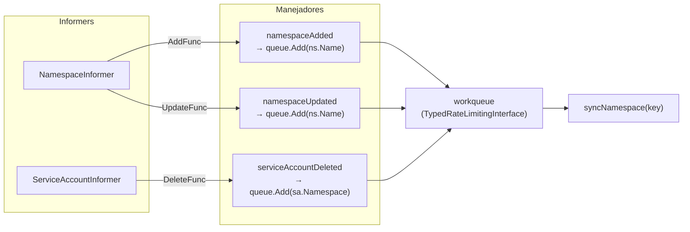
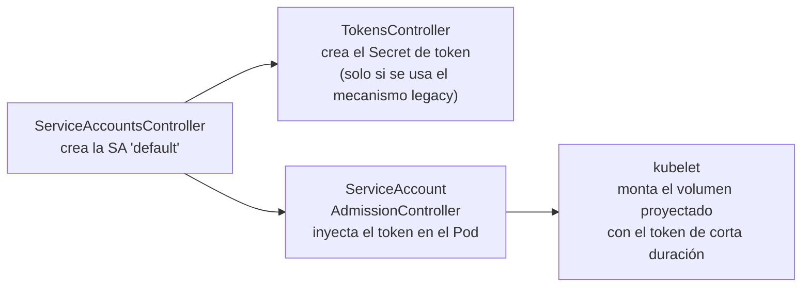
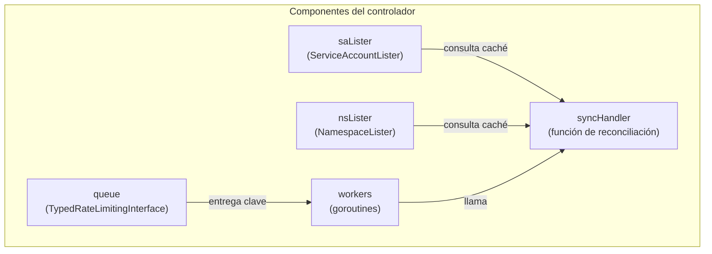

## Prerequisitos

- [La reconciliación en Kubernetes: fundamentos](../week01/01-reconciliation-theory.md)
- [Informers, cachés y listers en Kubernetes](../week01/02-informers-listers.md)
- [Workqueues en Kubernetes](../week01/03-workqueues.md)

Cuando creas un `Namespace`,
Kubernetes crea automáticamente una `ServiceAccount` llamada `default` dentro
de él.
¿Quién se encarga de eso?
¿Y si alguien la borra por error?
¿Qué pasa si el `Namespace` pasa a fase `Terminating`?
Esta explicación describe el `ServiceAccountsController`,
un controlador pequeño y centrado que garantiza la presencia de ciertas
`ServiceAccounts` en todos los `Namespaces` activos del clúster.

## El problema que resuelve

Cada `Pod` en Kubernetes necesita una identidad para autenticarse con el
API server.
Esa identidad viene de una `ServiceAccount`.
Si no especificas una, el plugin de admisión `ServiceAccount` usa la
`ServiceAccount` `default` del `Namespace`.

> **Analogía — el empleado nuevo y su tarjeta de acceso:**
> Cuando una empresa contrata a un empleado,
> RR HH le prepara una tarjeta de acceso antes incluso de que llegue
> su primer día.
> Si esa tarjeta se pierde o se destruye por error,
> RR HH emite una nueva de inmediato.
> El `ServiceAccountsController` es ese departamento:
> en cuanto un `Namespace` (oficina) se crea o la cuenta `default` desaparece,
> él genera o regenera la identidad necesaria.

Sin embargo, esa `ServiceAccount` no existe en el `Namespace` por arte de
magia: alguien debe crearla cuando el `Namespace` nace,
y recrearla si alguien la elimina.
Ese "alguien" es el `ServiceAccountsController`.

## Qué hace el controlador

El `ServiceAccountsController` gestiona una lista configurable de
`ServiceAccounts` que deben existir en **todos los `Namespaces` activos**.
Por defecto esa lista contiene solo una entrada: `default`.

Su única función de reconciliación, `syncNamespace`,
implementa la lógica siguiente:

```go
func (c *ServiceAccountsController) syncNamespace(
    ctx context.Context, key string,
) error {
    ns, err := c.nsLister.Get(key)
    if apierrors.IsNotFound(err) {
        return nil // el namespace ya no existe, nada que hacer
    }

    // No crea ServiceAccounts en namespaces que están siendo eliminados
    if ns.Status.Phase != v1.NamespaceActive {
        return nil
    }

    var createFailures []error
    for _, sa := range c.serviceAccountsToEnsure {
        switch _, err := c.saLister.ServiceAccounts(ns.Name).Get(sa.Name); {
        case err == nil:
            continue // ya existe, no hace nada
        case apierrors.IsNotFound(err):
            // no existe, la crea
        default:
            return err
        }
        sa.Namespace = ns.Name
        if _, err := c.client.CoreV1().ServiceAccounts(ns.Name).
            Create(ctx, &sa, metav1.CreateOptions{}); err != nil &&
            !apierrors.IsAlreadyExists(err) {
            // ignora el error específico de namespace en Terminating
            if !apierrors.HasStatusCause(err, v1.NamespaceTerminatingCause) {
                createFailures = append(createFailures, err)
            }
        }
    }
    return utilerrors.Flatten(utilerrors.NewAggregate(createFailures))
}
```

El controlador no borra ni actualiza `ServiceAccounts`.
Su trabajo es exclusivamente **garantizar la existencia** de las cuentas
configuradas.

## Eventos que disparan la reconciliación

El controlador reacciona a tres tipos de eventos mediante dos informers:



| Evento                   | Por qué dispara reconciliación                                             |
| ------------------------ | -------------------------------------------------------------------------- |
| `Namespace` creado       | Un `Namespace` nuevo no tiene `ServiceAccounts`; hay que crearlas.         |
| `Namespace` actualizado  | Si cambió a fase `Active` (p. ej., tras un resync), puede necesitar la SA. |
| `ServiceAccount` borrada | La `default` SA fue eliminada; hay que recrearla en ese `namespace`.       |

### El manejo del borrado con tombstone

Cuando el informer de `ServiceAccount` detecta un borrado,
el objeto puede llegar como `DeletedFinalStateUnknown`
si el watch se interrumpió y no se recibió el evento directamente:

```go
func (c *ServiceAccountsController) serviceAccountDeleted(
    logger klog.Logger, obj interface{},
) {
    sa, ok := obj.(*v1.ServiceAccount)
    if !ok {
        // Intenta extraer el objeto de la tombstone
        tombstone, ok := obj.(cache.DeletedFinalStateUnknown)
        if !ok { return }
        sa, ok = tombstone.Obj.(*v1.ServiceAccount)
        if !ok { return }
    }
    c.queue.Add(sa.Namespace)
}
```

Este patrón de manejo de tombstone es estándar en todos los controladores
de Kubernetes que reaccionan a borrados.
Viste su fundamento teórico en
[week01/02-informers-listers.md](../week01/02-informers-listers.md).

## Interacción con el ciclo de vida del Namespace

El `ServiceAccountsController` está deliberadamente desacoplado del
`NamespaceController`:

- Cuando un `Namespace` entra en `Terminating`,
  el `ServiceAccountsController` recibirá un evento `UpdateFunc` del informer.
- Al llamar a `syncNamespace`, comprobará que `phase != Active` y saldrá sin
  hacer nada.
- Esto significa que **no intenta recrear** las `ServiceAccounts` en un
  `Namespace` que está siendo eliminado.

Esta comprobación es un ejemplo de _idempotencia defensiva_:
la función de reconciliación siempre verifica el estado actual antes de actuar,
en lugar de suponer que las condiciones que la dispararon siguen siendo válidas.

## Relación con el sistema de tokens

El `ServiceAccountsController` es el primero de una cadena:



A partir de Kubernetes 1.24,
el `TokensController` solo genera `Secrets` para las `ServiceAccounts`
que han sido anotadas explícitamente.
El mecanismo principal de inyección de tokens es el volumen proyectado,
que el kubelet gestiona directamente mediante el API `TokenRequest`.

## Anatomía de un controlador mínimo

El `ServiceAccountsController` es un excelente ejemplo de la estructura
mínima de un controlador en Kubernetes porque implementa todos los componentes
esenciales sin abstracciones adicionales:

> **Analogía — el controlador como cadena de montaje mínima:**
> Una fábrica de zapatos mínima tiene cuatro puestos:
> el recepcionista que toma pedidos (informer + handler),
> la bandeja de pedidos pendientes (workqueue),
> el operario que los ejecuta (worker/goroutine)
> y el libro de inventario que consulta antes de actuar (lister).
> Ninguno se puede quitar sin romper la cadena.
> El `ServiceAccountsController` es exactamente esa fábrica de cuatro puestos.



Cada componente tiene una responsabilidad única y no puede sustituirse por
otro:

| Componente    | Responsabilidad                                                     |
| ------------- | ------------------------------------------------------------------- |
| `saLister`    | Consultar la caché local de `ServiceAccounts` sin ir al API server. |
| `nsLister`    | Consultar la caché local de `Namespaces` para leer su fase actual.  |
| `queue`       | Desacoplar los eventos del informer del procesamiento del worker.   |
| `syncHandler` | Implementar la lógica de reconciliación idempotente.                |
| `workers`     | Procesar las claves del workqueue en paralelo (varios goroutines).  |

## Configuración y extensión

La lista de `ServiceAccounts` a garantizar es configurable al crear el
controlador:

```go
options := ServiceAccountsControllerOptions{
    ServiceAccounts: []v1.ServiceAccount{
        {ObjectMeta: metav1.ObjectMeta{Name: "default"}},
        // aquí se pueden añadir otras cuentas si el clúster lo requiere
    },
    ServiceAccountResync: 5 * time.Minute,
    NamespaceResync:      5 * time.Minute,
}
```

En la práctica, los clústeres estándar de Kubernetes solo garantizan la
`ServiceAccount` `default`.
Los operadores y distribuciones pueden añadir otras cuentas a esta lista si
su arquitectura lo requiere.

## Comparación con los otros controladores de la semana

| Aspecto            | `NamespaceController`         | `LegacySATokenCleaner`     | `ServiceAccountsController`   |
| ------------------ | ----------------------------- | -------------------------- | ----------------------------- |
| Patrón de disparo  | Evento del informer + retraso | Temporizador periódico     | Evento del informer           |
| Usa workqueue      | Sí                            | No                         | Sí                            |
| Acción principal   | Borrar recursos               | Borrar `Secrets` obsoletos | Crear `ServiceAccounts`       |
| Idempotencia       | Verifica antes de borrar      | Verifica etiquetas y uso   | `Get` antes de `Create`       |
| Objetos observados | `Namespace`                   | `Secret`, `Pod`, `SA`      | `Namespace`, `ServiceAccount` |
| Complejidad        | Alta (discovery + deletion)   | Media (lógica de tiempo)   | Baja (get-or-create)          |

## Preguntas de repaso

Antes de continuar con la siguiente sesión,
intenta responder las siguientes preguntas:

1. ¿Por qué el controlador asegura la existencia de una `ServiceAccount` `default` en cada `Namespace` activo?
2. ¿Qué hace que este controlador sea un ejemplo de get-or-create idempotente?
3. ¿Qué cambia cuando el `Namespace` se está borrando?
4. ¿Por qué este controlador debe manejar tombstones al recibir eventos de borrado?

Si no puedes responder alguna pregunta con confianza,
revisa nuevamente el contenido de la sesión antes de avanzar.

## Glosario

| Término                     | Definición breve                                                                                         |
| --------------------------- | -------------------------------------------------------------------------------------------------------- |
| `ServiceAccount`            | Identidad para procesos que se ejecutan en un `Pod`.                                                     |
| `default` (SA)              | `ServiceAccount` que Kubernetes usa por defecto cuando un `Pod` no especifica una.                       |
| `DeletedFinalStateUnknown`  | Envoltura que el informer usa cuando no pudo recibir el evento de borrado directamente.                  |
| `NamespaceTerminatingCause` | Causa de error que el API server devuelve al intentar crear recursos en un `Namespace` en `Terminating`. |
| `TokensController`          | Controlador que crea `Secrets` de tipo `service-account-token` (mecanismo heredado).                     |
| `TokenRequest` API          | Mecanismo moderno para obtener tokens de corta duración sin crear `Secrets`.                             |

## Referencias

- [Managing Service Accounts](https://kubernetes.io/docs/reference/access-authn-authz/service-accounts-admin/) — Documentación oficial
- [Código fuente: serviceaccounts_controller.go](https://github.com/kubernetes/kubernetes/blob/master/pkg/controller/serviceaccount/serviceaccounts_controller.go) — kubernetes/kubernetes
- [Configure Service Accounts for Pods](https://kubernetes.io/docs/tasks/configure-pod-container/configure-service-account/) — Guía práctica

## Siguiente paso

[Semana 3: Deployment a profundidad](../week03/README.md) →
analiza el controlador más usado en Kubernetes: el `Deployment`,
su relación jerárquica con los `ReplicaSets` y sus estrategias de rollout.

[← Atrás](02-token-cleaner.md) | [Inicio](../README.md) | [Siguiente →](../week03/README.md)
