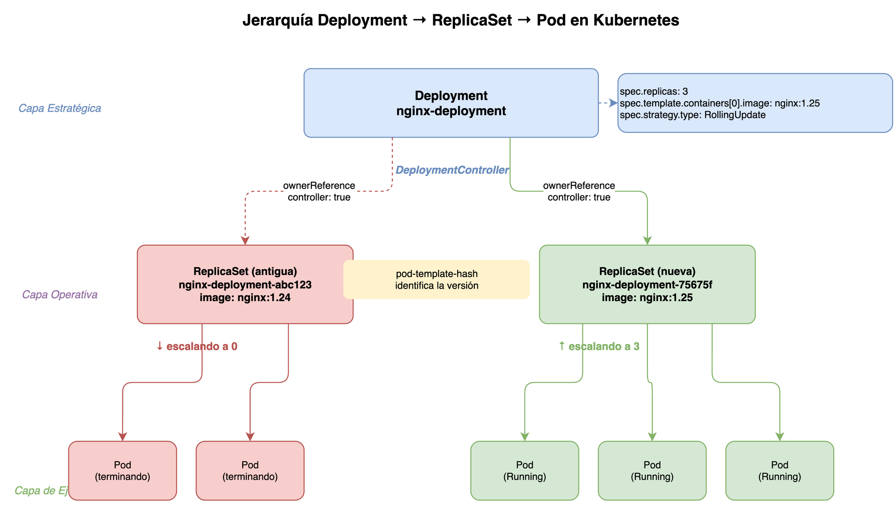

> **Versión de Kubernetes:** v1.29+
> **Fuentes:**
> [kubernetes.io/docs/concepts/workloads/controllers/deployment/](https://kubernetes.io/docs/concepts/workloads/controllers/deployment/),
> [kubernetes.io/docs/concepts/workloads/controllers/replicaset/](https://kubernetes.io/docs/concepts/workloads/controllers/replicaset/)

## Prerequisitos

- [La reconciliación en Kubernetes: fundamentos](../week01/01-reconciliation-theory.md)
- [Informers, cachés y listers en Kubernetes](../week01/02-informers-listers.md)
- [Utilidades de controladores en Kubernetes](../week01/04-controller-utilities.md)

## Por qué existe esta jerarquía



Un `Deployment` no ejecuta `Pods` directamente.
En cambio, crea y administra objetos `ReplicaSet`,
y cada `ReplicaSet` es quien mantiene el grupo de `Pods` corriendo.
Esta separación de responsabilidades no es arbitraria:
cada capa resuelve un problema diferente.

> **Analogía — el arquitecto y el capataz de obra:**
> El `Deployment` actúa como el arquitecto:
> define el plano (plantilla de `Pod`) y decide cuándo construir, remodelar o derribar.
> El `ReplicaSet` actúa como el capataz:
> traduce las instrucciones del arquitecto en trabajo concreto,
> asegurándose de que siempre haya exactamente el número de obreros (Pods) trabajando.
> Si el arquitecto cambia el plano, el capataz viejo no se adapta:
> se contrata uno nuevo que ejecute el diseño actualizado.

| Capa        | Recurso      | Responsabilidad principal                                       |
| ----------- | ------------ | --------------------------------------------------------------- |
| Estratégica | `Deployment` | Decide cómo evoluciona la aplicación (rollout, rollback, pausa) |
| Operativa   | `ReplicaSet` | Mantiene un número exacto de `Pods` vivos en cualquier momento  |
| Ejecución   | `Pod`        | Ejecuta los contenedores de la aplicación                       |

## Cómo se vinculan los objetos

Cuando creas un `Deployment`,
el `DeploymentController` crea un `ReplicaSet` con una `ownerReference` que apunta al `Deployment`.
A su vez, los `Pods` que crea el `ReplicaSet` tienen una `ownerReference` al `ReplicaSet`.
Esta cadena de propiedad es la que hace posible el borrado en cascada y el rastreo de estado.

```yaml
# Pod creado por un ReplicaSet propiedad de un Deployment
apiVersion: v1
kind: Pod
metadata:
  name: nginx-deployment-75675f5897-7ci7o
  labels:
    app: nginx
    pod-template-hash: "75675f5897" # hash del PodTemplate → identifica al ReplicaSet dueño
  ownerReferences:
    - apiVersion: apps/v1
      kind: ReplicaSet
      name: nginx-deployment-75675f5897
      uid: e129deca-f864-481b-bb16-b27abfd92292
      controller: true # este RS es el controlador activo del Pod
      blockOwnerDeletion: true # bloquea borrado en cascada foreground hasta que el Pod termine
```

### El campo `pod-template-hash`

Cada `ReplicaSet` generado por un `Deployment` recibe la etiqueta `pod-template-hash`,
calculada como el hash del `PodTemplateSpec`.
Esta etiqueta cumple tres funciones:

1. Diferencia los `Pods` de cada versión de la aplicación.
2. Impide que dos `ReplicaSets` del mismo `Deployment` adopten los mismos `Pods`.
3. Permite al `Deployment` encontrar el `ReplicaSet` que corresponde a una revisión concreta.

> **Advertencia:** No modifiques manualmente la etiqueta `pod-template-hash`.
> Es gestionada exclusivamente por el `DeploymentController`.

## Ciclo de vida de un rollout

Cuando el campo `.spec.template` de un `Deployment` cambia,
el `DeploymentController` no actualiza el `ReplicaSet` existente:
crea uno nuevo y gestiona la transición entre ambos.

```text
Estado inicial:
  ReplicaSet A  (replicas=3, imagen=nginx:1.14)  ← activo
  ReplicaSet B  (no existe aún)

Después de kubectl set image deployment/nginx-deployment nginx=nginx:1.16:
  ReplicaSet A  (replicas=2, imagen=nginx:1.14)  ← escalando hacia abajo
  ReplicaSet B  (replicas=2, imagen=nginx:1.16)  ← escalando hacia arriba

Estado final:
  ReplicaSet A  (replicas=0, imagen=nginx:1.14)  ← conservado para rollback
  ReplicaSet B  (replicas=3, imagen=nginx:1.16)  ← activo
```

Observa que el `ReplicaSet A` **no se borra**: permanece con cero réplicas para permitir rollback.
El número de `ReplicaSets` históricos que se conservan está controlado por `.spec.revisionHistoryLimit` (por defecto: 10).

### Cuándo se crea un nuevo ReplicaSet

Un nuevo rollout **solo** se dispara cuando cambia `.spec.template`.
Estas acciones NO crean un nuevo `ReplicaSet`:

- Escalar el `Deployment` (`.spec.replicas`).
- Anotar el `Deployment`.
- Pausar y reanudar.

Inspecciona los `ReplicaSets` asociados a un `Deployment`:

```bash
# Ver todos los ReplicaSets del Deployment, incluyendo los históricos
kubectl get rs -l app=nginx

# Salida esperada
NAME                          DESIRED   CURRENT   READY   AGE
nginx-deployment-75675f5897   3         3         3       5m
nginx-deployment-2035384211   0         0         0       20m
```

## El selector y la adopción de Pods

El selector de un `Deployment` (`.spec.selector`) es **inmutable** tras su creación.
Cambiarlo requiere borrar y recrear el `Deployment`.

Un `ReplicaSet` puede adoptar `Pods` preexistentes si sus etiquetas coinciden con el selector
y esos `Pods` no tienen controlador.
Este comportamiento de adopción es intencional:
facilita migraciones y pruebas, pero también puede causar conflictos si no se controlan las etiquetas.

```bash
# Comprobar qué Pods gestiona un ReplicaSet concreto
kubectl get pods -l app=nginx,pod-template-hash=75675f5897

# Inspeccionar la cadena ownerReference de un Pod
kubectl get pod nginx-deployment-75675f5897-7ci7o -o jsonpath='{.metadata.ownerReferences}'
```

## Múltiples controladores activos en paralelo

El `DeploymentController` y el `ReplicaSetController` son procesos independientes
dentro del `kube-controller-manager`.
Ambos escuchan eventos a través de sus informers y procesan colas propias.
No existe un loop único que los coordine:
la coordinación ocurre a través del estado en `etcd` y las `ownerReferences`.

Cuando el `DeploymentController` crea un `ReplicaSet`,
el `ReplicaSetController` lo detecta a través de su informer y comienza a crear `Pods` inmediatamente,
sin esperar instrucción explícita del `DeploymentController`.

## Resumen de responsabilidades

| Acción                               | Quién actúa            |
| ------------------------------------ | ---------------------- |
| Crear un nuevo `ReplicaSet`          | `DeploymentController` |
| Escalar hacia arriba el nuevo RS     | `DeploymentController` |
| Escalar hacia abajo el RS antiguo    | `DeploymentController` |
| Crear `Pods` hasta alcanzar réplicas | `ReplicaSetController` |
| Reemplazar `Pods` que fallan         | `ReplicaSetController` |
| Adoptar `Pods` sin dueño             | `ReplicaSetController` |

## Glosario

| Término                | Definición breve                                                                                                          |
| ---------------------- | ------------------------------------------------------------------------------------------------------------------------- |
| `Deployment`           | Recurso que gestiona el ciclo de vida de los `ReplicaSets` y coordina los rollouts de la aplicación.                      |
| `ReplicaSet`           | Recurso que mantiene un número exacto de `Pods` en ejecución en cualquier momento.                                        |
| `DeploymentController` | Controlador dentro del `kube-controller-manager` que gestiona los objetos `Deployment`.                                   |
| `ReplicaSetController` | Controlador que gestiona los `ReplicaSets` y crea o elimina `Pods` para satisfacer el recuento deseado.                   |
| `pod-template-hash`    | Etiqueta calculada como hash del `PodTemplateSpec`; diferencia los `Pods` de cada versión del `ReplicaSet`.               |
| `ownerReference`       | Campo en `metadata.ownerReferences` que vincula un dependiente con su propietario para el recolector de basura.           |
| `selector`             | Campo `.spec.selector` inmutable que define qué `Pods` pertenecen a un `Deployment` o `ReplicaSet`.                       |
| `revisionHistoryLimit` | Número máximo de `ReplicaSets` históricos (réplicas=0) que conserva el `Deployment` para permitir rollback (defecto: 10). |

## Siguiente paso

[Rollouts y estrategias de actualización](02-rollout-strategies.md) →
explica los parámetros que controlan la velocidad y seguridad del proceso de transición
entre el `ReplicaSet` antiguo y el nuevo.

## Referencias

- [Deployments — Documentación oficial](https://kubernetes.io/docs/concepts/workloads/controllers/deployment/)
  — kubernetes.io
- [ReplicaSet — Documentación oficial](https://kubernetes.io/docs/concepts/workloads/controllers/replicaset/)
  — kubernetes.io
- [Owners and Dependents](https://kubernetes.io/docs/concepts/overview/working-with-objects/owners-dependents/)
  — kubernetes.io

[Inicio semana](README.md) | [Siguiente →](02-rollout-strategies.md)
