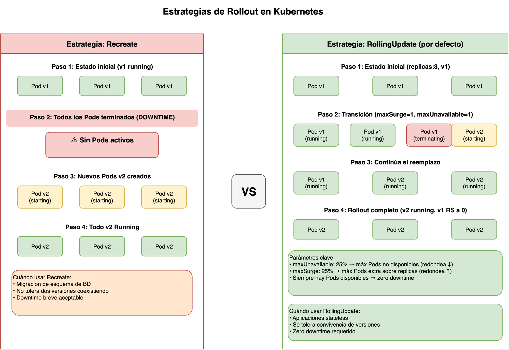

> **Versión de Kubernetes:** v1.29+
> **Fuentes:**
> [kubernetes.io/docs/concepts/workloads/controllers/deployment/](https://kubernetes.io/docs/concepts/workloads/controllers/deployment/)

## Prerequisitos

- [La relación Deployment ↔ ReplicaSet](01-deployment-replicaset.md)

## El problema de actualizar sin downtime



Reemplazar todos los `Pods` de una vez es la forma más rápida de desplegar una versión nueva.
También es la más arriesgada:
si la nueva imagen tiene un defecto, la aplicación deja de funcionar completamente
hasta que corriges el problema.
Kubernetes ofrece dos estrategias de actualización que representan extremos distintos de esta disyuntiva.

> **Analogía — el cambio de menú en un restaurante:**
> La estrategia `Recreate` es como cerrar el restaurante un día entero para renovar completamente la cocina.
> Los clientes no pueden entrar durante la renovación,
> pero al reabrir todo funciona con el nuevo equipamiento.
> La estrategia `RollingUpdate` es como renovar la cocina en secciones mientras el restaurante sigue abierto:
> una parte de los cocineros trabaja con la cocina nueva y otra con la vieja,
> los clientes notan una transición suave y el servicio nunca se interrumpe por completo.

## Estrategia Recreate

Con `strategy.type: Recreate`,
el `DeploymentController` termina **todos** los `Pods` del `ReplicaSet` antiguo antes de crear cualquier `Pod` nuevo.

```yaml
apiVersion: apps/v1
kind: Deployment
metadata:
  name: mi-app
spec:
  replicas: 3
  strategy:
    type: Recreate # primero mata todo, luego crea
  selector:
    matchLabels:
      app: mi-app
  template:
    metadata:
      labels:
        app: mi-app
    spec:
      containers:
        - name: app
          image: mi-app:2.0
```

Cuándo usar `Recreate`:

- La aplicación no tolera que dos versiones coexistan (p. ej., migración de esquema de base de datos).
- El downtime breve es aceptable.
- La aplicación no es `StatefulSet` pero tiene estado compartido que dos versiones corromperían.

## Estrategia RollingUpdate

La estrategia por defecto.
El `DeploymentController` escala simultáneamente el `ReplicaSet` nuevo hacia arriba
y el antiguo hacia abajo,
garantizando que la aplicación siempre tenga una mínima disponibilidad.

```yaml
spec:
  strategy:
    type: RollingUpdate
    rollingUpdate:
      maxUnavailable: 25% # máximo de Pods no disponibles durante la transición
      maxSurge: 25% # máximo de Pods extra por encima del número deseado
```

### maxUnavailable

Controla cuántos `Pods` pueden estar no disponibles durante el rollout.
El valor puede ser un número absoluto o un porcentaje.
El porcentaje se redondea **hacia abajo**.

Ejemplo con `replicas=4` y `maxUnavailable=25%` (→ 1 Pod):

```text
Inicio:   [v1][v1][v1][v1]   → 4 disponibles
Paso 1:   [v1][v1][v1][v2]   → 3 disponibles (1 v1 baja, 1 v2 sube)
Paso 2:   [v1][v1][v2][v2]   → 3 disponibles
Paso 3:   [v1][v2][v2][v2]   → 3 disponibles
Final:    [v2][v2][v2][v2]   → 4 disponibles
```

### maxSurge

Controla cuántos `Pods` extra (por encima del número deseado) pueden existir durante el rollout.
El porcentaje se redondea **hacia arriba**.
No puede ser 0 al mismo tiempo que `maxUnavailable` es 0.

Ejemplo con `replicas=4`, `maxUnavailable=0` y `maxSurge=1`:

```text
Inicio:   [v1][v1][v1][v1]      → 4 Pods totales
Paso 1:   [v1][v1][v1][v1][v2]  → 5 Pods totales (surge=1)
Paso 2:   [v1][v1][v1][v2][v2]  → 5 Pods (1 v1 baja porque hay v2 listo)
...
Final:    [v2][v2][v2][v2]       → 4 Pods totales
```

### Tabla de combinaciones comunes

| maxUnavailable | maxSurge | Efecto                                                          |
| -------------- | -------- | --------------------------------------------------------------- |
| 25%            | 25%      | Equilibrio: transición rápida, algo de recursos extra (defecto) |
| 0              | 1        | Sin downtime; requiere capacidad para un Pod extra              |
| 1              | 0        | Sin recursos extra; siempre habrá un Pod menos durante el paso  |
| 100%           | 0        | Equivale a `Recreate` en la práctica                            |

## Rollover: actualizaciones encadenadas

Si envías una nueva actualización mientras un rollout está en curso,
el `DeploymentController` no espera a que el rollout actual termine.
Abandona el objetivo intermedio y apunta directamente al nuevo estado deseado.

```text
Estado inicial:  [v1 x 5]
Rollout a v2:    [v1 x 4][v2 x 1]   ← en progreso
Nueva orden →v3: el RS v2 pasa a ser "histórico" con 1 réplica
                 [v1 x 4][v2 x 1]   → inmediatamente comienza escala hacia [v3 x 5]
```

Esto significa que puedes tener **tres generaciones de `ReplicaSets`** activos transitoriamente.

## Pausa y reanudación

Puedes pausar un `Deployment` antes de aplicar varios cambios
para que no se disparen múltiples rollouts innecesarios:

```bash
# Pausar: los cambios se acumulan sin disparar rollout
kubectl rollout pause deployment/nginx-deployment

# Cambiar imagen y recursos en el mismo "lote"
kubectl set image deployment/nginx-deployment nginx=nginx:1.16.1
kubectl set resources deployment/nginx-deployment -c=nginx --limits=cpu=200m,memory=512Mi

# Reanudar: un único rollout aplica todos los cambios acumulados
kubectl rollout resume deployment/nginx-deployment
```

> **Nota:** No puedes hacer rollback de un `Deployment` pausado hasta que lo reanudes.

## Monitorear el estado del rollout

```bash
# Seguir el progreso en tiempo real (bloquea hasta que termine o falle)
kubectl rollout status deployment/nginx-deployment

# Ejemplo de salida durante el rollout
# Waiting for rollout to finish: 2 out of 3 new replicas have been updated...
# deployment "nginx-deployment" successfully rolled out

# Ver los eventos del Deployment (muestra las operaciones de scale del DeploymentController)
kubectl describe deployment nginx-deployment | grep -A 20 "Events:"
```

## Preguntas de repaso

Antes de continuar con la siguiente sesión,
intenta responder las siguientes preguntas:

1. ¿Qué diferencia práctica hay entre `Recreate` y `RollingUpdate`?
2. ¿Cómo influyen `maxUnavailable` y `maxSurge` en la disponibilidad durante un rollout?
3. ¿Por qué `RollingUpdate` suele ser la estrategia por defecto?
4. ¿En qué escenario elegirías `Recreate` aunque implique downtime?

Si no puedes responder alguna pregunta con confianza,
revisa nuevamente el contenido de la sesión antes de avanzar.

## Glosario

| Término                   | Definición breve                                                                                                                      |
| ------------------------- | ------------------------------------------------------------------------------------------------------------------------------------- |
| `Recreate`                | Estrategia que termina todos los `Pods` del RS antiguo antes de crear los nuevos; implica downtime breve.                             |
| `RollingUpdate`           | Estrategia por defecto que actualiza los `Pods` gradualmente, manteniendo disponibilidad mínima durante la transición.                |
| `maxUnavailable`          | Máximo de `Pods` que pueden estar no disponibles durante el rollout; acepta número absoluto o porcentaje (redondeo hacia abajo).      |
| `maxSurge`                | Máximo de `Pods` extra por encima del total deseado que se permiten durante el rollout; acepta número absoluto o porcentaje.          |
| rollover                  | Comportamiento en que el `DeploymentController` abandona un rollout en curso al recibir una nueva orden de actualización.             |
| `progressDeadlineSeconds` | Tiempo máximo en segundos que puede transcurrir sin avance antes de que el controlador marque el rollout como fallido (defecto: 600). |

## Siguiente paso

[Gestión del campo status en un Deployment](03-deployment-status.md) →
explica cómo interpretar las condiciones de `.status` para saber si un rollout progresa,
está completo o ha fallado.

## Referencias

- [Deployments — Documentación oficial](https://kubernetes.io/docs/concepts/workloads/controllers/deployment/)
  — kubernetes.io

[← Atrás](01-deployment-replicaset.md) | [Inicio semana](README.md) | [Siguiente →](03-deployment-status.md)
