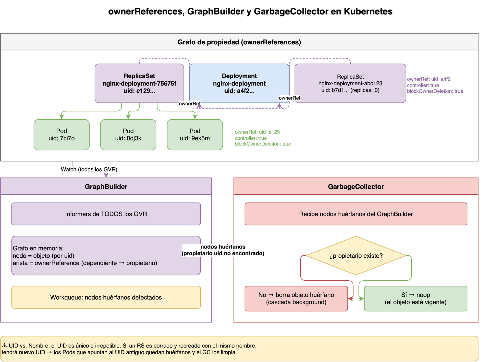

> **Versión de Kubernetes:** v1.29+
> **Fuentes:**
> [kubernetes.io/docs/concepts/architecture/garbage-collection/](https://kubernetes.io/docs/concepts/architecture/garbage-collection/),
> [kubernetes.io/docs/concepts/overview/working-with-objects/owners-dependents/](https://kubernetes.io/docs/concepts/overview/working-with-objects/owners-dependents/)

## Prerequisitos

- [Utilidades de controladores en Kubernetes](../week01/04-controller-utilities.md)
  (ownerReferences y finalizers)
- [La relación Deployment ↔ ReplicaSet](../week03/01-deployment-replicaset.md)

## El problema de los objetos huérfanos

Cuando un `ReplicaSet` termina, sus `Pods` deben desaparecer también.
Cuando un `Namespace` se borra, todos sus recursos deben limpiarse.
Sin un mecanismo centralizado,
cada controlador tendría que recordar y rastrear manualmente todos los objetos que creó,
lo que es frágil y propenso a fugas de recursos.

> **Analogía — el registro de propiedad de inmuebles:**
> En una ciudad, el ayuntamiento lleva un registro que dice:
> "el edificio B pertenece al solar A; el apartamento C pertenece al edificio B".
> Cuando el solar A es demolido, el ayuntamiento sabe automáticamente
> que el edificio B y el apartamento C ya no tienen propietario legítimo
> y deben ser gestionados (demolidos o transferidos).
> El `GarbageCollector` de Kubernetes hace exactamente lo mismo:
> mantiene un grafo interno de propietarios y dependientes,
> y cuando un propietario desaparece, limpia la cadena.

## Arquitectura del GarbageCollector



El `GarbageCollector` consta de dos componentes principales
que corren dentro del `kube-controller-manager`:

| Componente                       | Función                                                                    |
| -------------------------------- | -------------------------------------------------------------------------- |
| `GraphBuilder`                   | Observa todos los objetos del clúster y construye un grafo de dependencias |
| `GarbageCollector` (propiamente) | Detecta nodos huérfanos en el grafo y los borra                            |

Ambos son controladores independientes con sus propios informers y workqueues.
No existe un loop único de recolección:
cada componente reacciona a los eventos que recibe de forma asíncrona.

## El grafo de propietarios

El `GraphBuilder` mantiene un grafo en memoria donde:

- Cada nodo representa un objeto de Kubernetes (por su `uid`).
- Cada arista dirigida va de un dependiente hacia su propietario.

```text
Pod[uid=7ci7o]  ──ownerRef──>  ReplicaSet[uid=e129]  ──ownerRef──>  Deployment[uid=a4f2]
```

El `GraphBuilder` escucha eventos de **todos** los recursos (no solo los conocidos)
usando informers que cubren todos los GVR (_Group-Version-Resource_) del clúster.
Cuando un objeto es creado o actualizado,
el `GraphBuilder` actualiza el grafo con su `metadata.ownerReferences`.

### Cómo poblar el grafo con ownerReferences

El campo `metadata.ownerReferences` es el mecanismo por el que los objetos declaran su propietario:

```yaml
metadata:
  ownerReferences:
    - apiVersion: apps/v1
      kind: ReplicaSet
      name: nginx-deployment-75675f5897
      uid: e129deca-f864-481b-bb16-b27abfd92292
      controller: true # solo puede haber un controlador activo
      blockOwnerDeletion: true # en foreground deletion, bloquea hasta que este objeto sea borrado
```

El campo `controller: true` indica que este propietario es el que gestiona activamente el objeto.
Solo puede haber un controlador activo por objeto,
aunque un objeto puede tener múltiples `ownerReferences` (propietarios no-controladores).

## Restricciones de namespace en ownerReferences

Las `ownerReferences` tienen restricciones de alcance:

- Un dependiente con namespace puede apuntar a propietarios del mismo namespace
  o a propietarios de alcance de clúster.
- Un dependiente con namespace **no puede** apuntar a un propietario de un namespace diferente.
- Un dependiente de alcance de clúster solo puede apuntar a propietarios de alcance de clúster.

Si se viola alguna de estas reglas (desde v1.20+),
el `GarbageCollector` genera un evento de advertencia:

```bash
# Detectar ownerReferences inválidas
kubectl get events -A --field-selector=reason=OwnerRefInvalidNamespace
```

## Cómo el GraphBuilder detecta objetos huérfanos

El `GraphBuilder` identifica un objeto como **huérfano potencial** cuando:

1. El objeto tiene al menos una `ownerReference`.
2. Ninguno de los propietarios referenciados existe en el grafo.

En ese momento, encola el objeto en el `GarbageCollector` para su evaluación y eventual borrado.

### El papel de los tombstones (DeletedFinalStateUnknown)

Cuando un objeto se borra mientras el informer estaba temporalmente desconectado,
el informer entrega un evento especial `DeletedFinalStateUnknown` con el último estado conocido.
El `GraphBuilder` procesa este tombstone para actualizar el grafo correctamente
incluso cuando no vio el evento de borrado en tiempo real.

## Inspeccionar el grafo en la práctica

```bash
# Ver la ownerReference de los Pods de un Deployment
kubectl get pods -l app=nginx -o json | \
  jq '.items[].metadata | {name: .name, owner: .ownerReferences[0].name}'

# Verificar la cadena completa Deployment → ReplicaSet → Pod
kubectl get pod nginx-deployment-75675f5897-7ci7o \
  -o jsonpath='{.metadata.ownerReferences[0].name}'
# nginx-deployment-75675f5897

kubectl get rs nginx-deployment-75675f5897 \
  -o jsonpath='{.metadata.ownerReferences[0].name}'
# nginx-deployment
```

## Preguntas de repaso

Antes de continuar con la siguiente sesión,
intenta responder las siguientes preguntas:

1. ¿Qué problema resuelve el `GraphBuilder` dentro del `GarbageCollector`?
2. ¿Cómo se construye el grafo de dependencias a partir de las `ownerReferences`?
3. ¿Qué papel tienen los eventos de todos los recursos del clúster en esta arquitectura?
4. ¿Por qué el `GarbageCollector` necesita una workqueue además del grafo?

Si no puedes responder alguna pregunta con confianza,
revisa nuevamente el contenido de la sesión antes de avanzar.

## Lo que aprendí hoy

Hoy entendí el `GraphBuilder` como un mapa vivo del clúster.
Cada objeto es un punto y cada `ownerReference` es una flecha que va del
dependiente hacia su propietario.
Cuando llegan eventos de creación, actualización o borrado,
el mapa se ajusta y la workqueue deja pendientes los objetos que necesitan
revisión.
Así el `GarbageCollector` no tiene que adivinar las relaciones cuando busca
recursos huérfanos.

El `GraphBuilder` convierte en un grafo las relaciones de propiedad que
aparecen en la jerarquía de `Deployment`, `ReplicaSet` y `Pod` estudiada en
[la semana anterior](../week03/01-deployment-replicaset.md).
Así, el patrón de reconciliación y sus eventos adquieren una representación
que el `GarbageCollector` puede consultar.

## Glosario

| Término                                | Definición breve                                                                                                                     |
| -------------------------------------- | ------------------------------------------------------------------------------------------------------------------------------------ |
| `GarbageCollector`                     | Controlador dentro del `kube-controller-manager` que borra los objetos cuyos propietarios han desaparecido.                          |
| `GraphBuilder`                         | Subcomponente del `GarbageCollector` que mantiene el grafo de dependencias en memoria a partir de los eventos de todos los recursos. |
| DAG                                    | _Directed Acyclic Graph_ — grafo dirigido acíclico; estructura que usa el `GraphBuilder` para modelar las relaciones de propiedad.   |
| nodo                                   | Representación de un objeto de Kubernetes en el grafo del `GraphBuilder`, identificado por su `uid`.                                 |
| arista                                 | Conexión dirigida en el grafo que va de un dependiente hacia su propietario.                                                         |
| huérfano                               | Objeto cuyo propietario ya no existe en el grafo; el `GarbageCollector` lo encola para evaluación y posible borrado.                 |
| tombstone (`DeletedFinalStateUnknown`) | Evento especial que el informer entrega cuando perdió el evento de borrado real; contiene el último estado conocido del objeto.      |

## Siguiente paso

[ownerReferences en profundidad](02-owner-references.md) →
explica los campos del objeto `ownerReference`, las restricciones de namespace,
y cómo `blockOwnerDeletion` interactúa con el borrado en primer plano.

## Referencias

- [Garbage Collection](https://kubernetes.io/docs/concepts/architecture/garbage-collection/)
  — kubernetes.io
- [Owners and Dependents](https://kubernetes.io/docs/concepts/overview/working-with-objects/owners-dependents/)
  — kubernetes.io

[Inicio semana](README.md) | [Siguiente →](02-owner-references.md)
